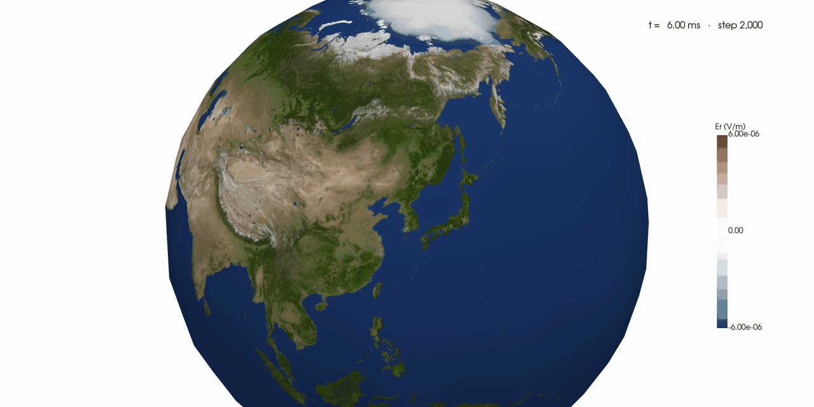

# Ionosphere geodesic FDTD

`ionosphere-fdtd` is a NumPy and PyTorch implementation of a three-dimensional
geodesic finite-difference time-domain model for the Earth–ionosphere
waveguide. It combines an icosahedral primal/dual surface mesh with staggered
radial Yee planes, conductive materials, localized current sources, receiver
sampling, and two- and three-dimensional visualization.



## Highlights

- NumPy CPU and PyTorch CPU, CUDA, and Apple Metal/MPS backends
- Full-spherical radial curls and conservative CFL selection
- Exponential conductive integration with a legacy trapezoidal option
- Configurable geodesic and radial grids, materials, sources, and anomalies
- Surface maps, radial sections, receiver traces, interactive 3-D views, and animations
- Analytic Maxwell verification and Simpson–Taflove reproduction workflows

## Quick start

Python 3.11 or newer is required.

```bash
uv sync --extra test --extra visualization --extra pytorch
uv run ionosphere --steps 200
```

Minimal Python usage:

```python
from ionosphere_fdtd import GeodesicFDTD, GaussianCurrent, SimulationConfig

simulation = GeodesicFDTD(
    SimulationConfig(subdivision=2, radial_cells=24),
    source=GaussianCurrent(carrier_frequency_hz=20.0),
)
simulation.step(1000)
print(simulation.diagnostics())
```

## Documentation

- [User manual](docs/manual/index.md)
- [Installation](docs/manual/installation.md)
- [Quick start](docs/manual/quickstart.md)
- [Command-line reference](docs/manual/command-line-reference.md)
- [Simulation configuration](docs/manual/simulation.md)
- [Materials and sources](docs/manual/materials-and-sources.md)
- [Backends and performance](docs/manual/backends.md)
- [Visualization and output](docs/manual/visualization-and-output.md)
- [Troubleshooting](docs/manual/troubleshooting.md)
- Verification: [analytic solutions](docs/verification/analytic-solution-benchmarks.md),
  [Simpson–Taflove 2004](docs/verification/simpson-taflove-2004.md), and
  [Simpson–Taflove 2006](docs/verification/simpson-taflove-2006.md)
- [Backend benchmarks](docs/benchmarks/backend-comparison.md)

## Development

```bash
uv run --extra test --extra visualization --extra pytorch pytest -q
```

Verification workflows are kept outside the distributed runtime package and
run from a source checkout. The linked verification reports contain their
commands, acceptance criteria, and current results.

## References

1. D. A. Randall et al., “Climate Modeling with Spherical Geodesic Grids,”
   *Computing in Science & Engineering*, 4(5), 32–41, 2002.
2. J. J. Simpson and A. Taflove, “Three-dimensional FDTD modeling of impulsive
   ELF propagation about the entire Earth-sphere,” *IEEE TAP*, 52(2), 443–451,
   2004.
3. J. J. Simpson, R. P. Heikes, and A. Taflove, “FDTD modeling of a novel ELF
   radar for major oil deposits using a three-dimensional geodesic grid of the
   Earth-ionosphere waveguide,” *IEEE TAP*, 54(6), 1734–1741, 2006.
4. A. Taflove and S. C. Hagness, *Computational Electrodynamics: The
   Finite-Difference Time-Domain Method*, 3rd ed., Chapter 3, 2005.

## License

Copyright 2026 Kyungwon Chun.

Licensed under the [Apache License 2.0](LICENSE). See [NOTICE](NOTICE) for the
project copyright notice.
