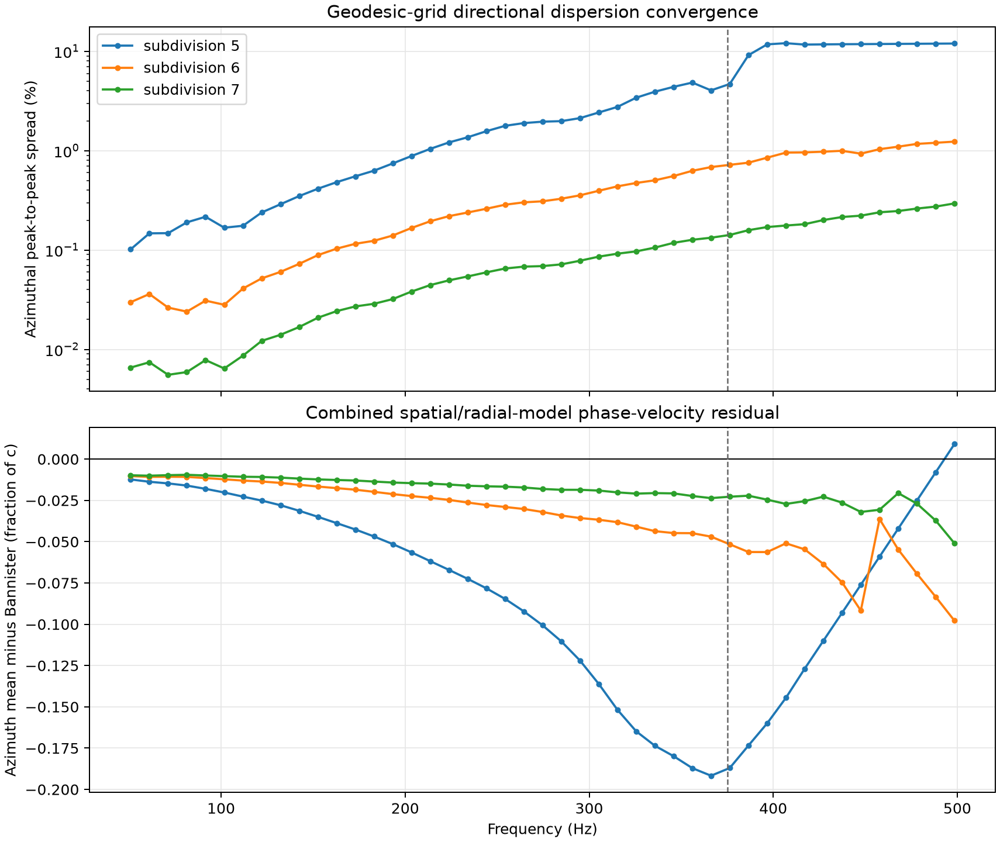

# Geodesic dual grid 방향성 분산 수렴 검증

검증일: 2026-08-03 (Asia/Seoul)

## 목적과 방법

원 논문의 merged latitude–longitude grid로 구현을 바꾸지 않고, 현재
geodesic dual grid 자체의 방향 의존 수치 분산을 직접 측정했다. 지표와
이온층이 수평으로 균질한 모델에서 동일한 Simpson–Taflove 소스를 사용하고,
소스로부터 0°부터 330°까지 30° 간격인 12개 방위각마다 45°와 90° 대권
거리에 수신기를 두었다.

연속 균질 구면의 해는 방위각에 무관하다. 따라서 45° 수신점과 90°
수신점의 복소 DFT 위상차로 얻은 위상속도의 방위각 평균에서 각 방향이
벗어난 정도는 현재 격자의 방향성만 측정한다. 반면 방위각 평균과
Bannister (1984) 식 (4)의 차이는 수평 공간 분산뿐 아니라 유한 방사층
물성 모델의 차이도 포함하므로 두 지표를 분리해서 해석했다.

모든 실행은 25,023 steps, 32,768-point DFT의 45개 고정 주파수
(50.863–498.454 Hz), PyTorch CUDA `float64`, compiled update로 수행했다.

## 재현 명령

```bash
for subdivision in 5 6 7; do
  uv run --extra pytorch --extra visualization \
    ionosphere-measure-dispersion \
    --subdivision "${subdivision}" --steps 25023 \
    --azimuth-step-deg 30 --backend torch --device cuda:0 \
    --dtype float64 --torch-compile --synchronize-every 1024 \
    --output-dir \
      "artifacts/directional-dispersion/uniform-level-${subdivision}-float64-cuda"
done
```

## 전체 대역 결과

| subdivision | 표면 셀 | 실행 시간 | 평균 방위각 spread | 최대 spread | 방위각 상대 RMS | 평균/최대 Bannister 잔차 |
|---:|---:|---:|---:|---:|---:|---:|
| 5 | 10,242 | 53.0 s | 4.2417% | 12.0832% | 2.4705% | 0.08136 / 0.19170 c |
| 6 | 40,962 | 190.4 s | 0.4492% | 1.2344% | 0.1708% | 0.03642 / 0.09781 c |
| 7 | 163,842 | 797.6 s | 0.0970% | 0.2947% | 0.0366% | 0.01895 / 0.05096 c |

최대 방향 spread는 subdivision 5에서 406.901 Hz, subdivision 6과 7에서는
498.454 Hz에 나타났다. 격자 간격이 subdivision마다 절반이 된다고 두면
평균 spread의 관측 수렴 차수는 5→6에서 3.24, 6→7에서 2.21이고, 최대
spread는 각각 3.29와 2.07이다. 가장 거친 level 5는 고주파에서 충분히
해상되지 않아 점근 구간 밖에 있지만, level 6→7은 약 2차 수렴을 보인다.



- [주파수별 격자 비교 CSV](directional-dispersion-convergence.csv)
- [대역별 집계 CSV](directional-dispersion-bands.csv)
- subdivision별 전체 실행: [5](../uniform-level-5-float64-cuda/verification-report.md),
  [6](../uniform-level-6-float64-cuda/verification-report.md),
  [7](../uniform-level-7-float64-cuda/verification-report.md)

## 주파수 대역별 결과

표의 값은 각 대역에서 방위각 최대–최소 위상속도 차이를 방위각 평균으로
나눈 값의 평균/최대다.

| subdivision | 50–200 Hz | 200–375 Hz | 375–500 Hz |
|---:|---:|---:|---:|
| 5 | 0.323 / 0.745% | 2.449 / 4.849% | 11.107 / 12.083% |
| 6 | 0.0649 / 0.140% | 0.373 / 0.685% | 0.992 / 1.234% |
| 7 | 0.0150 / 0.0321% | 0.0798 / 0.133% | 0.214 / 0.295% |

원 논문이 공간 해상도 기준으로 삼은 375 Hz 이하에서 level 7 평균
spread는 0.0494%, 최대는 0.133%다. 375–500 Hz에서는 더 크지만 평균
0.214%, 최대 0.295%로 제한된다. 따라서 level 5의 400 Hz 이상 급격한
분기는 명확한 under-resolution이며, paper-scale level 7에서는 같은
방향성 오차가 크게 억제된다.

## DFT 절단 민감도

각 trace의 adaptive 절단 대신 모든 방위각에 공통 최소·중앙·최대 절단을
적용해 다시 계산했다. level 7의 평균 spread는 0.0967–0.0973%, 최대
spread는 0.2931–0.3122%였고 adaptive 값은 0.0970%와 0.2947%였다.
level 6에서도 평균 0.4409–0.4488%, 최대 1.189–1.233%로 유지됐다. 따라서
관측된 약 2차 수렴은 방향별 DFT window 선택으로 생긴 현상이 아니다.

## 결론

merged latitude–longitude grid와 geodesic dual grid가 동일한 분산 관계를
갖도록 만들 수는 없지만, 현재 구현을 유지한 상태에서 그 차이의 방향성
성분을 직접 정량화하고 해상도 증가로 억제할 수 있다. paper-scale
subdivision 7에서 방향성 자체는 전 대역 최대 0.295%로 작다.

그러나 level 7 방위각 평균의 Bannister 최대 잔차는 여전히 0.05096 c다.
이는 방향성 spread보다 훨씬 크므로 기존 Simpson–Taflove 고주파 잔차를
오직 두 수평 격자의 방향성 차이로 설명할 수는 없다. 남은 절대 오차에는
등방성 공간 분산과 유한 방사층/물성 모델 차이가 함께 포함된다. 이번
측정은 격자 구현을 교체하지 않고도 방향성 원인을 분리하고, 사용할
해상도에 대한 정량적 오차 범위를 제공한다.
