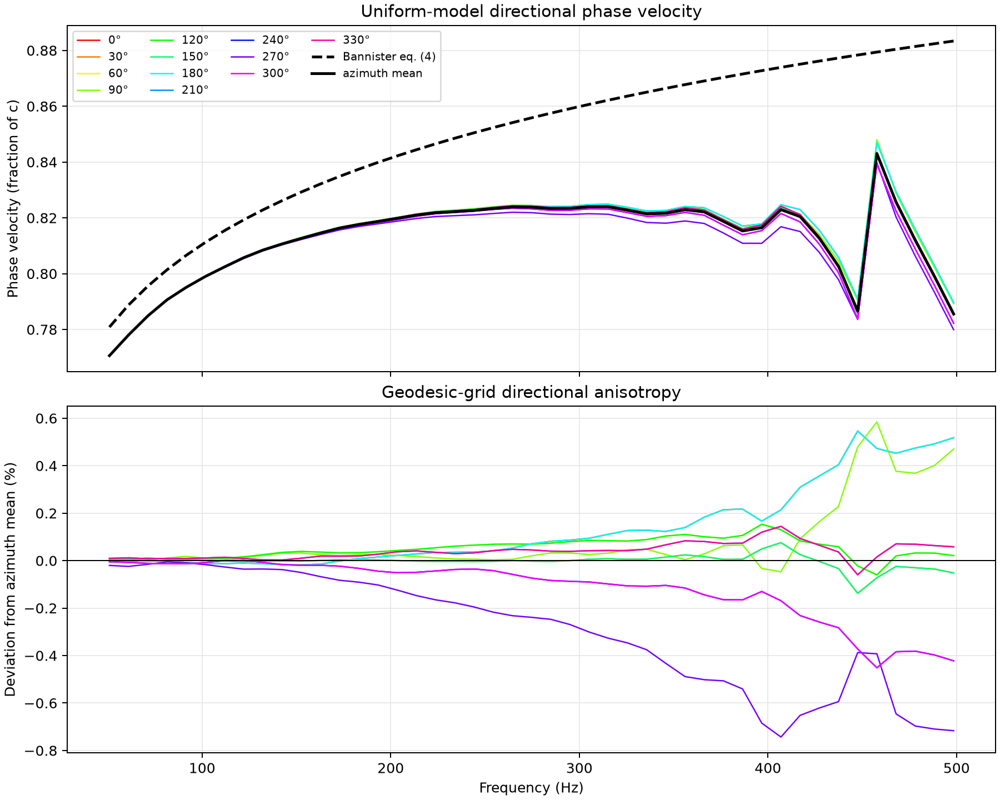

# Geodesic grid directional-dispersion measurement

Generated: 2026-08-03T13:42:35+09:00

## Reproduction command

```bash
uv run --extra pytorch --extra visualization ionosphere-measure-dispersion \
  --subdivision 6 \
  --steps 25023 \
  --azimuth-step-deg 30 \
  --backend torch \
  --device cuda:0 \
  --dtype float64 \
  --torch-compile \
  --synchronize-every 1024 \
  --output-dir artifacts/directional-dispersion/uniform-level-6-float64-cuda
```

## Configuration

| Item | Value |
|---|---:|
| Git revision | `4255efa-dirty` |
| subdivision | 6 |
| surface cells | 40,962 |
| radial cells | 40 |
| material | `uniform` |
| backend | `torch` |
| device | `cuda:0` |
| dtype | `float64` |
| compiled | `True` |
| azimuth spacing | 30° |
| azimuth count | 12 |
| receiver arcs | 45° / 90° |
| DFT cutoffs | 21,486–21,584 samples |
| elapsed | 190.4 s |

## Metrics

| Metric | Value |
|---|---:|
| `mean_azimuthal_relative_spread` | 0.00449172539 |
| `maximum_azimuthal_relative_spread` | 0.0123436594 |
| `maximum_azimuthal_spread_frequency_hz` | 498.453776 |
| `azimuthal_relative_rms` | 0.00170804095 |
| `mean_phase_velocity_mae_fraction_c` | 0.0364241564 |
| `mean_phase_velocity_max_error_fraction_c` | 0.0978066379 |
| `mean_phase_velocity_max_error_frequency_hz` | 498.453776 |



- [Per-frequency and per-azimuth values](directional-phase-velocity.csv)
- [Receiver traces](directional-traces.npz)

## Interpretation

The material and ionosphere are laterally uniform, so the continuum solution is
azimuth-independent. Deviation from the azimuth mean therefore measures grid
directionality. The difference between the azimuth mean and Bannister equation
(4) measures the combined frequency dispersion of the spatial discretization
and the finite radial material model. No latitude–longitude grid is introduced;
this experiment measures the existing geodesic dual grid unchanged.
