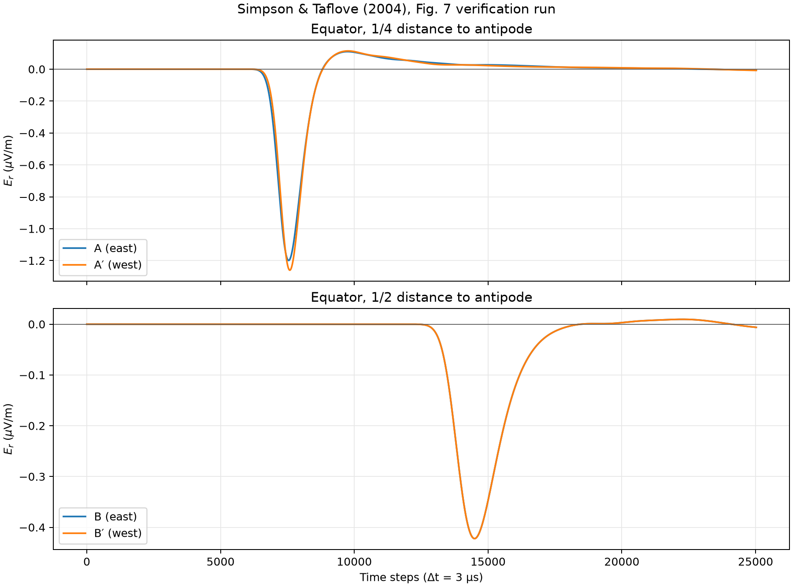
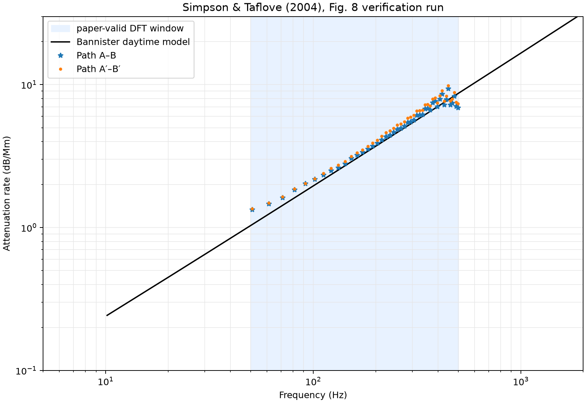

# Simpson–Taflove 2004 Fig. 7·8 검증

> 정량 검증 상태: **실패**

생성 시각: 2026-08-03T13:15:34+09:00

## 재현 명령

```bash
uv run --extra pytorch --extra visualization ionosphere-verify-2004 \
  --subdivision 7 \
  --steps 25023 \
  --material etopo5 \
  --backend torch \
  --device cuda:0 \
  --dtype float64 \
  --dft-window adaptive \
  --ionosphere-reference-height-km 70 \
  --ionosphere-scale-height-km 3.33 \
  --torch-compile \
  --synchronize-every 1024 \
  --output-dir artifacts/simpson-taflove-2004/etopo5-level-7-float64-cuda-staggered-source \
  --etopo5-path data/ETOPO5.DAT
```

## 실행 구성

| 항목 | 값 |
|---|---:|
| Git revision | `2275ad1-dirty` |
| subdivision | 7 |
| 표면 셀 | 163,842 |
| 방사 셀 | 40 |
| 시간 간격 | 3.000e-06 s |
| 시간 스텝 | 25,023 |
| 재료 모델 | `etopo5` |
| relief 자료 | `data/ETOPO5.DAT` |
| 이온층 reference height | 70 km |
| 이온층 scale height | 3.33 km |
| DFT window | `adaptive` |
| backend | `torch` |
| device | `cuda:0` |
| dtype | `float64` |
| compiled step | `True` |
| 실행 시간 | 747.3 s |

## 논문 파라미터

- 소스: 적도, 47° W, 지표 바로 위의 5 km 수직 전류 셀
- 소스 방사 배치: 2.5 km 중심을 인접 staggered `Er` 평면에 선형
  cloud-in-cell 가중하고, 수평 barycentric 가중치와 함께 총전류를 보존
- Gaussian `1/e` full width: `480 Δt`
- Gaussian center: `960 Δt`
- `Δt = 3.0 μs`
- 관측점: A/A′는 반대편까지 거리의 1/4, B/B′는 1/2
- DFT 절단: `adaptive`는 각 계산 파형의 slow-tail 직전 zero crossing,
  `paper`는 A 22,849, B 24,165, A′ 22,737, B′ 25,023 samples
- 고정 비교 주파수: Fig. 8 marker 간격과 일치하는 32,768-point
  DFT의 50–500 Hz 구간 45개 bin (50.863–498.454 Hz)
- 위상속도: 복소 DFT의 `A·conj(B)`와 `A′·conj(B′)` 위상을 DC부터
  unwrap하고, 두 수신점 사이의 추가 45° 전파 거리로 환산한다. 비교선은
  Bannister (1984) 식 (4)의 daytime phase velocity다.

## 판정

| 경로 | 평균 절대 오차 | 최대 절대 오차 | 논문 보고 범위 | 결과 |
|---|---:|---:|---:|---:|
| A–B | 0.387 dB/Mm | 1.746 dB/Mm | ±0.5 dB/Mm | 실패 |
| A′–B′ | 0.589 dB/Mm | 2.016 dB/Mm | ±1.0 dB/Mm | 실패 |

## 전체 지표

| 지표 | 값 |
|---|---:|
| `path_ab_mean_absolute_error_db_per_mm` | 0.386878 |
| `path_apbp_mean_absolute_error_db_per_mm` | 0.589475 |
| `path_ab_maximum_absolute_error_db_per_mm` | 1.74578 |
| `path_apbp_maximum_absolute_error_db_per_mm` | 2.01599 |
| `path_ab_maximum_error_frequency_hz` | 498.454 |
| `path_apbp_maximum_error_frequency_hz` | 447.591 |
| `path_ab_maximum_residual_db_per_mm` | -1.74578 |
| `path_apbp_maximum_residual_db_per_mm` | 2.01599 |
| `A_negative_peak_step` | 7546 |
| `A_negative_peak_uv_m` | -1.19919 |
| `A′_negative_peak_step` | 7589 |
| `A′_negative_peak_uv_m` | -1.26018 |
| `B_negative_peak_step` | 14494 |
| `B_negative_peak_uv_m` | -0.422184 |
| `B′_negative_peak_step` | 14494 |
| `B′_negative_peak_uv_m` | -0.422184 |
| `quarter_east_west_relative_rms` | 0.0821513 |
| `half_east_west_relative_rms` | 6.97483e-16 |
| `A_negative_peak_travel_time_s` | 0.019758 |
| `A_apparent_peak_velocity_fraction_c` | 0.844761 |
| `A′_negative_peak_travel_time_s` | 0.019887 |
| `A′_apparent_peak_velocity_fraction_c` | 0.839281 |
| `B_negative_peak_travel_time_s` | 0.040602 |
| `B_apparent_peak_velocity_fraction_c` | 0.822166 |
| `B′_negative_peak_travel_time_s` | 0.040602 |
| `B′_apparent_peak_velocity_fraction_c` | 0.822166 |
| `path_ab_negative_peak_travel_time_s` | 0.020844 |
| `path_ab_apparent_peak_velocity_fraction_c` | 0.800748 |
| `path_apbp_negative_peak_travel_time_s` | 0.020715 |
| `path_apbp_apparent_peak_velocity_fraction_c` | 0.805734 |
| `source_requested_altitude_m` | 2500 |
| `source_staggered_centroid_altitude_m` | 2500 |
| `source_staggered_lower_plane_altitude_m` | 0 |
| `source_staggered_upper_plane_altitude_m` | 5000 |
| `source_staggered_radial_support_planes` | 2 |
| `source_distribution_weight_sum` | 1 |
| `path_ab_phase_velocity_mean_absolute_error_fraction_c` | 0.0197188 |
| `path_apbp_phase_velocity_mean_absolute_error_fraction_c` | 0.0146434 |
| `path_ab_phase_velocity_maximum_absolute_error_fraction_c` | 0.0829402 |
| `path_apbp_phase_velocity_maximum_absolute_error_fraction_c` | 0.0964638 |
| `A_dft_cutoff_step` | 22922 |
| `A′_dft_cutoff_step` | 23287 |
| `B_dft_cutoff_step` | 24081 |
| `B′_dft_cutoff_step` | 24081 |

## 생성 결과





[Receiver traces (NPZ)](simpson-taflove-2004-traces.npz)

[Source placement comparison (CSV)](source-placement-comparison.csv)

## 해석 시 주의사항

- NOAA-NGDC `ETOPO5.DAT`의 5′ 지형·수심을 각 geodesic 표본점에
  bilinear interpolation하여 공기·해수·암석 경계를 정한다.
- Hermance (1995)는 배포 가능한 3-D 전도도 격자가 아니라 Fig. 6의
  경계형 개념도 출처다. 해양/대륙별 500/200/50 Ω·m 대표 깊이
  프로파일을 사용하며, 그림의 국지 전도성 구조는 재현하지 않는다.
- Fig. 8 기준선은 Bannister (1984), 식 (5), (7), (8)의 daytime attenuation
  모델을 `H = 70 km`, `ξ₀ = ξ₁ = 1/0.3 km`로 계산한다.
- 원 논문의 병합 위경도 격자와 이 프로젝트의 geodesic dual grid는 서로
  다르다.
- 논문에 전류 진폭이 명시되지 않아 Fig. 7은 1 A로 정규화한다. Fig. 8의
  스펙트럼 비율은 이 진폭 선택과 무관하다.

## 실행 환경

- Python: `3.12.3`
- NumPy: `2.5.1`
- Platform: `Linux-6.8.0-136-generic-x86_64-with-glibc2.39`
- Python executable: `/home/kwchun/Workspace/ionosphere-fdtd/.venv/bin/python`
