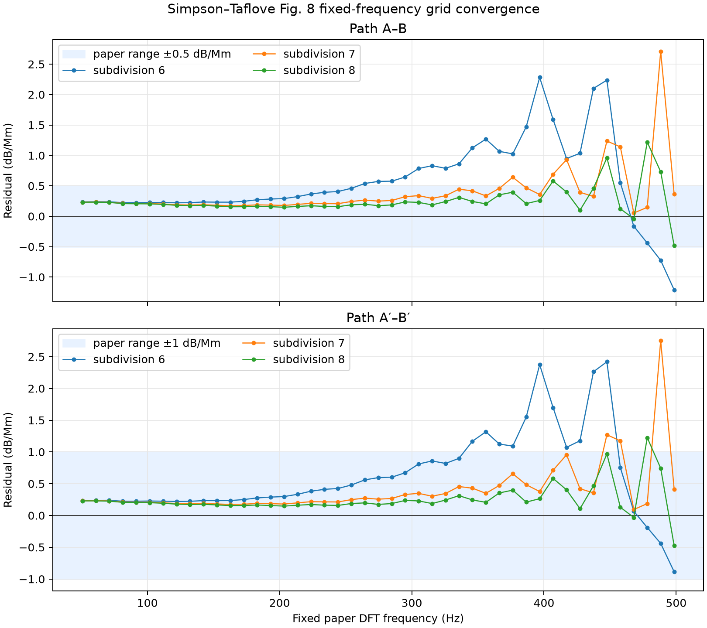

# Simpson–Taflove 2004 Fig. 8 고정 주파수 재분석

> 정량 검증 상태: **실패**

재분석일: 2026-08-03 (Asia/Seoul)

## 기준 자료

Simpson–Taflove Fig. 8의 `Previous Results`는 참고문헌 [21]인
P. R. Bannister, “ELF Propagation Update,” *IEEE Journal of Oceanic
Engineering*, OE-9(3), 179–188, 1984의 daytime attenuation 모델이다.

- [Simpson–Taflove 저자 공개 PDF](https://my.ece.utah.edu/~simpson/Papers/Paper2.pdf)
- [Bannister 1984 보존 PDF](https://zenodo.org/records/1274951/files/article.pdf)
- DOI: [`10.1109/TAP.2004.823953`](https://doi.org/10.1109/TAP.2004.823953),
  [`10.1109/JOE.1984.1145609`](https://doi.org/10.1109/JOE.1984.1145609)

Bannister 식 (5), (7), (8)을 `H = 70 km`,
`ξ₀ = ξ₁ = 1/0.3 km`로 계산했다. 이 설정은 원문이 제시한
75 Hz의 약 1.5 dB/Mm와 1000 Hz의 약 16.6 dB/Mm를 재현한다.
기존의 Fig. 8 수동 회귀식 `0.0265 f^0.938`은 더 이상 판정 기준으로
사용하지 않는다.

## 평가 주파수

Simpson–Taflove Fig. 8의 marker 간격은 `Δt = 3 µs`, `N = 32,768`
DFT의 50–500 Hz 구간과 일치한다. 따라서 bin 5–49에 해당하는
50.862630–498.453776 Hz의 45개 주파수만 평가한다. 더 큰 FFT로
zero-padding하더라도 이 고정 주파수로 다시 표본화하므로 판정값은
변하지 않는다.

## 결과

| subdivision | A–B 평균/최대 오차 | 최대 주파수 | A′–B′ 평균/최대 오차 | 최대 주파수 |
|---:|---:|---:|---:|---:|
| 6 | 0.681 / 2.282 dB/Mm | 396.729 Hz | 0.696 / 2.420 dB/Mm | 447.591 Hz |
| 7 | 0.387 / 2.708 dB/Mm | 488.281 Hz | 0.399 / 2.753 dB/Mm | 488.281 Hz |
| 8 | 0.274 / 1.218 dB/Mm | 478.109 Hz | 0.275 / 1.225 dB/Mm | 478.109 Hz |

subdivision 8은 level 7 대비 평균 오차를 A–B에서 약 29%, A′–B′에서
약 31% 줄였다. 그러나 최대 오차는 A–B의 ±0.5 dB/Mm와 A′–B′의
±1.0 dB/Mm 범위를 모두 초과한다. 따라서 source-based 기준으로
재평가한 전체 정량 상태는 실패다.

[45개 고정 평가점과 level 6/7/8 감쇠율 CSV](fixed-frequency-comparison.csv)

## 해석

- FFT 길이 32,768과 65,536에서 모든 지표가 약 `1e-12` 상대 오차 내로
  일치하므로 기존 최대값의 zero-padding 민감도는 제거됐다.
- 50–300 Hz에서는 격자 세분화에 따라 잔차가 일관되게 감소한다.
- 남은 실패는 400–500 Hz의 진동성 잔차가 지배한다. 이는 fixed-frequency
  판정이나 adaptive cutoff 문제가 아니라 고주파 공간 분산 또는 원 논문과
  다른 지각·지형 모델의 영향으로 보인다.
- 원 논문의 NOAA-NGDC relief, 전체 Hermance 지각 모델, adaptive merged
  latitude–longitude grid가 아직 재현되지 않았으므로 완전한 논문 재현을
  주장하지 않는다.
