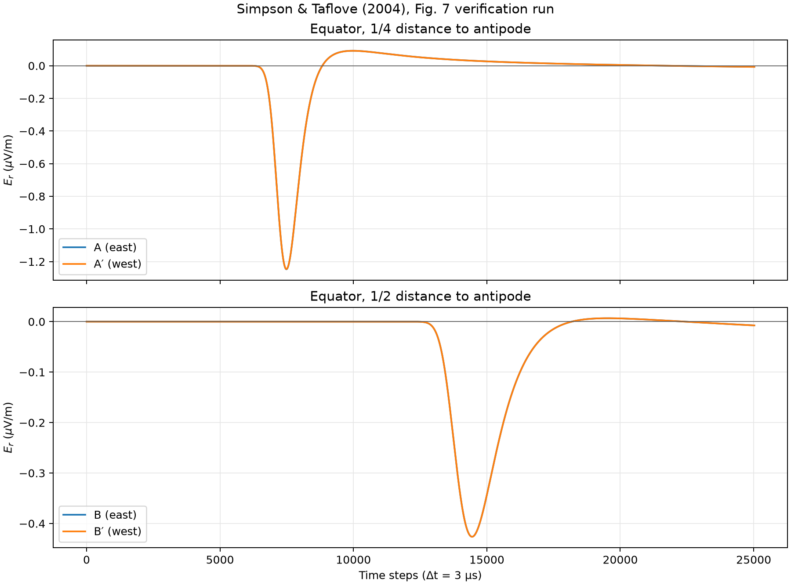
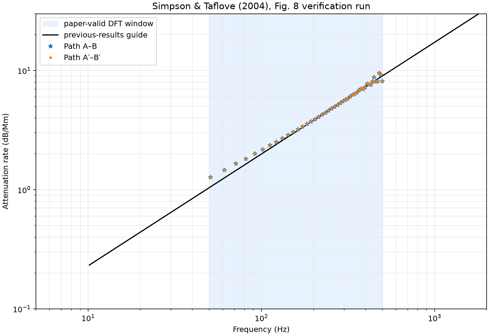

# Simpson–Taflove 2004 Fig. 7·8 검증

> 정량 검증 상태: **실패**

생성 시각: 2026-08-03T04:54:04+09:00

## 재현 명령

```bash
uv run --extra pytorch --extra visualization ionosphere-verify-2004 \
  --subdivision 8 \
  --steps 25023 \
  --material natural-earth \
  --backend torch \
  --device cuda:0 \
  --dtype float64 \
  --dft-window adaptive \
  --ionosphere-reference-height-km 70 \
  --ionosphere-scale-height-km 3.33 \
  --torch-compile \
  --synchronize-every 1024 \
  --output-dir artifacts/simpson-taflove-2004/level-8-float64-cuda-corrected
```

## 실행 구성

| 항목 | 값 |
|---|---:|
| Git revision | `d574c5d-dirty` |
| subdivision | 8 |
| 표면 셀 | 655,362 |
| 방사 셀 | 40 |
| 시간 간격 | 3.000e-06 s |
| 시간 스텝 | 25,023 |
| 재료 모델 | `natural-earth` |
| 이온층 reference height | 70 km |
| 이온층 scale height | 3.33 km |
| DFT window | `adaptive` |
| backend | `torch` |
| device | `cuda:0` |
| dtype | `float64` |
| compiled step | `True` |
| 실행 시간 | 3477.9 s |

## 논문 파라미터

- 소스: 적도, 47° W, 지표 바로 위의 5 km 수직 전류 셀
- Gaussian `1/e` full width: `480 Δt`
- Gaussian center: `960 Δt`
- `Δt = 3.0 μs`
- 관측점: A/A′는 반대편까지 거리의 1/4, B/B′는 1/2
- DFT 절단: `adaptive`는 각 계산 파형의 slow-tail 직전 zero crossing,
  `paper`는 A 22,849, B 24,165, A′ 22,737, B′ 25,023 samples
- 유효 비교 주파수: 50–500 Hz

## 판정

| 경로 | 평균 절대 오차 | 최대 절대 오차 | 논문 보고 범위 | 결과 |
|---|---:|---:|---:|---:|
| A–B | 0.156 dB/Mm | 0.906 dB/Mm | ±0.5 dB/Mm | 실패 |
| A′–B′ | 0.156 dB/Mm | 0.913 dB/Mm | ±1.0 dB/Mm | 통과 |

## 전체 지표

| 지표 | 값 |
|---|---:|
| `path_ab_mean_absolute_error_db_per_mm` | 0.156099 |
| `path_apbp_mean_absolute_error_db_per_mm` | 0.156239 |
| `path_ab_maximum_absolute_error_db_per_mm` | 0.906238 |
| `path_apbp_maximum_absolute_error_db_per_mm` | 0.913396 |
| `A_negative_peak_step` | 7489 |
| `A_negative_peak_uv_m` | -1.2469 |
| `A′_negative_peak_step` | 7489 |
| `A′_negative_peak_uv_m` | -1.2456 |
| `B_negative_peak_step` | 14446 |
| `B_negative_peak_uv_m` | -0.42624 |
| `B′_negative_peak_step` | 14446 |
| `B′_negative_peak_uv_m` | -0.42624 |
| `quarter_east_west_relative_rms` | 0.00129538 |
| `half_east_west_relative_rms` | 6.89945e-16 |
| `A_dft_cutoff_step` | 21788 |
| `A′_dft_cutoff_step` | 21722 |
| `B_dft_cutoff_step` | 22436 |
| `B′_dft_cutoff_step` | 22436 |

## 생성 결과





[Receiver traces (NPZ)](simpson-taflove-2004-traces.npz)

## 해석 시 주의사항

- NOAA-NGDC relief 원본 대신 Natural Earth 110-m 육지 마스크를 사용한다.
- Fig. 6의 부등식 경계값으로 지각 층을 근사하며 전체 Hermance 모델은
  아니다.
- Fig. 8 기준선은 원시 Bannister 자료가 아니라 논문 그림을 근사한
  `0.0265 f^0.938` log-log guide이다.
- 원 논문의 병합 위경도 격자와 이 프로젝트의 geodesic dual grid는 서로
  다르다.
- 논문에 전류 진폭이 명시되지 않아 Fig. 7은 1 A로 정규화한다. Fig. 8의
  스펙트럼 비율은 이 진폭 선택과 무관하다.

## 실행 환경

- Python: `3.12.3`
- NumPy: `2.5.1`
- Platform: `Linux-6.8.0-136-generic-x86_64-with-glibc2.39`
- Python executable: `/home/kwchun/Workspace/ionosphere-fdtd/.venv/bin/python`
