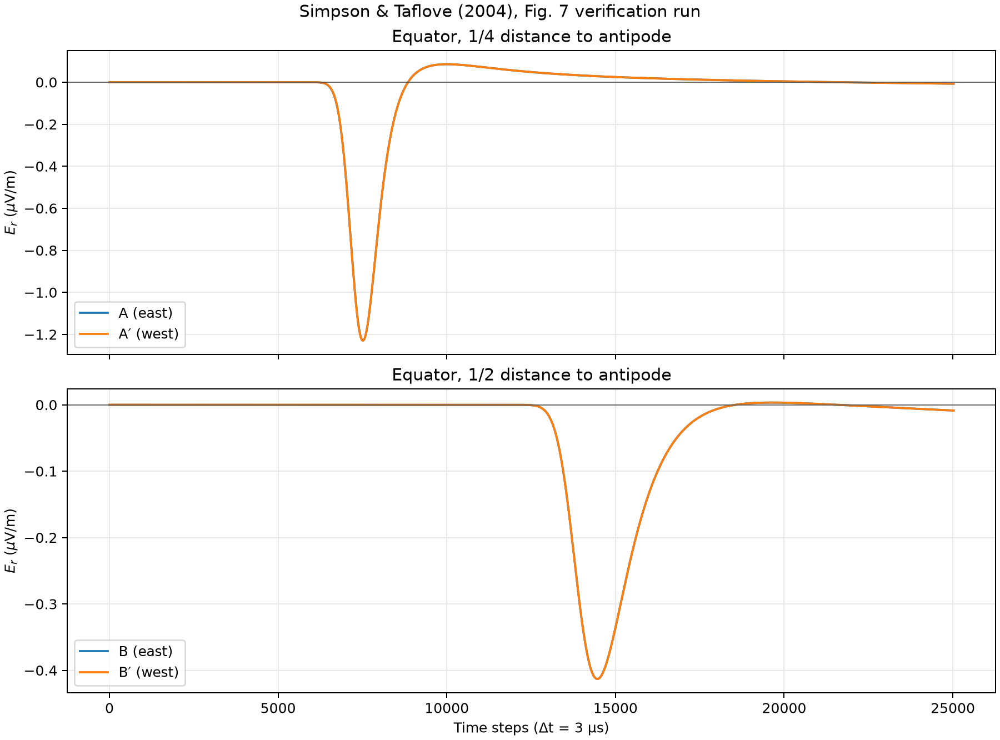
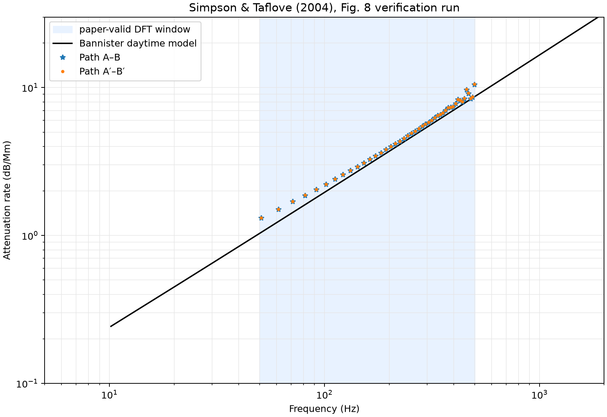

# Simpson–Taflove 2004 Fig. 7·8 검증

> 정량 검증 상태: **실패**

생성 시각: 2026-08-03T10:58:24+09:00

## 재현 명령

```bash
uv run --extra pytorch --extra visualization ionosphere-verify-2004 \
  --subdivision 7 \
  --steps 25023 \
  --material uniform \
  --backend torch \
  --device cuda:0 \
  --dtype float64 \
  --dft-window adaptive \
  --ionosphere-reference-height-km 70 \
  --ionosphere-scale-height-km 3.33 \
  --torch-compile \
  --synchronize-every 1024 \
  --output-dir artifacts/simpson-taflove-2004/uniform-level-7-float64-cuda
```

## 실행 구성

| 항목 | 값 |
|---|---:|
| Git revision | `f5852d6-dirty` |
| subdivision | 7 |
| 표면 셀 | 163,842 |
| 방사 셀 | 40 |
| 시간 간격 | 3.000e-06 s |
| 시간 스텝 | 25,023 |
| 재료 모델 | `uniform` |
| 이온층 reference height | 70 km |
| 이온층 scale height | 3.33 km |
| DFT window | `adaptive` |
| backend | `torch` |
| device | `cuda:0` |
| dtype | `float64` |
| compiled step | `True` |
| 실행 시간 | 849.7 s |

## 논문 파라미터

- 소스: 적도, 47° W, 지표 바로 위의 5 km 수직 전류 셀
- Gaussian `1/e` full width: `480 Δt`
- Gaussian center: `960 Δt`
- `Δt = 3.0 μs`
- 관측점: A/A′는 반대편까지 거리의 1/4, B/B′는 1/2
- DFT 절단: `adaptive`는 각 계산 파형의 slow-tail 직전 zero crossing,
  `paper`는 A 22,849, B 24,165, A′ 22,737, B′ 25,023 samples
- 고정 비교 주파수: Fig. 8 marker 간격과 일치하는 32,768-point
  DFT의 50–500 Hz 구간 45개 bin (50.863–498.454 Hz)

## 판정

| 경로 | 평균 절대 오차 | 최대 절대 오차 | 논문 보고 범위 | 결과 |
|---|---:|---:|---:|---:|
| A–B | 0.412 dB/Mm | 1.838 dB/Mm | ±0.5 dB/Mm | 실패 |
| A′–B′ | 0.427 dB/Mm | 1.890 dB/Mm | ±1.0 dB/Mm | 실패 |

## 전체 지표

| 지표 | 값 |
|---|---:|
| `path_ab_mean_absolute_error_db_per_mm` | 0.411872 |
| `path_apbp_mean_absolute_error_db_per_mm` | 0.427233 |
| `path_ab_maximum_absolute_error_db_per_mm` | 1.83834 |
| `path_apbp_maximum_absolute_error_db_per_mm` | 1.89017 |
| `path_ab_maximum_error_frequency_hz` | 498.454 |
| `path_apbp_maximum_error_frequency_hz` | 498.454 |
| `path_ab_maximum_residual_db_per_mm` | 1.83834 |
| `path_apbp_maximum_residual_db_per_mm` | 1.89017 |
| `A_negative_peak_step` | 7514 |
| `A_negative_peak_uv_m` | -1.22922 |
| `A′_negative_peak_step` | 7510 |
| `A′_negative_peak_uv_m` | -1.22964 |
| `B_negative_peak_step` | 14462 |
| `B_negative_peak_uv_m` | -0.41304 |
| `B′_negative_peak_step` | 14462 |
| `B′_negative_peak_uv_m` | -0.41304 |
| `quarter_east_west_relative_rms` | 0.00389224 |
| `half_east_west_relative_rms` | 6.86074e-16 |
| `A_negative_peak_travel_time_s` | 0.019662 |
| `A_apparent_peak_velocity_fraction_c` | 0.848885 |
| `A′_negative_peak_travel_time_s` | 0.01965 |
| `A′_apparent_peak_velocity_fraction_c` | 0.849404 |
| `B_negative_peak_travel_time_s` | 0.040506 |
| `B_apparent_peak_velocity_fraction_c` | 0.824114 |
| `B′_negative_peak_travel_time_s` | 0.040506 |
| `B′_apparent_peak_velocity_fraction_c` | 0.824114 |
| `path_ab_negative_peak_travel_time_s` | 0.020844 |
| `path_ab_apparent_peak_velocity_fraction_c` | 0.800748 |
| `path_apbp_negative_peak_travel_time_s` | 0.020856 |
| `path_apbp_apparent_peak_velocity_fraction_c` | 0.800287 |
| `path_ab_phase_velocity_mean_absolute_error_fraction_c` | 0.0188845 |
| `path_apbp_phase_velocity_mean_absolute_error_fraction_c` | 0.0195294 |
| `path_ab_phase_velocity_maximum_absolute_error_fraction_c` | 0.0503701 |
| `path_apbp_phase_velocity_maximum_absolute_error_fraction_c` | 0.052111 |
| `A_dft_cutoff_step` | 21509 |
| `A′_dft_cutoff_step` | 21513 |
| `B_dft_cutoff_step` | 21572 |
| `B′_dft_cutoff_step` | 21572 |

## 생성 결과





[Receiver traces (NPZ)](simpson-taflove-2004-traces.npz)

## 해석 시 주의사항

- NOAA-NGDC relief 원본 대신 Natural Earth 110-m 육지 마스크를 사용한다.
- Fig. 6의 부등식 경계값으로 지각 층을 근사하며 전체 Hermance 모델은
  아니다.
- Fig. 8 기준선은 Bannister (1984), 식 (5), (7), (8)의 daytime attenuation
  모델을 `H = 70 km`, `ξ₀ = ξ₁ = 1/0.3 km`로 계산한다.
- 원 논문의 병합 위경도 격자와 이 프로젝트의 geodesic dual grid는 서로
  다르다.
- 논문에 전류 진폭이 명시되지 않아 Fig. 7은 1 A로 정규화한다. Fig. 8의
  스펙트럼 비율은 이 진폭 선택과 무관하다.

## 실행 환경

- Python: `3.12.3`
- NumPy: `2.5.1`
- Platform: `Linux-6.8.0-136-generic-x86_64-with-glibc2.39`
- Python executable: `/home/kwchun/Workspace/ionosphere-fdtd/.venv/bin/python`
