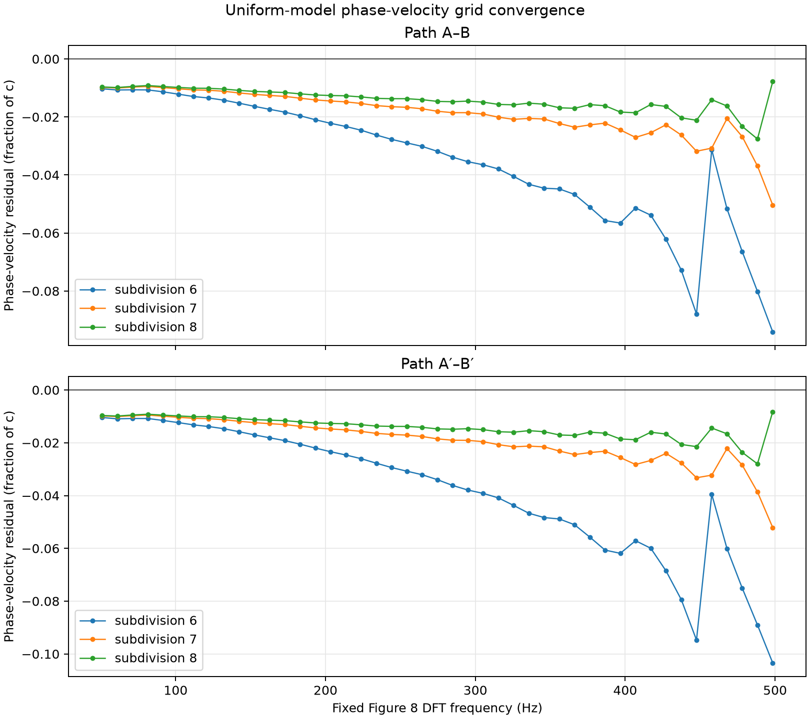

# 균질 모델 위상속도·도달시간 격자 수렴 검증

검증일: 2026-08-03 (Asia/Seoul)

## 목적과 방법

자연 지구 재료 모델의 고주파 잔차에서 재료 비대칭과 격자 수치 분산을
분리하기 위해, 균질한 지표 재료와 동일한 70 km/3.33 km 이온층을 사용해
subdivision 6–8을 CUDA `float64`로 실행했다.

위상속도는 각 수신기 파형을 adaptive zero-crossing에서 자른 복소 DFT로
계산했다. `A·conj(B)`와 `A′·conj(B′)`의 위상을 DC부터 unwrap한 뒤,
수신기 사이의 추가 45° 대권 거리 `πR/4`에 대해
`v = 2πf(πR/4)/Δφ`를 적용했다. 평가는 Fig. 8과 동일한 32,768-point
DFT의 45개 고정 주파수(50.863–498.454 Hz)에서 수행했고, 기준은
Bannister (1984) 식 (4), `c/v = 0.985 sqrt(h₁/h₀)`다. 도달시간은
A–B와 A′–B′ 음의 주펄스 피크 사이의 시간차로 측정했다.

## 재현 명령

```bash
for subdivision in 6 7 8; do
  uv run --extra pytorch --extra visualization ionosphere-verify-2004 \
    --subdivision "${subdivision}" --steps 25023 \
    --material uniform --backend torch --device cuda:0 --dtype float64 \
    --torch-compile --dft-window adaptive \
    --ionosphere-reference-height-km 70 \
    --ionosphere-scale-height-km 3.33 \
    --synchronize-every 1024 \
    --output-dir \
      "artifacts/simpson-taflove-2004/uniform-level-${subdivision}-float64-cuda"
done
```

## 결과

| subdivision | 표면 셀 | 실행 시간 | A–B 위상속도 MAE/최대 | A′–B′ 위상속도 MAE/최대 | A–B/A′–B′ 피크 속도 | 1/4 지점 동서 RMS |
|---:|---:|---:|---:|---:|---:|---:|
| 6 | 40,962 | 196.9 s | 0.0357 / 0.0941 c | 0.0388 / 0.1034 c | 0.8040 / 0.8025 c | 1.500e-2 |
| 7 | 163,842 | 849.7 s | 0.0189 / 0.0504 c | 0.0195 / 0.0521 c | 0.8007 / 0.8003 c | 3.892e-3 |
| 8 | 655,362 | 3,527.6 s | 0.0142 / 0.0276 c | 0.0143 / 0.0280 c | 0.7994 / 0.7993 c | 1.014e-3 |



- [주파수별 위상속도 비교 CSV](phase-velocity-comparison.csv)
- [도달시간과 집계 지표 CSV](arrival-convergence.csv)
- subdivision별 전체 실행: [6](../uniform-level-6-float64-cuda/verification-report.md),
  [7](../uniform-level-7-float64-cuda/verification-report.md),
  [8](../uniform-level-8-float64-cuda/verification-report.md)

## 수렴 해석

격자 간격이 subdivision 증가마다 절반이 된다고 두고
`p = log₂(error_coarse/error_fine)`로 관측 차수를 계산했다.

| 지표 | 6→7 차수 | 7→8 차수 |
|---|---:|---:|
| A–B 위상속도 MAE | 0.92 | 0.42 |
| A′–B′ 위상속도 MAE | 0.99 | 0.45 |
| A–B 위상속도 최대 오차 | 0.90 | 0.87 |
| A′–B′ 위상속도 최대 오차 | 0.99 | 0.90 |
| 1/4 지점 동서 RMS | 1.95 | 1.94 |

최대 위상속도 오차는 두 경로 모두 거의 1차로 수렴한다. 최대 잔차는
subdivision 6과 7에서 498.454 Hz, subdivision 8에서 488.281 Hz에 있고
모두 음수이므로 현재 격자의 고주파 위상속도가 Bannister 기준보다 낮다.
평균 오차는 계속 감소하지만 level 7→8의 관측 차수가 약 0.4로 낮아져,
이 세 해상도만으로 점근 차수를 확정하지는 않는다.

피크 기반 경로 속도는 0.8040/0.8025 c에서 0.7994/0.7993 c로 수렴한다.
이는 50–500 Hz 전 대역 위상속도의 단일 대표값이 아니라 광대역 펄스
최댓값의 이동 속도다. 한편 1/4 지점 동서 RMS 차이가 거의 2차로 줄고
반대편 B/B′ 차이는 부동소수점 반올림 수준이어서, 균질 모델의 방향
비대칭은 격자 세분화로 빠르게 사라진다.

따라서 자연 지구 모델에 남은 400–500 Hz 진동성 잔차에는 공간 분산이
실제로 포함되어 있다는 근거가 생겼다. 다만 subdivision 8에서도 위상속도
최대 오차가 약 0.028 c이고 평균 오차의 점근 차수가 아직 안정되지
않았으므로, 이 결과만으로 전체 Simpson–Taflove 정량 검증을 통과했다고
판정하지 않는다.
