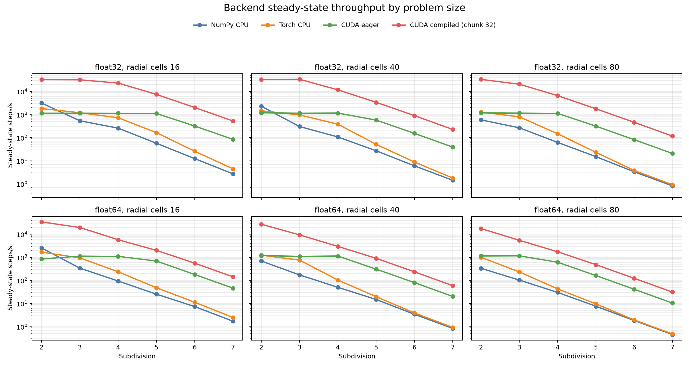
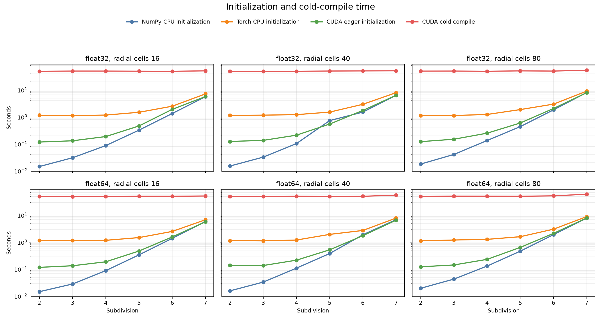
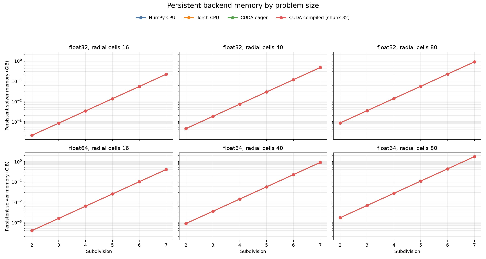

# Backend Performance Comparison

## Scope

This benchmark compares the same production `GeodesicFDTD.step()` workload on
the supported array backends and devices:

| Implementation | Device | Availability |
|---|---|---|
| NumPy | CPU | Required |
| PyTorch | CPU | Optional `pytorch` dependency |
| PyTorch | NVIDIA CUDA GPU | Requires a CUDA-enabled PyTorch runtime |
| PyTorch | Apple Metal (MPS) | Requires Apple silicon/macOS and an MPS-enabled runtime |

NumPy does not provide a GPU backend. Apple Metal is exposed through PyTorch's
`mps` device. MPS supports `float32` fields but not `float64` in this solver.

## Method

Each row uses identical mesh dimensions, radial cells, initial pseudo-random
fields, dtype, warm-up steps, measured steps, and repeat count. Setup and data
transfer are excluded from timed regions. CUDA and MPS are synchronized before
the timer stops. The primary metric is

$$
\text{throughput}=\frac{N_{\mathrm{steps}}}{t_{\mathrm{median}}}.
$$

Field memory is the sum of the four backend-native arrays
$E_r$, $E_t$, $H_r$, and $H_t$; framework caches and compiled graphs are not
included. Results from different dtypes or mesh sizes must not be placed in the
same comparison table.

## Reference run

The repository includes a 2026-08-14 eager `float32` reference run on Linux
x86-64 with NumPy 2.5.1 and PyTorch 2.13.0+cu130. The intentionally small
subdivision-2 workload exposes framework and kernel-launch overhead:

| Backend | Device | Steps/s | Relative to NumPy | Status |
|---|---|---:|---:|---|
| NumPy | CPU | 3022.4 | 1.00× | available |
| PyTorch | CPU | 1822.5 | 0.60× | available |
| PyTorch | CUDA | 1193.8 | 0.39× | available |
| PyTorch | Metal/MPS | — | — | unavailable on this host |

For this small grid, accelerator launch overhead exceeds the saved arithmetic;
the table must not be generalized to production subdivisions. The complete
machine-readable record is
[`artifacts/benchmarks/backend-matrix-float32.json`](../../artifacts/benchmarks/backend-matrix-float32.json).

## Compiled chunk sweep on CUDA

A 2026-08-15 follow-up measured the multi-step compiled graph introduced after
the eager reference run. The sweep retained the subdivision-2, 16-radial-cell,
`float32` workload, increased each measured interval to 512 steps, used 256
warm-up steps, and took the median of five repeats. Both counts are divisible
by every measured chunk size. Compilation and initial host-to-device transfers
remain outside the timed interval.

| Mode | Chunk | RTX 3060 steps/s | RTX 2060 SUPER steps/s |
|---|---:|---:|---:|
| NumPy CPU | — | 3119.8 | 3026.0 |
| CUDA eager | — | 1166.9 | 1133.6 |
| CUDA compiled | 1 | 5432.8 | 5387.4 |
| CUDA compiled | 16 | 29546.6 | 29933.5 |
| CUDA compiled | 32 | 36550.9 | 36877.7 |
| CUDA compiled | 64 | 34551.0 | 40768.2 |
| CUDA compiled | 128 | 43588.3 | 44715.2 |
| CUDA compiled | 256 | 45534.1 | 46663.8 |

The tested GPUs used PyTorch 2.13.0+cu130: an RTX 3060 (compute capability
8.6, 12 GB) and RTX 2060 SUPER (compute capability 7.5, 8 GB). Chunk 16 already
delivered 25.3–26.4 times the eager CUDA throughput and 9.5–9.9 times the NumPy
throughput. Chunk 256 produced the highest steady-state result, but only
improved 4–5% over chunk 128 while its first compilation took many minutes on
this host. Chunk 32 or 64 is therefore a more practical latency/throughput
choice for short and medium runs; chunk 128 or 256 is justified only when a
long run can amortize compilation.

The machine-readable records are
[`gpu-chunk-sweep-rtx3060.json`](../../artifacts/benchmarks/gpu-chunk-sweep-rtx3060.json)
and
[`gpu-chunk-sweep-rtx2060-super.json`](../../artifacts/benchmarks/gpu-chunk-sweep-rtx2060-super.json).
This benchmark has no source or observation consumer, so it isolates field-step
batching; it does not measure source-current transfer or observation sampling.

## Reproduction

Run an eager `float32` comparison:

```bash
python -m benchmarks.backend_matrix \
  --subdivision 2 \
  --radial-cells 16 \
  --steps 200 \
  --warmup-steps 20 \
  --repeats 3 \
  --dtype float32 \
  --output artifacts/benchmarks/backend-matrix-float32.json
```

Measure PyTorch compilation separately:

```bash
python -m benchmarks.backend_matrix \
  --subdivision 2 \
  --radial-cells 16 \
  --steps 200 \
  --warmup-steps 20 \
  --repeats 3 \
  --dtype float32 \
  --torch-compile \
  --torch-compile-chunk-size 8 \
  --output artifacts/benchmarks/backend-matrix-compiled-float32.json
```

Unavailable devices are recorded as `unavailable`, not silently omitted. Run
the same command on an Apple-silicon host to populate the MPS row and on an
NVIDIA host to populate CUDA. Hardware-specific results should remain JSON
artifacts; this document defines the stable comparison method rather than
presenting one machine's numbers as universal performance.

### Production-size scaling sweep

Use the isolated-worker scaling benchmark for crossover analysis across mesh
and radial sizes:

```bash
uv run --extra pytorch python -m benchmarks.backend_scaling \
  --subdivisions 2,3,4,5,6,7 \
  --radial-cells-list 16,40,80 \
  --dtypes float32,float64 \
  --implementations numpy,torch-cpu,cuda,mps \
  --modes eager,compiled \
  --steps 32 \
  --warmup-steps 32 \
  --repeats 3 \
  --torch-compile-chunk-size 32 \
  --output artifacts/benchmarks/backend-scaling.json
```

Each case runs in a fresh process. This makes process peak resident memory
comparable between cases and prevents an out-of-memory exit or timeout from
discarding the rest of the sweep. Results are written atomically after every
case and `--resume` is enabled by default. Compiled cases use a fresh
TorchInductor cache by default, so `compile_seconds` measures a cold first
chunk; pass `--no-cold-compile` to study cache reuse instead.

The scaling schema separates:

- `initialization_seconds`: solver construction, initial field upload, and
  device synchronization;
- `compile_seconds`: the first synchronized compiled chunk, including its
  execution, or `null` for eager cases;
- `steps_per_second`: median synchronized steady-state throughput after
  compilation and warm-up;
- `peak_process_memory_bytes`: the worker process high-water resident set;
- `peak_device_memory_bytes`: peak live CUDA tensor allocation when available;
- `persistent_memory_bytes`: fields, coefficients, geometry, and topology
  retained by the solver.

MPS does not support this solver's `float64` mode and is recorded as
`unavailable`. A worker that exceeds `--timeout-seconds` is recorded as
`timeout`, allowing large subdivision-7 cases to fail explicitly rather than
stalling or truncating the complete matrix.

## Production-size results

The 2026-08-15 Linux run used an RTX 3060 12 GB, PyTorch 2.13.0+cu130,
NumPy 2.5.1, 32 measured steps, 32 warm-up steps, and three repeats. All 108
available eager cases and all 36 cold-compiled CUDA cases completed. The 36 MPS
cases were recorded as unavailable because this host is not macOS.







Representative endpoints show the change in scale:

| Grid | Dtype | NumPy | Torch CPU | CUDA eager | CUDA compiled |
|---|---|---:|---:|---:|---:|
| subdivision 2, radial 16 | float32 | 3167.8 | 1833.9 | 1151.1 | 32614.7 |
| subdivision 4, radial 40 | float32 | 107.7 | 383.6 | 1166.5 | 11806.5 |
| subdivision 6, radial 80 | float32 | 3.3 | 3.8 | 82.1 | 465.1 |
| subdivision 7, radial 80 | float32 | 0.8 | 0.9 | 20.7 | 116.8 |
| subdivision 7, radial 80 | float64 | 0.5 | 0.5 | 10.5 | 31.1 |

Values are steady-state steps/s. Eager CUDA first becomes the fastest tested
backend at subdivision 3 for most configurations, but the exact crossover
depends on radial cells and dtype. For example, subdivision 2 with 80 radial
cells favors Torch CPU in `float32` and CUDA in `float64`.

Cold compilation took 49–60 seconds across the matrix. Compared with the best
eager backend, the estimated break-even run length ranges from about 174,000
steps for subdivision 2/radial 16/`float32` down to about 950 steps for
subdivision 7/radial 80/`float64`. Consequently, changing `device="auto"` from
GPU-first to a size-only rule is not justified: an optimal choice also needs
the requested dtype, compilation mode, expected step count, GPU model, and
whether a compiled graph is already cached. Keep automatic selection unchanged
until those inputs can be represented explicitly at the run-planning layer.

Complete records are
[`backend-scaling-eager-rtx3060.json`](../../artifacts/benchmarks/backend-scaling-eager-rtx3060.json)
and
[`backend-scaling-compiled-rtx3060.json`](../../artifacts/benchmarks/backend-scaling-compiled-rtx3060.json).

## Interpretation

- Compare eager and compiled PyTorch as separate experiments because compilation
  warm-up and graph caches change the cost model.
- Keep warm-up and measured step counts divisible by the compile chunk size to
  isolate the multi-step graph from the single-step remainder graph.
- Sweep chunk sizes on the target hardware; larger graphs reduce dispatch but
  cost more to compile and need not be faster for every grid.
- Use `float32` for a four-device comparison. Use a separate `float64` run for
  NumPy CPU, PyTorch CPU, and CUDA; MPS will be unavailable.
- Increase subdivision and step count for accelerator studies so kernel time
  dominates Python and launch overhead.
- Benchmark results measure performance only. Solver correctness remains owned
  by pytest and the analytic verification report.
