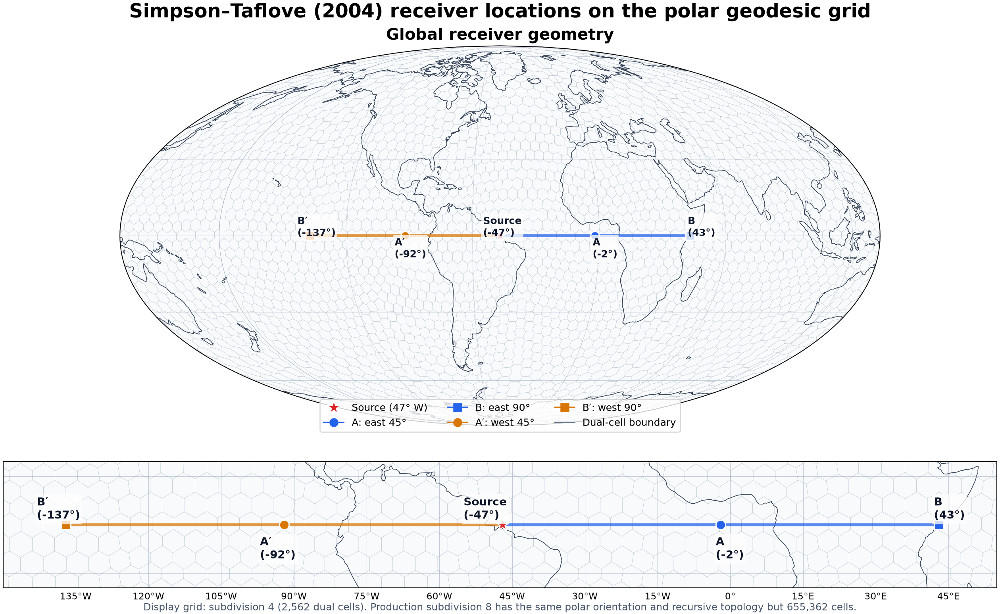
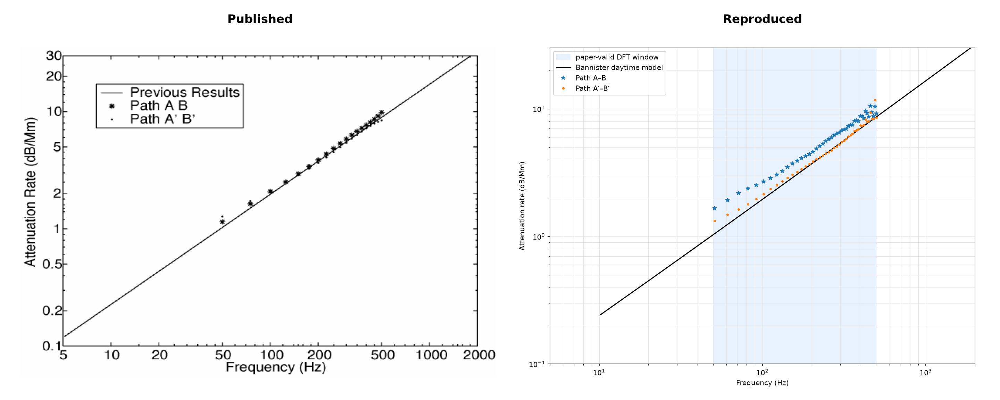

# Final Simpson–Taflove 2004 Verification Report

> Final quantitative status: **FAIL**

Production rerun completed on 2026-08-06 (Asia/Seoul).

Korean version: [한국어](simpson-taflove-2004.ko.md).

## Executive summary

This study tested whether the geodesic FDTD implementation reproduces the
time-domain receiver waveforms in Figure 7 and the frequency-dependent
attenuation in Figure 8 of Simpson and Taflove (2004). The audited
implementation reproduces the expected negative main pulse followed by an
overshoot and slow tail. It does not, however, satisfy the paper's strict
pointwise attenuation tolerances over the complete 50–500 Hz band.

The authoritative comparison uses a complete 35,000-step receiver trace and
the period-appropriate ETOPO5 reconstruction of the paper's unspecified
NOAA-NGDC Global Relief CD-ROM input. ETOPO5 cannot be conclusively identified
as the exact source selected by the authors. The rerun restores clearly visible
east–west asymmetry and follows the published time extent. It reproduces the negative
main pulse, positive overshoot, and persistent slow tail, but the relative
east/west peak ordering and separation do not reproduce the published panel.

For Figure 8, the same trace gives mean absolute attenuation errors of 1.104
dB/Mm on A–B and 0.242 dB/Mm on A′–B′. Their maximum absolute errors are 2.538
dB/Mm at 457.764 Hz and 3.258 dB/Mm at 488.281 Hz. The maxima exceed the
paper's reported ±0.5 dB/Mm A–B and ±1.0 dB/Mm A′–B′ agreement ranges.

| Verification target | Acceptance criterion | Current result | Status |
|---|---|---|---:|
| Figure 7 full time extent | Published plot extends to about 35,000 steps | Samples 0–35,000 | **PASS** |
| Figure 7 waveform morphology | Main negative pulse, positive overshoot, and slow tail | All three features reproduced | **PASS** |
| Figure 7 arrival ordering | A/A′ precede B/B′ | 7,491/7,721 versus 14,803/14,667 steps | **PASS** |
| Figure 7 east–west nonidentity | Both receiver pairs visibly differ | Relative RMS is 37.90%/30.46% | **PASS** |
| Figure 7 relative pair amplitudes | East/west peak ordering and visual separation match | Both peak orderings reverse; B′ is 32.4% larger than B | **FAIL** |
| Figure 7 exact plot reproduction | Time extent, morphology, and relative traces agree | Morphology agrees; relative traces do not | **FAIL** |
| Figure 8 A–B attenuation | Pointwise residual within ±0.5 dB/Mm | Maximum 2.538 dB/Mm | **FAIL** |
| Figure 8 A′–B′ attenuation | Pointwise residual within ±1.0 dB/Mm | Maximum 3.258 dB/Mm | **FAIL** |
| Complete Figures 7–8 reproduction | All applicable criteria pass | Morphological pass; quantitative fail | **FAIL** |

### Change from the previous fixed-depth production result

| Metric | Fixed-depth, 25,023 steps | ETOPO5, 35,000 steps | Change |
|---|---:|---:|---:|
| A/A′ relative RMS | 0.545% | 37.895% | required asymmetry restored, but excessive |
| B/B′ relative RMS | 0.463% | 30.458% | required asymmetry restored, but excessive |
| A / A′ peak step | 7,490 / 7,491 | 7,491 / 7,721 | 230-step split replaces near overlap |
| B / B′ peak step | 14,449 / 14,450 | 14,803 / 14,667 | 136-step split replaces near overlap |
| A–B attenuation MAE / maximum | 0.310 / 2.384 dB/Mm | 1.104 / 2.538 dB/Mm | worse |
| A′–B′ attenuation MAE / maximum | 0.286 / 1.092 dB/Mm | 0.242 / 3.258 dB/Mm | mean better; maximum worse |
| Production wall time | 2,002.5 s | 2,677.5 s | 40% more steps in 33.7% more time |

The complete time axis and visible material-driven asymmetry are substantive
Figure 7 improvements. They also reveal that the reconstructed relief and
representative conductivity profile over-separate the receiver pairs and
reverse the published peak ordering. Figure 8 retains the same overall fail:
the west mean improves, but both pointwise maxima remain outside tolerance.

The investigation ruled out floating-point precision, FFT zero-padding, DFT
cutoff selection, and source-plane rounding as primary causes.
Uniform-model and azimuthal studies show that spatial dispersion is real and
convergent. At subdivision 8, directional anisotropy is no more than 0.0867%
over the evaluated band, so the remaining absolute residual also includes
isotropic spatial dispersion and
differences in the finite radial and crustal models.

New CUDA `float64` physics diagnostics further narrow the material-driven
Figure 7 mismatch. They rule out the PyTorch backend, compilation, diagnostic
logging, non-finite fields, and larger bulk east-path conductive loss. At
subdivision 5, the anomalously weak B trace instead comes from one dominant
receiver-support cell whose ETOPO5 surface is 30 m above sea level even though
the exact B coordinate is 207 m below sea level. Clamping positive relief only
as a diagnostic restores the B/B′ pair, which identifies coarse horizontal and
vertical material aliasing at the coastline. This is evidence for conservative
material integration, not justification for removing real topography. The
resulting dual-cell area average was implemented and tested at both
subdivisions 5 and 8. It reduces point-sampling sensitivity but does not restore
the weak level-5 B receiver and worsens the level-8 A–B maximum attenuation
error from 2.538 to 5.339 dB/Mm. The subdivision-8 B support is already 88.9%
ocean by interpolation weight, so coastline aliasing is not the dominant cause
of the final high-frequency Figure 8 residual.

A coupled radial/temporal refinement study then separated the finite 5 km
radial spacing from horizontal dispersion. Halving only the time step changes
the uniform level-5 mean phase-velocity error by `5.05e-8 c`, excluding time
integration error. Halving radial spacing does not give consistent improvement:
the mean error improves 5.2% at subdivision 5 but worsens 8.5% at subdivision
6. In contrast, horizontal refinement from subdivision 5 to 6 reduces the mean
error by 53.3% on the 5 km radial grid and 46.5% on the 2.5 km grid. A costly
level-8 radial rerun was therefore rejected by the screening gate. The next
screen was therefore horizontal refinement, not a smaller time step or
uniformly finer radial grid.

The direct horizontal level-7 and level-8 runs confirm that refinement removes
directional error at approximately second order: mean azimuthal spread falls
from 0.1157% to 0.02422%. The Bannister MAE falls more slowly, from 0.01870 c
to 0.01418 c. Three-grid extrapolation predicts a level-9 MAE of 0.01294 c and
a nonzero horizontal-continuum limit of 0.01247 c. Level 9 was not run because
its 13.40 GiB analytic storage lower bound already exceeds the installed 12
GiB GPU; the measured level-8 peak projects to approximately 21.3 GiB. Grid
refinement is therefore an effective correction for anisotropy and part of the
phase mismatch, but it is not presently supported as a complete explanation
of the paper mismatch.

## Scope and acceptance criteria

The target study is:

J. J. Simpson and A. Taflove, “Three-dimensional FDTD modeling of impulsive
ELF propagation about the entire Earth-sphere,” *IEEE Transactions on Antennas
and Propagation*, 52(2), 443–451, 2004,
[doi:10.1109/TAP.2004.823953](https://doi.org/10.1109/TAP.2004.823953).

The verification covers:

- Figure 7 waveform shape and receiver arrival behavior at A, A′, B, and B′;
- Figure 8 attenuation from the A–B and A′–B′ spectral ratios;
- phase velocity and arrival-time convergence in a laterally uniform model;
- sensitivity to precision, FFT length, DFT cutoff, surface relief, crustal
  profiles, source staggering, and horizontal grid direction;
- subdivisions 6–8, from 40,962 to 655,362 surface cells.

The strict quantitative decision is based on the pointwise Figure 8 residual:

| Path | Required agreement over evaluated frequencies |
|---|---:|
| A–B | within ±0.5 dB/Mm |
| A′–B′ | within ±1.0 dB/Mm |

Figure 7 is assessed qualitatively because the paper does not specify the
source-current amplitude. The computed traces use a 1 A normalization;
spectral attenuation ratios do not depend on that amplitude.

## Reference equations and evaluation frequencies

Figure 8's “Previous Results” curve is the daytime model from P. R. Bannister,
“ELF Propagation Update,” *IEEE Journal of Oceanic Engineering*, OE-9(3),
179–188, 1984,
[doi:10.1109/JOE.1984.1145609](https://doi.org/10.1109/JOE.1984.1145609).

The final attenuation reference evaluates Bannister equations (5), (7), and
(8) with `H = 70 km` and `ξ₀ = ξ₁ = 1 / 0.3 km`. This produces approximately
1.5 dB/Mm at 75 Hz and 16.6 dB/Mm at 1000 Hz, as reported by Bannister. The
earlier manually fitted curve, `0.0265 f^0.938`, is retained only as historical
context and is not used for the final decision.

The comparison uses bins 5–49 of the paper-compatible 32,768-point DFT with
`Δt = 3 μs`: 45 fixed frequencies from 50.862630 to 498.453776 Hz. Results from
a 65,536-point zero-padded transform are resampled at these same frequencies.
Phase velocity is compared with Bannister equation (4).

## Simulation configuration

| Item | Value |
|---|---:|
| Radial domain | −100 to +100 km relative to sea level |
| Radial cells | 40 at 5 km spacing |
| Time step | 3.0 μs |
| Production steps / samples | 35,000 / 35,001 |
| Source position | equator, 47° W |
| Source extent | 5 km vertical current element |
| Source centroid | 2.5 km, linearly staggered between 0 and 5 km `Er` planes |
| Gaussian `1/e` full width | `480 Δt` |
| Gaussian center | `960 Δt` |
| A / A′ distance | 45° east / west from the source |
| B / B′ distance | 90° east / west from the source |
| Ionosphere reference height | 70 km |
| Ionosphere scale height | `1/0.3 km` (3.333… km) |
| Surface grid | subdivision 8, polar orientation, 655,362 cells |
| Material | ETOPO5 relief reconstruction + Figure 6 oceanic/continental profiles |
| Deep lithosphere resistivity | 500 Ω·m |
| DFT window | adaptive post-overshoot zero crossing |
| Production backend | PyTorch compiled update on CUDA |
| Production precision | float64 |
| ETOPO5 SHA-256 | `471d3dd534144aa9a6551fe3e76320a06a45dade6fd8d45f7d6ad981d59f93c3` |
| Production implementation revision | `ec9583a` |
| Trace SHA-256 | `147b4756b11c25f11b63825a381afe9fc17e747dbc2a33910c7a36060946d5e1` |
| Wall time | 2,677.5 s |

Surface cell counts are 40,962, 163,842, and 655,362 for subdivisions 6, 7,
and 8. Subdivision 7 matches the paper's 163,842 cells per radial plane.

## Receiver geometry

The requested receiver coordinates lie on the equator at 45° and 90° east or
west of the 47° W source. The exact coordinates are drawn over a subdivision-4
version of the same polar-oriented recursive dual grid so that the cells remain
visible; the production subdivision-8 grid has 655,362 cells and is visually
indistinguishable from a solid fill at this scale. Markers are not snapped to
display-grid cell centers.



## Published-plot comparison

The left-hand panels below are cropped from page 450 of the
[author-hosted paper PDF](https://my.ece.utah.edu/~simpson/Papers/Paper2.pdf).
The published panels are © 2004 IEEE and are excerpted here for
source-attributed technical comparison.
The right-hand panels were regenerated with the current analysis code from the
2026-08-06 subdivision-8 CUDA `float64` ETOPO5 receiver trace that explicitly
uses the Reference 23 deep-rock value and Reference 24 ionosphere profile. The
Figure 8 reproduction uses Bannister's source equations and the final fixed
comparison frequencies, not the deprecated plot-fit reference.


The reproduced Figure 7 waveforms have the same primary sequence as the
published plots: a quiet pre-arrival interval, a sharp negative main pulse, a
positive overshoot, and a decaying slow tail across the complete 35,000-step
axis. The level-8 negative peaks occur at steps 7,491/7,721 for A/A′ and
14,803/14,667 for B/B′. The values at step 35,000 remain negative at
−0.02408/−0.02560 μV/m and −0.03277/−0.03189 μV/m, respectively, with tail
magnitudes comparable to the published panels after relative scaling.
Absolute amplitudes are not an acceptance criterion because the paper does not
state its source-current amplitude; the reproduction uses a 1 A normalization.

ETOPO5 restores the missing east–west separation, but not its quantitative
pattern. The reproduced west peaks are 3.7% and 32.4% larger in magnitude than
the east peaks at the quarter and half paths, whereas the published solid east
curves are visually slightly deeper than the dashed west curves. The Figure 7
status is therefore a qualitative morphology pass and an exact-plot fail.



The reproduced Figure 8 points follow the same overall attenuation trend, but
the ETOPO5 east path is systematically more attenuating than the Bannister
daytime curve. The upper-band oscillation gives final subdivision-8 maximum
residuals of 2.538 and 3.258 dB/Mm. Thus the side-by-side plot supports the
same conclusion as the scalar metrics: both strict pointwise criteria fail.

## Investigation history

### Baseline and precision check

The initial level-7 Apple MPS `float32` run used the earlier 74 km reference
height, 6 km scale height, fixed paper cutoffs, and a Natural Earth land mask.
It reproduced the broad pulse and slow-tail morphology but arrived late and
gave attenuation MAEs of 6.146 dB/Mm on A–B and 5.991 dB/Mm on A′–B′.

An otherwise matched CUDA `float64` run produced 6.148 and 5.992 dB/Mm. The
changes of 0.002 and 0.001 dB/Mm are negligible relative to the residual, so
insufficient floating-point precision was rejected as the cause.

### Ionosphere and DFT-window correction

The earlier ionosphere was too gradual, delaying the main pulse and removing
the positive overshoot and zero crossing needed by the paper's DFT procedure.
Using a 70 km reference height and 3.33 km scale height restored that waveform
structure. Each computed trace is now truncated at its own post-overshoot zero
crossing rather than at a cutoff copied from a waveform with a different
arrival time.

At corrected level 7, the negative peaks moved from steps 8,760 and 18,222 to
approximately 7,513 and 14,459 for A and B. The authoritative fixed-frequency
attenuation MAEs fell from about 6 dB/Mm to 0.387 and 0.399 dB/Mm. This was the
largest improvement in the verification campaign.

### Authoritative attenuation convergence

The following table supersedes attenuation metrics in older automatically
generated reports that used the deprecated plot-fit reference. Every value
below uses Bannister's source equations and the same 45 fixed frequencies.

| Subdivision | Surface cells | A–B MAE / maximum | Maximum frequency | A′–B′ MAE / maximum | Maximum frequency |
|---:|---:|---:|---:|---:|---:|
| 6 | 40,962 | 0.681 / 2.282 dB/Mm | 396.729 Hz | 0.696 / 2.420 dB/Mm | 447.591 Hz |
| 7 | 163,842 | 0.387 / 2.708 dB/Mm | 488.281 Hz | 0.399 / 2.753 dB/Mm | 488.281 Hz |
| 8, previous | 655,362 | 0.274 / 1.218 dB/Mm | 478.109 Hz | 0.275 / 1.225 dB/Mm | 478.109 Hz |
| 8, fixed-depth polar control | 655,362 | 0.310 / 2.384 dB/Mm | 488.281 Hz | 0.286 / 1.092 dB/Mm | 478.109 Hz |
| 8, ETOPO5 production | 655,362 | 1.104 / 2.538 dB/Mm | 457.764 Hz | 0.242 / 3.258 dB/Mm | 488.281 Hz |

The current ETOPO5 west-path mean is lower than both earlier level-8 results,
but its pointwise maximum is larger. The east path is systematically displaced
and has the largest mean of the level-8 cases. Material fidelity therefore
improves the time-domain asymmetry without improving Figure 8 as a whole.
Neither path changes verdict.

The audited level-8 ETOPO5 run completed 35,000 steps in 2,677.5 seconds on an
NVIDIA GeForce RTX 3060. The lower peak memory of the ordered dual-circulation
kernel avoided the former 10.1 GB compiled-preflight allocation. Its adaptive
cutoffs were 23,462, 22,676, 24,491, and 24,550 samples for A, A′, B, and B′.

## Uniform-model phase and arrival convergence

Laterally varying surface materials were removed to separate grid dispersion
from natural east–west asymmetry. Complex spectra were formed as
`A·conj(B)` and `A′·conj(B′)`, unwrapped from DC, and converted to phase
velocity over the additional 45° great-circle distance.

| Subdivision | A–B phase MAE / maximum | A′–B′ phase MAE / maximum | Peak velocity A–B / A′–B′ | Quarter-arc east–west RMS |
|---:|---:|---:|---:|---:|
| 6 | 0.0357 / 0.0941 c | 0.0388 / 0.1034 c | 0.8040 / 0.8025 c | 1.500e-2 |
| 7 | 0.0189 / 0.0504 c | 0.0195 / 0.0521 c | 0.8007 / 0.8003 c | 3.892e-3 |
| 8 | 0.0142 / 0.0276 c | 0.0143 / 0.0280 c | 0.7994 / 0.7993 c | 1.014e-3 |

The observed orders for maximum phase-velocity error are 0.90 and 0.87 on
A–B, and 0.99 and 0.90 on A′–B′, for level 6→7 and 7→8. The quarter-arc
east–west RMS difference converges at orders 1.95 and 1.94. Thus the absolute
high-frequency phase error converges at approximately first order, while
uniform-model directional symmetry is restored at approximately second order.
The mean phase-error order is not yet asymptotic: it drops from about one for
level 6→7 to about 0.4 for level 7→8.

## NOAA ETOPO5 and crustal-profile check

The paper identifies its relief source only as the NOAA-NGDC “Global Relief
CD-ROM” in Reference 22. It does not name ETOPO5, a source filename, the
edition, or the preprocessing convention. ETOPO5 is a 1993 NOAA-NGDC global
relief product of the appropriate period and is used here as a reproducible
reconstruction, not as a confirmed identical source.

The archived big-endian NOAA-NGDC `ETOPO5.DAT` input contains a
2,160×4,320 cell-centered, five-arc-minute elevation and bathymetry grid. The
loader verifies its 18,662,400-byte size and SHA-256 digest
`471d3dd534144aa9a6551fe3e76320a06a45dade6fd8d45f7d6ad981d59f93c3`,
then bilinearly samples it at each geodesic material point.

[Hermance (1995)](https://doi.org/10.1029/RF001p0190) is the source of the
bounded conceptual section reused in the paper's Figure 6, not a distributable
global 3-D conductivity data set. The figure labels 0.3 Ω·m seawater,
≥500 Ω·m shallow rock, a ≤200 Ω·m oceanic intermediate region, and
≤500 Ω·m deep rock. The implementation uses the labeled boundary values,
giving a representative 500/200/500 Ω·m profile. Its geographically
unspecified local ≤5/≤10 Ω·m conductors are not promoted to global layers.

An audit with the supplied source exposed an error in the former profile: its
50 Ω·m value had no corresponding global region in Figure 6 but was applied
everywhere below 60 km. Correcting that deep value to 500 Ω·m changes the
controlled subdivision-5 CUDA `float64` receiver traces by only `2.34e-16`
relative RMS. The attenuation metrics are equal at the reported precision
because the corrected material lies many ELF skin depths below the surface.

The authoritative subdivision-8, 35,000-step CUDA `float64` run was then
repeated with the same corrected value. Its receiver fields differ from the
former production trace by `7.69e-16` relative RMS, with a maximum absolute
difference of `8.74e-22 V/m`. Peak steps, adaptive DFT cutoffs, Figure 8
metrics, and every PASS/FAIL decision remain unchanged. Figures 7 and 8 were
rendered again from this trace and are pixel-identical to the former raw plots.

| Deep value | A–B / A′–B′ MAE | A–B / A′–B′ maximum | B / B′ normalized peak |
|---:|---:|---:|---:|
| 50 Ω·m, former | 5.04682 / 2.19317 dB/Mm | 7.34090 / 6.21746 dB/Mm | 0.040361 / 0.407856 |
| 500 Ω·m, corrected | 5.04682 / 2.19317 dB/Mm | 7.34090 / 6.21746 dB/Mm | 0.040361 / 0.407856 |

[Bannister (1985)](https://doi.org/10.1029/RS020i004p00977) gives the daytime
single-scale-height profile as
`σ(z)/ε0 = 2.5×10⁵ exp[(z−H)/ζ₀]`. The implementation now encodes
`ζ₀ = 1/0.3 km` exactly instead of rounding it to 3.33 km and has a regression
test for `σ(H) = 2.5×10⁵ ε0`. The final production commands already supplied
the exact value explicitly. The complete subdivision-8 rerun therefore also
confirms that this default correction does not change the production curves.

| Level-7 material | Quarter-arc east–west RMS | A / A′ peak steps | A–B / A′–B′ attenuation MAE | A–B / A′–B′ maximum error |
|---|---:|---:|---:|---:|
| Uniform | 0.00389 | 7,514 / 7,510 | 0.412 / 0.427 dB/Mm | 1.838 / 1.890 dB/Mm |
| ETOPO5 + Figure 6 profiles | 0.08220 | 7,546 / 7,589 | 0.387 / 0.590 dB/Mm | 1.747 / 2.020 dB/Mm |

The sampled level-7 relief ranges from −9.69 to +6.30 km and is 28.9% land.
Real relief and separate oceanic/continental profiles split the A/A′ peaks by
43 steps and increase the quarter-arc east–west RMS by a factor of about 21.
This reproduces material-driven directional asymmetry, but it does not bring
the pointwise attenuation residuals inside the paper's ranges.

## TensorBoard physics diagnosis

The diagnostic runs use the same solver update as the verification workflow
and perform reductions on the CUDA device. They record field norms, finite
flags, a positive discrete staggered-field energy, conductive power by radial
region and east/west equatorial corridor, source timing, receiver values,
throughput, and CUDA memory. Exact sampled values are also written to
`physics-diagnostics.npz`; TensorBoard is only the interactive view. The
staggered energy is a comparison diagnostic rather than a claim of an exact
same-time conserved Hamiltonian.

### Backend and observer controls

The backend controls used a subdivision-3 uniform model for 15,000 steps.
The logging-neutrality control used the actual TensorBoard recorder every 512
steps.

| Check | Numerical result | Consequence |
|---|---:|---|
| NumPy CPU vs CUDA eager | Final `Er`, `Et`, `Hr`, and `Ht` arrays exactly equal; trace relative L2 `4.15e-17` | CUDA eager arithmetic is not the cause |
| NumPy CPU vs CUDA compiled | Trace relative L2 `6.52e-15`; `Er`/`Et`/`Ht` relative L2 about `1e-14` | Compilation changes only roundoff-scale values |
| Compiled `Hr` control | Maximum absolute difference `1.84e-24 A/m`; reference norm `1.26e-23 A/m` | A large relative ratio in this ideally absent mode is numerically insignificant |
| Logged vs unlogged CUDA compiled | Receiver traces and all four final fields are bitwise equal | TensorBoard observation does not perturb the simulation |
| Finite-field flags | All sampled fields finite in every 35,000-step material run | Instability and NaN/Inf propagation are excluded |

### Energy and conductive-loss localization

The material controls used subdivision 5, CUDA `float64`, 35,000 steps, and
otherwise identical source, ionosphere, radial grid, and solver settings. The
global integrals were sampled every 256 steps. Corridor ratios came from
independent 512-step-cadence reruns and cover latitude ±10° from 5° to 90°
east or west of the source, excluding the common source neighborhood.

| Material | Global conductive loss | Atmosphere share | East/west corridor loss | B / B′ negative peak |
|---|---:|---:|---:|---:|
| Uniform | 0.62843 mJ | 88.43% | 1.0452 | −0.404 / −0.403 μV/m |
| Natural Earth | 0.62819 mJ | 88.69% | 1.0450 | −0.414 / −0.415 μV/m |
| ETOPO5 + Figure 6 profiles | 0.62714 mJ | 88.88% | 1.0279 | −0.040 / −0.407 μV/m |

All three global losses agree within 0.21%, and ETOPO5 has the most symmetric
corridor-loss ratio despite its tenfold B suppression. Near the B arrival at
step 15,360, the ETOPO5 east corridor contains `5.28e-8 J`, 28% more sampled
field energy than the west corridor's `4.12e-8 J`. The weak B value therefore
does not represent a pulse removed by excessive integrated east-path loss.

### Receiver support and coastline aliasing

At the exact B coordinate, 43° E on the equator, ETOPO5 gives −207 m. The
subdivision-5 barycentric receiver nevertheless assigns 88.8869% of its weight
to a neighboring dual vertex at 42.75° E whose sampled surface is +30 m. At
the B peak, that land vertex is nearly zero while the two ocean support
vertices are both about −0.36 μV/m. The anomaly is thus not destructive
interpolation cancellation: the dominant support degree of freedom has been
assigned rock at the sea-level `Er` plane.

| Subdivision | B interpolation weight assigned to land | Dominant support surface |
|---:|---:|---:|
| 5 | 88.8869% | +30.00 m, land |
| 6 | 77.7772% | +30.00 m, land |
| 7 | 55.5555% | +30.00 m, land |
| 8 | 11.1111% | −246.75 m, ocean |

Refinement moves the dominant support into the ocean and reduces the land
weight monotonically. A subdivision-5 sensitivity run retained all bathymetry
but replaced only positive surface elevations with zero. It changed B/B′
from −0.040/−0.407 to −0.414/−0.414 μV/m and reduced the half-path
east/west RMS from 8.649 to 0.00556. This deliberately nonphysical clamp is a
cause-isolation control, not a proposed terrain model.

At subdivision 8, an area-weighted static audit of the 5°–90° corridors finds
44.96% land east of the source and 30.27% west. Shallow ocean occupies 5.02%
east and 6.05% west, so shallow-ocean sampling alone has the wrong sign to
explain the greater east-path attenuation. The evidence supports two separate
remaining effects: point-sampled topography can overstate the influence of
coastal land in a 5 km radial cell, while the 400–500 Hz residual also contains
the independently measured isotropic spatial dispersion and differences from
the paper's grid and material data.

### Conservative dual-cell material experiment

An opt-in `dual-cell` support now area-averages `Er` material properties over
the actual polygon associated with each radial degree of freedom. Every dual
cell is partitioned into five or six disjoint spherical wedges. The method
samples relief once at each normalized wedge centroid and uses the exact wedge
solid angle as its weight. The weights close to one within `2e-12`, and a
uniform-material regression is identical to point support. This is a
conservative first-order quadrature, not a conformal split of the field degree
of freedom at the coastline.

At subdivision 5, only 15.72% of the dominant B cell's wedge area is strictly
above sea level. Area averaging therefore changes its sea-level material from
pure rock (`0.002 S/m`, `εr = 10`) to `3.143e-4 S/m`, `εr = 2.415` without
altering the relief. That reduction is still strongly conductive at the
3 μs time step and cannot represent separate land and ocean fields in one
`Er` degree of freedom.

| Subdivision-5 support | B / B′ negative peak | Half-path east/west RMS | Global sampled loss | East/west corridor loss |
|---|---:|---:|---:|---:|
| Point `Er`, point `Et` | −0.0402 / −0.4065 μV/m | 8.649 | 0.61005 mJ | 1.0279 |
| Dual-cell `Er`, point `Et` | −0.0397 / −0.4043 μV/m | 8.716 | 0.60968 mJ | 1.0009 |
| Dual-cell `Er`, fractional edge-diamond `Et` | −0.0343 / −0.3347 μV/m | 8.637 | 1.54744 mJ | 1.0760 |

The `Er` area average makes pathwise loss more symmetric but leaves the B
suppression unchanged. Adding the existing fractional radial-interface and
edge-diamond `Et` averages reduces both half-path amplitudes and more than
doubles sampled global loss, so that combination is also rejected as a
Figure 7 correction.

The complete subdivision-8 CUDA `float64` control retained point `Et` support
and changed only `Er` from point to dual-cell averaging. Its dominant B support
cell, carrying 88.8889% receiver weight, has six ocean wedge samples; the
remaining 11.1111%-weight cell is 68.11% land by wedge area. The 35,000-step
run completed in 2,713.7 seconds with finite fields throughout.

| Subdivision-8 metric | Point `Er` production | Dual-cell `Er` control | Change |
|---|---:|---:|---:|
| A/A′ relative RMS | 37.895% | 38.247% | worse |
| B/B′ relative RMS | 30.458% | 30.369% | negligible improvement |
| A / A′ peak step | 7,491 / 7,721 | 7,492 / 7,724 | +1 / +3 steps |
| B / B′ peak step | 14,803 / 14,667 | 14,806 / 14,672 | +3 / +5 steps |
| A–B attenuation MAE / maximum | 1.104 / 2.538 dB/Mm | 1.160 / 5.339 dB/Mm | worse |
| A′–B′ attenuation MAE / maximum | 0.242 / 3.258 dB/Mm | 0.235 / 1.591 dB/Mm | better, still FAIL |

The west attenuation maximum improves but remains above its 1.0 dB/Mm limit,
while the east maximum more than doubles. Figure 7 separation is effectively
unchanged. The dual-cell method is therefore retained as an explicit material
integration option but is not adopted as the production verification default.
The negative result rules out point-to-area coefficient averaging as the
missing Figure 7/8 correction. A true coastal subcell method would need
separate field freedom on the two sides of the coastline; for the final
level-8 frequency residual, reducing the independently observed isotropic
spatial dispersion has higher priority because the dominant B support is
already entirely ocean.

## Staggered source-placement check

The paper's 5 km vertical source is centered at 2.5 km, halfway between this
solver's 0 and 5 km staggered `Er` planes. The corrected implementation
combines three horizontal barycentric weights with 0.5/0.5 radial
cloud-in-cell weights, preserving both the exact 2,500 m centroid and total
current over six `Er` degrees of freedom.

| Placement | Represented centroid | Trace RMS change | Quarter-arc east–west RMS | A–B / A′–B′ MAE | A–B / A′–B′ maximum |
|---|---:|---:|---:|---:|---:|
| Nearest plane | 0 m | reference | 0.082197 | 0.387016 / 0.589615 | 1.7465 / 2.0198 dB/Mm |
| Linear staggered | 2,500 m | 5.496e-4 | 0.082151 | 0.386878 / 0.589475 | 1.7458 / 2.0160 dB/Mm |

All main-pulse peak steps are unchanged. Correct source placement removes a
real geometric error but has negligible effect on the remaining validation
residual.

## Geodesic-grid directional dispersion

The existing geodesic dual grid was retained. In a laterally uniform model,
phase velocity was measured between matched 45° and 90° receivers along 12
azimuths separated by 30°. The continuum solution is azimuth-independent, so
deviation from the azimuthal mean isolates grid directionality.

All four runs used 25,023 steps, the same 45 fixed DFT frequencies, compiled
PyTorch on CUDA, and `float64`. Levels 5–6 are the radial-screen baselines;
levels 7–8 were rerun at revision `85d311e` so their raw traces and
per-frequency values use the corrected solver. The azimuthal spread is the
peak-to-peak phase-velocity difference divided by the azimuthal mean. The
Bannister columns compare that mean with equation (4), so they contain both
horizontal spatial dispersion and finite radial/model error. Runtime values
come from the available RTX 3060 and RTX 2060 SUPER and are not cross-device
scaling measurements.

| Subdivision | Surface cells | Runtime | DFT cutoff range | Mean spread | Maximum spread (frequency) | Relative RMS | Bannister MAE / maximum (maximum frequency) |
|---:|---:|---:|---:|---:|---:|---:|---:|
| 5 | 10,242 | 33.0 s | 21,407–21,657 | 5.0419% | 13.7591% (498.454 Hz) | 2.0896% | 0.07537 / 0.17966 c (366.211 Hz) |
| 6 | 40,962 | 118.3 s | 21,491–21,581 | 0.4671% | 1.3342% (498.454 Hz) | 0.1766% | 0.03523 / 0.09466 c (498.454 Hz) |
| 7 | 163,842 | 467.8 s | 21,508–21,561 | 0.1157% | 0.4789% (498.454 Hz) | 0.04700% | 0.01870 / 0.04920 c (498.454 Hz) |
| 8 | 655,362 | 1,580.6 s | 21,513–21,556 | 0.02422% | 0.08662% (488.281 Hz) | 0.01001% | 0.01418 / 0.02804 c (488.281 Hz) |

Assuming that each subdivision halves the characteristic horizontal spacing,
the observed orders for mean spread are 3.43, 2.01, and 2.26 for levels 5→6,
6→7, and 7→8. The corresponding maximum-spread orders are 3.37, 1.48, and
2.47; the relative-RMS orders are 3.56, 1.91, and 2.23. Level 5 is outside the
asymptotic regime at high frequency. Levels 6–8 are consistent with
approximately second-order directional convergence despite late-window
variation in the maximum statistic.

Bandwise mean and maximum spreads make the under-resolution threshold
explicit:

| Subdivision | 50–200 Hz mean / maximum | 200–375 Hz mean / maximum | 375–500 Hz mean / maximum |
|---:|---:|---:|---:|
| 5 | 0.4518 / 1.1312% | 3.3448 / 7.1391% | 12.5575 / 13.7591% |
| 6 | 0.09297 / 0.20978% | 0.42829 / 0.70535% | 0.94942 / 1.33419% |
| 7 | 0.02420 / 0.05126% | 0.09707 / 0.15903% | 0.24561 / 0.47887% |
| 8 | 0.004879 / 0.01104% | 0.02096 / 0.03658% | 0.05081 / 0.08662% |

Above 375 Hz, the mean/maximum spread falls from 0.949%/1.334% at level 6 to
0.0508%/0.0866% at level 8. The sharp level-5 branch above approximately 400
Hz is therefore an under-resolution effect, and ordinary grid refinement
effectively removes the directional component.

Reanalysis with one common minimum, median, or maximum adaptive cutoff for
every azimuth gives mean-spread ranges of 0.4678–0.4680%, 0.1154–0.1162%, and
0.02422–0.02452% at levels 6, 7, and 8. Their maximum-spread ranges are
1.288–1.334%, 0.4617–0.4969%, and 0.08621–0.08724%. The observed convergence is
therefore not an artifact of direction-dependent DFT window selection.

Directional convergence is not the same as convergence to Bannister. The
Bannister MAE decreases only by factors corresponding to orders 1.10, 0.91,
and 0.40 from levels 5→6→7→8. A three-grid fit of
`E(h) = E∞ + C h^p` gives the following separation of the horizontal
discretization term from the residual limit:

| Frequency band | Level 6 MAE | Level 7 MAE | Level 8 MAE | Fitted `p` | `E∞` | Predicted level 9 MAE |
|---|---:|---:|---:|---:|---:|---:|
| 50–500 Hz | 0.03523 c | 0.01870 c | 0.01418 c | 1.87 | 0.01247 c | 0.01294 c |
| 375–500 Hz | 0.06190 c | 0.02771 c | 0.01766 c | 1.77 | 0.01349 c | 0.01471 c |
| 400–500 Hz | 0.06463 c | 0.02921 c | 0.01797 c | 1.66 | 0.01275 c | 0.01441 c |

This extrapolation uses only three horizontal resolutions and is not a direct
level-9 result. It nevertheless predicts diminishing returns and a nonzero
approximately 0.0125–0.0135 c limit with the present 5 km radial and analytic
material model. Thus refinement can remove nearly all grid anisotropy and a
large part of the phase mismatch, but the available evidence does not support
the claim that it alone will produce exact agreement with the paper.

A direct level-9 CUDA `float64` run was gated by memory rather than attempted
to failure. The estimates count all four fields and four electric-update
coefficient arrays as the analytic lower bound. Measured peaks additionally
include topology, Hodge factors, observations, and compiled temporaries.

| Subdivision | Surface cells | Analytic persistent lower bound | Measured/projected CUDA peak | Status |
|---:|---:|---:|---:|---|
| 7 | 163,842 | 0.84 GiB | 1.44 GiB measured | Direct run complete |
| 8 | 655,362 | 3.35 GiB | 5.33 GiB measured | Direct run complete |
| 9 | 2,621,442 | 13.40 GiB | approximately 21.3 GiB projected | Not run: installed GPUs provide at most 12 GiB |

The directional CLI now accepts subdivision 9 so a CUDA accelerator with at
least approximately 24 GiB can replace the extrapolation with a direct result.
The geodesic and merged latitude–longitude grids still need not have identical
finite-resolution dispersion relations, but both should approach their
respective continuum models under refinement.

## Radial and isotropic-dispersion separation

The post-audit screen used the laterally uniform model and the same twelve
azimuths. A radial refinement factor of two changes 40 cells at 5 km to 80
cells at 2.5 km. CFL consistency requires `Δt` to change from 3 to 1.5 μs;
steps and DFT size consequently double to preserve the 75.069 ms observation
time and 98.304 ms transform window. Source center and width remain fixed in
physical time, and all cases are evaluated at the same 45 frequencies.

| Subdivision | Radial spacing | `Δt` | Mean / maximum phase error | Mean / maximum azimuth spread | Peak-arrival velocity spread |
|---:|---:|---:|---:|---:|---:|
| 5 | 5 km | 3 μs | 0.07537 / 0.17966 c | 5.0419% / 13.7591% | 0.5294% |
| 5, temporal control | 5 km | 1.5 μs | 0.07537 / 0.17966 c | 5.0419% / 13.7591% | 0.5294% |
| 5 | 2.5 km | 1.5 μs | 0.07145 / 0.16188 c | 7.1384% / 19.0672% | 0.5477% |
| 6 | 5 km | 3 μs | 0.03523 / 0.09466 c | 0.4671% / 1.3342% | 0.2454% |
| 6 | 2.5 km | 1.5 μs | 0.03821 / 0.09096 c | 1.4074% / 10.8257% | 0.2367% |

The temporal control differs from the level-5 baseline by only `5.05e-8 c`
in mean error and `8.48e-7 c` in maximum error. It also reproduces the
azimuth-spread values to approximately `3e-7` relative. Temporal dispersion at
3 μs is therefore negligible over this band.

| Subdivision / radial spacing | 50–200 Hz MAE / maximum | 200–375 Hz MAE / maximum | 375–500 Hz MAE / maximum |
|---|---:|---:|---:|
| 5 / 5 km | 0.02707 / 0.04914 c | 0.11099 / 0.17966 c | 0.08451 / 0.17792 c |
| 5 / 2.5 km | 0.03034 / 0.05189 c | 0.10700 / 0.16188 c | 0.07241 / 0.15571 c |
| 6 / 5 km | 0.01442 / 0.02084 c | 0.03319 / 0.04498 c | 0.06190 / 0.09466 c |
| 6 / 2.5 km | 0.01764 / 0.02316 c | 0.03546 / 0.04825 c | 0.06555 / 0.09096 c |

Radial refinement improves the level-5 upper bands but does not preserve that
trend at level 6. Its adaptive DFT cutoffs also widen from 21,491–21,581 samples
at 3 μs to 40,918–43,305 samples at 1.5 μs, or 64.47–64.74 ms versus
61.38–64.96 ms in physical time. Reanalysis with one common 64 ms cutoff still
increases the level-6 mean/maximum spread from 0.522%/2.818% to
2.228%/12.346%. The main-pulse arrival spread remains about 0.24%, so the large
spectral spread comes from direction-dependent late waveform and modal content,
not from a comparable change in primary arrival speed.

Horizontal refinement is the consistent effect. Subdivision 5→6 reduces mean
and maximum phase errors by 53.3% and 47.3% at 5 km, and by 46.5% and 43.8% at
2.5 km. Uniform radial refinement is therefore not promoted to a level-8
production run: it would cost roughly four times as much, changes the paper's
specified 5 km discretization, and fails the lower-resolution improvement gate.
The subsequent levels 7–8 screen confirms that the horizontal directional term
continues to converge, while the Bannister residual approaches a nonzero
limit. A higher-order or dispersion-optimized Hodge/curl construction could
reduce the remaining horizontal term more efficiently while retaining the grid
topology, but it is no longer justified as a complete correction by itself. A
scalar wave-speed rescaling would also fail to match the frequency dependence.

## Robustness checks

| Check | Result | Interpretation |
|---|---:|---|
| float32 MPS vs float64 CUDA baseline MAE | ≤0.002 dB/Mm change | Precision is not the cause |
| 32,768 vs 65,536 FFT at fixed frequencies | approximately `1e-12` relative agreement | Zero-padding is not the cause |
| Adaptive cutoff shifted by ±16 samples | approximately 0.01 dB/Mm maximum-error change | Cutoff choice is not the cause |
| Nearest-plane vs staggered source | 5.496e-4 trace-relative RMS | Source rounding is not the cause |
| Uniform symmetry under refinement | approximately second-order convergence | Grid directionality is controlled by resolution |
| NumPy vs CUDA eager/compiled | Exact to approximately `1e-14` relative | PyTorch backend and compilation are not the cause |
| Logged vs unlogged CUDA compiled | Bitwise-identical fields and traces | TensorBoard observation is non-perturbing |
| ETOPO5 east/west corridor loss | Ratio 1.0279 despite tenfold B suppression | Bulk east-path conductive loss is not the cause |
| Positive-relief clamp at level 5 | B/B′ restored to −0.414/−0.414 μV/m | Coarse coastline material aliasing is confirmed |
| Dual-cell `Er` at level 5 | B/B′ remains −0.040/−0.404 μV/m | Area averaging cannot resolve separate coastal fields |
| Dual-cell `Er` at level 8 | East/west maxima 5.339/1.591 dB/Mm | Overall Figure 8 correction is rejected |
| `Δt` 3 vs 1.5 μs at level 5 | Mean phase error changes `5.05e-8 c` | Temporal dispersion is not the cause |
| 5 vs 2.5 km radial spacing | No consistent level-5/6 phase improvement | Uniform radial refinement is rejected |
| Horizontal level 5→6 refinement | Mean error falls 53.3% / 46.5% on the two radial grids | Horizontal error is the dominant reducible term on coarse grids |
| Horizontal levels 6→8 | Mean spread 0.4671%→0.02422%; Bannister MAE 0.03523→0.01418 c | Anisotropy converges; absolute mismatch approaches a nonzero limit |

## Reproduction commands

Run the authoritative complete-time ETOPO5 reconstruction with CUDA `float64`:

```bash
uv run --extra pytorch --extra visualization python -m \
  verification.simpson_taflove_2004 \
  --subdivision 8 --mesh-orientation polar --steps 35000 \
  --material etopo5 --etopo5-path data/ETOPO5.DAT \
  --deep-lithosphere-resistivity-ohm-m 500 \
  --backend torch --device cuda:0 --dtype float64 --torch-compile \
  --dft-window adaptive \
  --ionosphere-reference-height-km 70 \
  --ionosphere-scale-height-km 3.3333333333333335 \
  --synchronize-every 1024 \
  --output-dir /tmp/ionosphere-verification-20260806/st2004-fig7-l8-etopo5-35000
```

Run the fixed-depth Natural Earth control by changing only the material and
output directory:

```bash
uv run --extra pytorch --extra visualization python -m \
  verification.simpson_taflove_2004 \
  --subdivision 8 --mesh-orientation polar --steps 35000 \
  --material natural-earth \
  --deep-lithosphere-resistivity-ohm-m 500 \
  --backend torch --device cuda:0 --dtype float64 --torch-compile \
  --dft-window adaptive \
  --ionosphere-reference-height-km 70 \
  --ionosphere-scale-height-km 3.3333333333333335 \
  --synchronize-every 1024 \
  --output-dir /tmp/ionosphere-verification-20260806/st2004-l8-fixed-depth-control
```

Record the subdivision-5 ETOPO5 physics controls in TensorBoard while retaining
the exact sampled archive:

```bash
uv run --with tensorboard --extra pytorch --extra visualization python -m \
  verification.simpson_taflove_2004 \
  --subdivision 5 --mesh-orientation polar --steps 35000 \
  --material etopo5 --etopo5-path data/ETOPO5.DAT \
  --radial-support dual-cell \
  --deep-lithosphere-resistivity-ohm-m 500 \
  --backend torch --device cuda:0 --dtype float64 --torch-compile \
  --dft-window adaptive \
  --ionosphere-reference-height-km 70 \
  --ionosphere-scale-height-km 3.3333333333333335 \
  --diagnostics-every 512 \
  --tensorboard-log-dir /tmp/ionosphere-diagnostics/st2004-l5-etopo5/events \
  --output-dir /tmp/ionosphere-diagnostics/st2004-l5-etopo5

uv run --with tensorboard tensorboard \
  --logdir /tmp/ionosphere-diagnostics
```

Run the complete subdivision-8 dual-cell control by changing the subdivision,
sampling cadence, and output locations:

```bash
uv run --with tensorboard --extra pytorch --extra visualization python -m \
  verification.simpson_taflove_2004 \
  --subdivision 8 --mesh-orientation polar --steps 35000 \
  --material etopo5 --etopo5-path data/ETOPO5.DAT \
  --radial-support dual-cell \
  --deep-lithosphere-resistivity-ohm-m 500 \
  --backend torch --device cuda:0 --dtype float64 --torch-compile \
  --dft-window adaptive \
  --ionosphere-reference-height-km 70 \
  --ionosphere-scale-height-km 3.3333333333333335 \
  --diagnostics-every 1024 --synchronize-every 1024 \
  --tensorboard-log-dir /tmp/ionosphere-diagnostics/st2004-l8-dual/events \
  --output-dir /tmp/ionosphere-diagnostics/st2004-l8-dual
```

Regenerate the directional-dispersion sweep without changing the geodesic
grid:

```bash
for subdivision in 5 6 7 8; do
  uv run --extra pytorch --extra visualization python -m \
    verification.directional_dispersion \
    --subdivision "${subdivision}" --steps 25023 \
    --azimuth-step-deg 30 \
    --backend torch --device cuda:0 --dtype float64 --torch-compile \
    --synchronize-every 1024 \
    --output-dir \
      "/tmp/horizontal-dispersion-level-${subdivision}-float64-cuda"
done
```

Subdivision 9 is accepted by the CLI but requires an accelerator with at least
approximately 24 GiB free for this CUDA `float64` configuration:

```bash
uv run --extra pytorch --extra visualization python -m \
  verification.directional_dispersion \
  --subdivision 9 --steps 25023 \
  --azimuth-step-deg 30 \
  --backend torch --device cuda:0 --dtype float64 --torch-compile \
  --synchronize-every 1024 \
  --output-dir /tmp/horizontal-dispersion-level-9-float64-cuda
```

Separate radial, temporal, and horizontal dispersion with matched physical
observation times:

```bash
for subdivision in 5 6; do
  for radial_refinement in 1 2; do
    time_refinement="${radial_refinement}"
    steps=$((25023 * time_refinement))
    uv run --extra pytorch --extra visualization python -m \
      verification.directional_dispersion \
      --subdivision "${subdivision}" --steps "${steps}" \
      --radial-refinement "${radial_refinement}" \
      --azimuth-step-deg 30 \
      --backend torch --device cuda:0 --dtype float64 --torch-compile \
      --synchronize-every 1024 \
      --output-dir "/tmp/radial-dispersion-l${subdivision}-r${radial_refinement}"
  done
done

uv run --extra pytorch --extra visualization python -m \
  verification.directional_dispersion \
  --subdivision 5 --steps 50046 \
  --radial-refinement 1 --time-refinement 2 \
  --azimuth-step-deg 30 \
  --backend torch --device cuda:0 --dtype float64 --torch-compile \
  --synchronize-every 1024 \
  --output-dir /tmp/radial-dispersion-l5-r1-t2
```

These commands regenerate per-run figures, compressed traces, metrics, and a
Markdown report. The consolidated scalar results above remain the archival
record; generated Simpson–Taflove and directional-dispersion artifacts are not
retained in the repository.

## Final assessment

The implementation passes structural and qualitative checks:

- it launches and propagates the expected global ELF pulse;
- corrected ionosphere parameters restore the expected pulse sequence;
- attenuation, phase velocity, arrival time, and symmetry all improve under
  refinement;
- ETOPO5 relief and bounded crustal profiles create physically plausible
  east–west asymmetry;
- the source is positioned at its exact staggered centroid with conserved
  current;
- directional grid error is quantified and converges at approximately second
  order;
- backend equivalence and non-perturbing diagnostics exclude the PyTorch
  implementation path from the observed mismatch;
- field-energy and conductive-loss localization exclude numerical instability
  and excessive bulk east-path absorption;
- a controlled topography experiment identifies coastline material aliasing
  as the direct cause of the extreme coarse-grid B suppression;
- conservative dual-cell `Er` averaging reduces point sensitivity but does not
  repair that coarse-grid receiver or the final level-8 attenuation residual;
- coupled radial/temporal controls exclude time integration and uniform radial
  refinement as effective corrections, while horizontal refinement produces
  the dominant consistent phase-error reduction;
- direct levels 7–8 show approximately second-order directional convergence,
  while three-grid extrapolation leaves approximately 0.0125 c of Bannister
  mismatch in the horizontal-continuum limit.

It fails exact Figure 7 reproduction because the reconstructed east/west peak
ordering is reversed and the half-path separation is excessive. It also fails
Figure 8 because subdivision 8 has 2.538 and 3.258 dB/Mm maximum attenuation
errors, exceeding the required 0.5 and 1.0 dB/Mm limits. The residual is
dominated by 400–500 Hz.
Likely contributors are isotropic high-frequency spatial dispersion, the
finite 5 km radial discretization, point-sampled coastal material volumes,
unavailable local crustal structures from the conceptual Hermance section,
and the unavoidable difference between the paper's adaptive merged
latitude–longitude grid and this implementation's geodesic dual grid. The
coarse-grid receiver anomaly is now localized. Both its subdivision-8 support
geometry and the completed dual-cell control show that simple material
coefficient averaging cannot account for the complete high-frequency
attenuation residual. The radial screen further shows that halving the 5 km
spacing is neither consistently convergent toward Bannister nor robust in the
late-window spectrum. Horizontal refinement substantially reduces spatial
dispersion, but its diminishing Bannister improvement indicates that the
remaining mismatch must also be sought in the finite radial, ionosphere, and
reference-model assumptions rather than assigned wholly to grid resolution.

This result must therefore be described as a complete-time, morphologically
correct Figure 7 reconstruction with failed relative-trace agreement, together
with a failed strict pointwise Figure 8 reproduction—not as a successful exact
reproduction of Figures 7 and 8.
