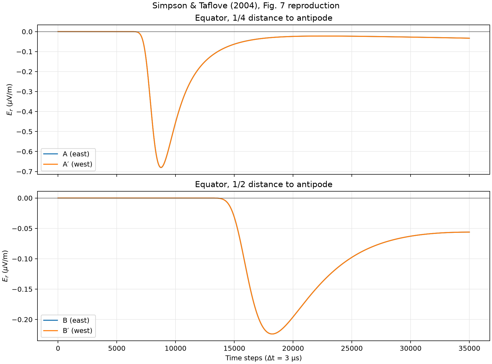
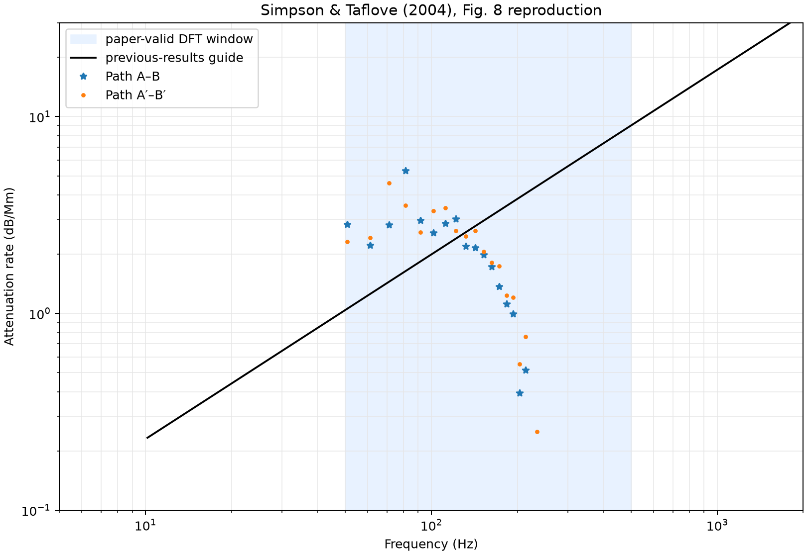

# Simpson–Taflove 2004 Fig. 7·8 기준 및 수정 검증 결과

> 정량 검증 상태: **실패**

검증일: 2026-08-03 (Asia/Seoul)

## 목적

Simpson과 Taflove의 2004년 논문에 제시된 파라미터로 Fig. 7의 네 수신점
시간파형과 Fig. 8의 주파수별 전파 감쇠율을 계산하여 현재 geodesic FDTD
구현의 재현 가능성을 확인했다.

## 재현 명령

```bash
uv run --extra pytorch --extra visualization ionosphere-verify-2004 \
  --subdivision 7 \
  --steps 35000 \
  --material natural-earth \
  --backend torch \
  --device mps \
  --dtype float32 \
  --torch-compile \
  --output-dir artifacts/simpson-taflove-2004/level-7
```

새 CLI는 실행할 때마다 그림과 함께 `verification-report.md`를 자동으로
생성한다. 이 문서는 보고서 자동 생성 기능을 추가하기 전에 수행한 기준
실행을 보존한 것이다.

## 논문 파라미터

| 항목 | 적용값 |
|---|---:|
| 계산 영역 | 해수면 기준 -100–100 km |
| 방사 셀 | 40개, 5 km 간격 |
| 시간 간격 | 3.0 μs |
| 시간 스텝 | 35,000 |
| 소스 위치 | 적도, 47° W |
| 소스 길이 | 수직 5 km 셀 |
| Gaussian `1/e` full width | `480 Δt` |
| Gaussian center | `960 Δt` |
| A / A′ | 소스에서 동/서 방향 45° |
| B / B′ | 소스에서 동/서 방향 90° |
| Fig. 8 유효 주파수 | 50–500 Hz |

수신기별 DFT 절단 길이는 A 22,849, B 24,165, A′ 22,737, B′ 25,023
samples로 설정했다. 논문에는 소스 전류 진폭이 명시되지 않아 Fig. 7은
1 A로 정규화했다. Fig. 8의 스펙트럼 비율은 이 진폭과 무관하다.

## 실행 환경

| 항목 | 값 |
|---|---:|
| 표면 셀 | 163,842 |
| 방사 셀 | 40 |
| backend | PyTorch |
| device | Apple MPS |
| dtype | float32 |
| compiled step | 활성화 |
| 실행 시간 | 609.5 s |
| 재료 모델 | Natural Earth 110-m + Fig. 6 층상 근사 |

## 결과

### Fig. 7 시간파형

음의 주펄스와 뒤따르는 slow-tail 형태는 정성적으로 나타났다. 그러나
주펄스 도달이 논문보다 늦고, 논문에서 지각 구조 차이로 분리되는 동·서
파형이 현재 결과에서는 거의 겹쳤다.



### Fig. 8 감쇠율

이 초기 Fig. 8 결과는 논문 그림에서 판독한 log-log 근사식
`0.0265 f^0.938`을 사용했다. 현재 판정은 아래의 Bannister
원문 공식 재분석으로 대체했다.



| 경로 | 평균 절대 오차 | 논문의 보고 범위 | 판정 |
|---|---:|---:|---:|
| A–B | 6.146 dB/Mm | 약 ±0.5 dB/Mm | 실패 |
| A′–B′ | 5.991 dB/Mm | 약 ±1.0 dB/Mm | 실패 |

중간 해상도인 subdivision 5에서도 각각 6.623 dB/Mm, 6.448 dB/Mm였으며
실행 시간은 51.6초였다. subdivision 7에서 오차가 소폭 감소했지만 논문의
정량 일치 범위에는 도달하지 못했다.

## 결론

현재 구현은 전 지구 ELF 전파의 핵심 시간영역 형태를 생성하지만 Fig. 7과
Fig. 8을 정량적으로 재현하지 못한다. 따라서 이 결과를 논문 재현 성공으로
사용하면 안 된다.

## float64 재검증 결과

Apple MPS가 PyTorch `float64`를 지원하지 않아 CUDA가 있는 Linux 시스템의
NVIDIA GeForce RTX 3060에서 같은 level-7 격자와 35,000스텝을 재실행했다.
실행 시간은 1,083.6초였으며 PyTorch compiled step을 사용했다.

```bash
uv run --extra pytorch --extra visualization ionosphere-verify-2004 \
  --subdivision 7 --steps 35000 \
  --material natural-earth \
  --backend torch --device cuda:0 --dtype float64 --torch-compile \
  --output-dir artifacts/simpson-taflove-2004/level-7-float64-cuda
```

[전체 float64 실행 보고서](../../artifacts/simpson-taflove-2004/level-7-float64-cuda/verification-report.md)

| dtype | A–B 평균 절대 오차 | A′–B′ 평균 절대 오차 |
|---|---:|---:|
| float32 | 6.146 dB/Mm | 5.991 dB/Mm |
| float64 | 6.148 dB/Mm | 5.992 dB/Mm |

float64 결과도 두 경로 모두 논문의 보고 범위를 크게 벗어나 정량 검증에
실패했다. float32 대비 오차 변화는 A–B에서 +0.002 dB/Mm,
A′–B′에서 +0.001 dB/Mm에 불과하므로, 기존 불일치는 부동소수점
정밀도 부족으로 설명되지 않는다.

## 원인 수정 후 CUDA float64 재검증

기존 검증은 완만한 74 km/6 km 이온층 전도도 프로파일을 사용해
주펌스 도달이 늦었고, 양의 overshoot와 slow-tail 직전 zero
crossing이 사라졌다. 그 상태에서 논문의 고정 절단 스텝을 적용해
DFT 스펙트럼이 추가로 왜곡되었다.

대표 daytime exponential profile인 reference height 70 km, scale height
3.33 km를 적용하고 각 계산 파형의 post-overshoot zero crossing을
자동으로 찾아 DFT를 잘라 다시 검증했다.

```bash
uv run --extra pytorch --extra visualization ionosphere-verify-2004 \
  --subdivision 7 --steps 25023 \
  --material natural-earth \
  --backend torch --device cuda:0 --dtype float64 --torch-compile \
  --dft-window adaptive \
  --ionosphere-reference-height-km 70 \
  --ionosphere-scale-height-km 3.33 \
  --output-dir artifacts/simpson-taflove-2004/level-7-float64-cuda-corrected
```

[수정 level-7 전체 보고서](../../artifacts/simpson-taflove-2004/level-7-float64-cuda-corrected/verification-report.md)

위 링크의 자동 보고서는 당시 사용한 `0.0265 f^0.938` 그림 회귀식을
보존한다. 아래 표의 수정 결과는 이후 확보한 Bannister 원문 식과
Fig. 8 marker 기반 고정 주파수로 재계산했으며, 현재 판정에는 이
값을 사용한다.

| 항목 | 기존 float64 | 수정 float64 |
|---|---:|---:|
| A 음의 피크 스텝 | 8,760 | 7,513 |
| B 음의 피크 스텝 | 18,222 | 14,459 |
| A–B 평균 절대 오차 | 6.148 dB/Mm | 0.387 dB/Mm |
| A′–B′ 평균 절대 오차 | 5.992 dB/Mm | 0.399 dB/Mm |
| A–B 최대 절대 오차 | 미측정 | 2.708 dB/Mm |
| A′–B′ 최대 절대 오차 | 미측정 | 2.753 dB/Mm |

자동 선택된 DFT 절단은 A 21,784, A′ 21,721, B/B′ 22,442
samples였다. Fig. 8의 전체 기울기와 대부분의 점은 크게 개선되었지만,
488.281 Hz의 잔차가 약 +2.7 dB/Mm이어 논문의 보고 범위를
최대 절대 오차 기준으로 엄격하게 적용하면 아직 실패다.

## subdivision 8 CUDA float64 수렴 검증

논문 격자보다 거친 subdivision 7의 고주파 수치 분산 여부를 확인하기 위해
표면 셀을 4배 늘린 subdivision 8을 같은 조건으로 실행했다. PyTorch
backend에서 face edge를 한 번에 모으던 큰 임시 tensor를 corner별로
누적하고 solver 산술을 제자리 연산으로 바꿔 12 GB RTX 3060에서 실행할
수 있도록 peak memory를 줄였다. Compiled one-step preflight의 peak allocated
memory는 약 10.1 GB였고, 전체 25,023스텝 실행에는 3,477.9초가 걸렸다.

```bash
uv run --extra pytorch --extra visualization ionosphere-verify-2004 \
  --subdivision 8 --steps 25023 \
  --material natural-earth \
  --backend torch --device cuda:0 --dtype float64 --torch-compile \
  --dft-window adaptive \
  --ionosphere-reference-height-km 70 \
  --ionosphere-scale-height-km 3.33 \
  --synchronize-every 1024 \
  --output-dir artifacts/simpson-taflove-2004/level-8-float64-cuda-corrected
```

[subdivision 8 전체 보고서](../../artifacts/simpson-taflove-2004/level-8-float64-cuda-corrected/verification-report.md)

Simpson–Taflove Fig. 8이 인용한 Bannister (1984) 원문을 확인해 식 (5),
(7), (8)을 `H = 70 km`, `ξ₀ = ξ₁ = 1/0.3 km`로 직접 구현했다.
평가점은 Fig. 8 marker 간격과 일치하는 `Δt = 3 µs`,
`N = 32,768` DFT의 bin 5–49, 즉
50.862630–498.453776 Hz의 45개로 고정했다.

[Bannister 기준식 고정 주파수 재분석](../../artifacts/simpson-taflove-2004/fixed-frequency-reanalysis/verification-report.md)

| subdivision | 표면 셀 | A–B 평균/최대 오차 | A′–B′ 평균/최대 오차 |
|---:|---:|---:|---:|
| 6 | 40,962 | 0.681 / 2.282 dB/Mm | 0.696 / 2.420 dB/Mm |
| 7 | 163,842 | 0.387 / 2.708 dB/Mm | 0.399 / 2.753 dB/Mm |
| 8 | 655,362 | 0.274 / 1.218 dB/Mm | 0.275 / 1.225 dB/Mm |

subdivision 7의 488.281 Hz 잔차는 A–B에서 +2.708 dB/Mm였으나
subdivision 8에서 +0.731 dB/Mm로 감소했다. 평균 오차도 두 경로에서
각각 약 29%, 31% 감소해 공간 해상도 증가에 따른 전반적인 수렴을
확인했다.
음의 주펄스 위치는 A/A′ 7,489, B/B′ 14,446스텝이며 adaptive DFT 절단은
A 21,788, A′ 21,722, B/B′ 22,436 samples였다.

다만 subdivision 8의 최대 잔차는 478.109 Hz에서 +1.218/+1.225 dB/Mm로
이동했다. 따라서 A–B의 ±0.5 dB/Mm와 A′–B′의 ±1.0 dB/Mm 범위를 모두
통과하지 못해 전체 정량 상태는 여전히 실패다. 절단점을
±16 samples 바꿔도 최대 오차 변화는 약 0.01 dB/Mm에 불과해 adaptive
cutoff가 원인은 아니다. 고정 45개 평가점을 사용하면 zero-padding을
32,768에서 65,536으로 늘려도 모든 지표가 약 `1e-12` 상대 오차 내에서
일치한다. 남은 불일치는 400–500 Hz의 진동성 잔차에 집중된다.

이 단계에서 가능성이 큰 차이 원인은 다음과 같았다. 아래의 후속
ETOPO5 검증에서 첫 두 항목을 직접 다룬다.

1. NOAA-NGDC 지형·수심 원본 대신 해안선 기반 육지 마스크를 사용했다.
2. 전체 Hermance 지각 모델 대신 Fig. 6의 저항률 경계값으로 층을 근사했다.
3. 원 논문의 adaptive merged latitude–longitude grid와 현재 geodesic dual
   grid의 수치 분산 특성이 다르다.
4. 논문 DFT 절단 스텝은 원 논문 파형의 zero-crossing에 맞춘 값이므로,
   도달 시간이 다른 현재 파형에는 동일한 절단이 추가 오차를 만든다.

## 균질 모델 위상속도·도달시간 수렴 검증

재료 비대칭을 제거한 `uniform` 모델을 subdivision 6, 7, 8에서 같은
CUDA `float64` 조건으로 실행했다. 복소 DFT의 `A·conj(B)`와
`A′·conj(B′)` 위상을 DC부터 unwrap하고, 수신점 사이의 추가 45° 거리로
위상속도를 계산해 Bannister (1984) 식 (4)와 비교했다. 음의 주펄스 피크
사이의 시간차도 별도로 계산했다.

[균질 모델 수렴 분석과 산출물](../../artifacts/simpson-taflove-2004/uniform-phase-convergence/verification-report.md)

| subdivision | A–B 위상속도 평균/최대 오차 | A′–B′ 위상속도 평균/최대 오차 | 피크 속도 A–B/A′–B′ | 1/4 지점 동서 RMS |
|---:|---:|---:|---:|---:|
| 6 | 0.0357 / 0.0941 c | 0.0388 / 0.1034 c | 0.8040 / 0.8025 c | 1.500e-2 |
| 7 | 0.0189 / 0.0504 c | 0.0195 / 0.0521 c | 0.8007 / 0.8003 c | 3.892e-3 |
| 8 | 0.0142 / 0.0276 c | 0.0143 / 0.0280 c | 0.7994 / 0.7993 c | 1.014e-3 |

최대 위상속도 오차의 관측 수렴 차수는 A–B에서 0.90, 0.87,
A′–B′에서 0.99, 0.90으로 거의 1차다. 1/4 지점 동서 RMS 차이는
1.95, 1.94차로 감소해 균질 재료에서의 대칭성이 격자 세분화에 따라
거의 2차로 회복된다. 따라서 남은 고주파 오차에는 geodesic dual grid의
공간 분산이 실제로 포함되어 있으며, 자연 지구 모델의 동서 비대칭과는
분리해서 해석할 수 있다.

## NOAA ETOPO5·Hermance 재료 검증

원 논문의 NOAA-NGDC `Global Relief CD-ROM`이 보존한 big-endian
`ETOPO5.DAT`를 확보했다. 이 자료는 5′ 간격의 2,160×4,320 cell-center
고도·수심이며, 공식 파일 크기 18,662,400 bytes와 SHA-256
`471d3dd534144aa9a6551fe3e76320a06a45dade6fd8d45f7d6ad981d59f93c3`를
로더에서 검증한다. 각 geodesic 재료 표본점에는 bilinear interpolation을
적용하고, 실제 지표고도를 기준으로 공기·해수·암석 셀을 구분한다.

Hermance (1995)는 내려받을 수 있는 전 지구 3-D 전도도 자료가 아니라
Fig. 6에 재사용된 경계형 개념도의 출처임을 원문에서 확인했다. 따라서
그림에 명시된 해수 0.3 Ω·m와 해양/대륙별 500/200/50 Ω·m 대표 깊이
프로파일을 구현했다. 그림에 보이는 ≤5/≤10 Ω·m 국지 전도체는 위치와
형상이 수치로 제공되지 않아 포함하지 않는다.

```bash
uv run --extra pytorch --extra visualization ionosphere-verify-2004 \
  --subdivision 7 --steps 25023 \
  --material etopo5 --etopo5-path data/ETOPO5.DAT \
  --backend torch --device cuda:0 --dtype float64 --torch-compile \
  --dft-window adaptive --ionosphere-reference-height-km 70 \
  --ionosphere-scale-height-km 3.33 --synchronize-every 1024 \
  --output-dir artifacts/simpson-taflove-2004/etopo5-level-7-float64-cuda
```

[ETOPO5 level-7 전체 보고서](../../artifacts/simpson-taflove-2004/etopo5-level-7-float64-cuda/verification-report.md)

| level-7 재료 | 1/4 지점 동서 RMS | A/A′ 피크 스텝 | A–B/A′–B′ 감쇠 MAE | 최대 오차 |
|---|---:|---:|---:|---:|
| 균질 | 0.00389 | 7,514 / 7,510 | 0.412 / 0.427 dB/Mm | 1.838 / 1.890 dB/Mm |
| ETOPO5 + Fig. 6 | 0.08220 | 7,546 / 7,589 | 0.387 / 0.590 dB/Mm | 1.747 / 2.020 dB/Mm |

level-7 표면 표본의 relief 범위는 −9.69~+6.30 km이고 육지 비율은
28.9%다. 실제 수심과 대륙 프로파일을 적용하자 A/A′ 피크가 43스텝
갈라지고, 동서 RMS가 균질 모델보다 약 21배 커져 재료에 의한 동서
파형 비대칭을 재현했다. 반대편 B/B′는 부동소수점 반올림 수준에서
일치한다. 다만 두 경로의 최대 감쇠 오차가 여전히 논문 범위를 넘으므로
전체 정량 판정은 실패다.

## 2.5 km source staggered 배치 검증

기존 `GaussianCurrent`는 2.5 km 요청을 가장 가까운 `Er` 평면 하나에
배치했다. 0 km와 5 km가 같은 거리일 때 `argmin`이 0 km를 선택해 실제
표현 고도가 2.5 km 낮았다. 수정 구현은 수평 triangle의 barycentric
가중치 3개와 방사 0/5 km 평면의 0.5/0.5 cloud-in-cell 가중치를 곱해
6개 `Er` 자유도에 전류를 배치한다. 결합 가중치 합은 1이고 방사 가중
중심은 정확히 2,500 m다.

```bash
uv run --extra pytorch --extra visualization ionosphere-verify-2004 \
  --subdivision 7 --steps 25023 \
  --material etopo5 --etopo5-path data/ETOPO5.DAT \
  --backend torch --device cuda:0 --dtype float64 --torch-compile \
  --dft-window adaptive --ionosphere-reference-height-km 70 \
  --ionosphere-scale-height-km 3.33 --synchronize-every 1024 \
  --output-dir \
    artifacts/simpson-taflove-2004/etopo5-level-7-float64-cuda-staggered-source
```

[staggered source level-7 전체 보고서](../../artifacts/simpson-taflove-2004/etopo5-level-7-float64-cuda-staggered-source/verification-report.md)

| source 배치 | 표현 중심 | A/A′/B/B′ 피크 스텝 | 동서 RMS | 감쇠 MAE A–B/A′–B′ | 최대 오차 A–B/A′–B′ |
|---|---:|---:|---:|---:|---:|
| 최근접 평면 | 0 m | 7,546 / 7,589 / 14,494 / 14,494 | 0.082197 | 0.387016 / 0.589615 | 1.7465 / 2.0198 |
| 선형 staggered | 2,500 m | 7,546 / 7,589 / 14,494 / 14,494 | 0.082151 | 0.386878 / 0.589475 | 1.7458 / 2.0160 |

수정 전후 전체 수신 파형의 상대 RMS 차이는 `5.496e-4`이고 모든 주펄스
피크 스텝은 동일하다. A′–B′ 최대 감쇠 오차는 2.0198에서
2.0160 dB/Mm로 소폭 감소했지만 엄격 판정은 여전히 실패다. 따라서
소스 중심 반올림은 제거됐으나 남은 고주파 잔차의 주원인은 아니다.

solver 단위 테스트는 6개 주입 성분을 `area/Cb`로 역환산해 각 결합
가중치와 일치하는지, 합계가 정확히 1 A인지 검증한다. CLI 보고서도 요청
고도, 실제 중심, 지지 평면, 총가중치를 기록한다.

## geodesic dual grid 방향성 분산 직접 측정

현재 격자 구현은 유지하고, 균질 모델에서 소스 기준 12개 방위각의 45°와
90° 수신점 사이 위상속도를 측정했다. 연속 균질 구면의 위상속도는
방위각에 무관하므로 방위각 평균에서의 편차가 geodesic dual grid의
방향성 수치 분산을 직접 나타낸다.

[방향성 분산 수렴 분석과 산출물](../../artifacts/directional-dispersion/grid-convergence/verification-report.md)

| subdivision | 표면 셀 | 평균 방위각 spread | 최대 spread | 375–500 Hz 평균/최대 spread |
|---:|---:|---:|---:|---:|
| 5 | 10,242 | 4.2417% | 12.0832% | 11.107 / 12.083% |
| 6 | 40,962 | 0.4492% | 1.2344% | 0.992 / 1.234% |
| 7 | 163,842 | 0.0970% | 0.2947% | 0.214 / 0.295% |

level 6→7의 평균/최대 spread 관측 차수는 2.21/2.07로 약 2차다.
375 Hz 이하에서 level 7 평균/최대 spread는 0.0494/0.133%다. 공통 DFT
절단점을 사용한 민감도 분석에서도 level 7 평균 spread는
0.0967–0.0973%로 유지되어 adaptive window의 인공 효과가 아님을
확인했다.

따라서 두 격자의 차이는 현재 구현을 교체하지 않고도 방향성 성분을
정량화하고 세분화로 억제할 수 있다. 다만 level 7의 방위각 평균과
Bannister 식 사이 최대 잔차 0.05096 c는 최대 방향 spread 0.2947%보다
훨씬 크다. 남은 전체 고주파 불일치는 방향성만이 아니라 등방성 공간
분산과 유한 방사층/물성 모델 차이도 포함한다.

## 참고문헌

J. J. Simpson and A. Taflove, “Three-dimensional FDTD modeling of impulsive
ELF propagation about the entire Earth-sphere,” *IEEE Transactions on Antennas
and Propagation*, 52(2), 443–451, 2004.
