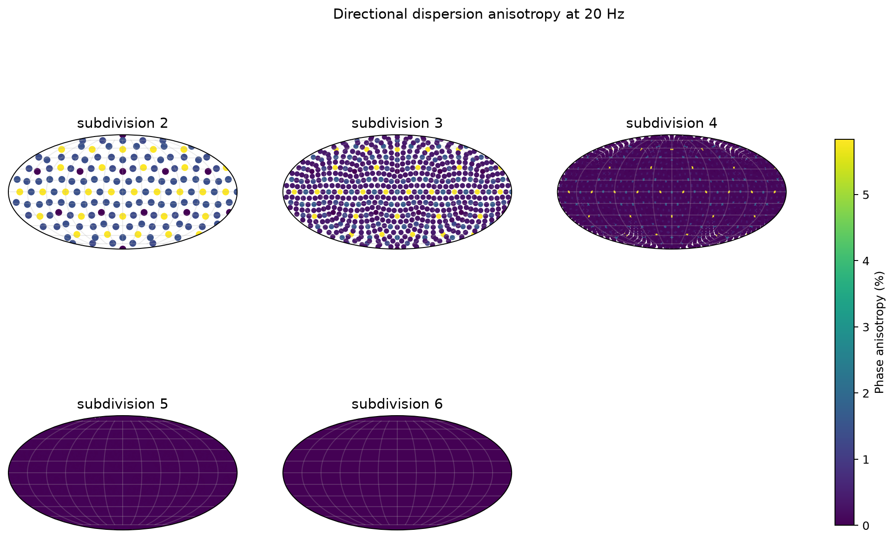
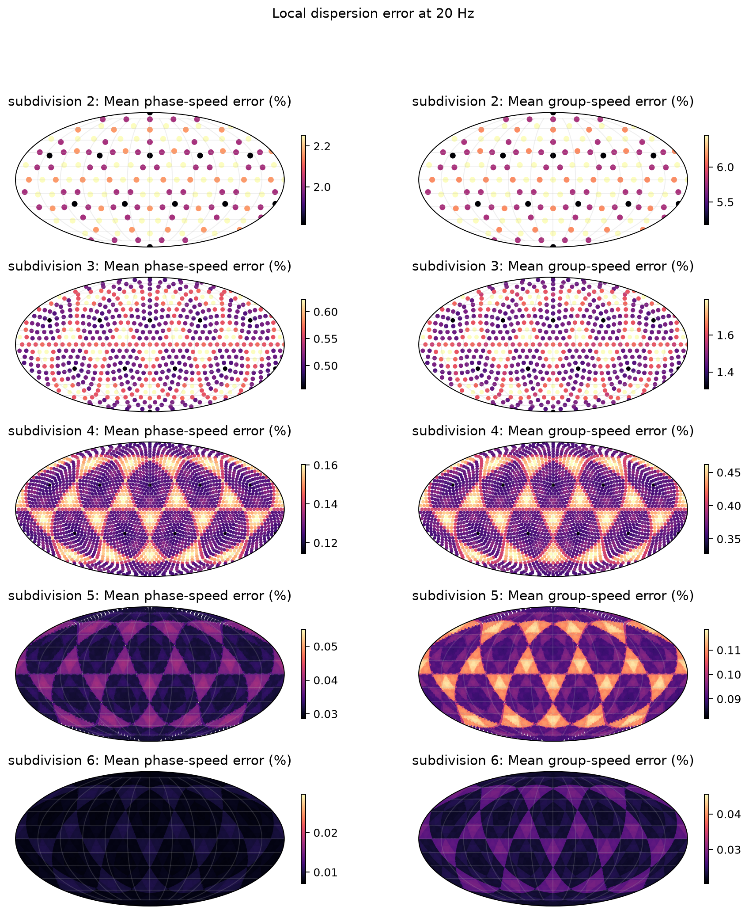

# Simpson–Taflove 2004 Reproduction Verification

## Scope

This study evaluates Figures 7 and 8 of J. J. Simpson and A. Taflove,
“Three-dimensional FDTD modeling of impulsive ELF propagation about the entire
Earth-sphere,” *IEEE Transactions on Antennas and Propagation*, 52(2), 443–451,
2004 ([doi:10.1109/TAP.2004.823953](https://doi.org/10.1109/TAP.2004.823953)).

The reproduction uses the geodesic FDTD solver, the paper's equatorial
source/receiver geometry, a $3\ \mu\mathrm{s}$ time step, 40 radial cells, the
published exponential ionosphere profile, and NOAA ETOPO5 surface relief.

## Reference model

The source current is Gaussian in time. Figure 7 compares radial electric-field
records at quarter-circumference receivers A/A′ and half-circumference receivers
B/B′. Figure 8 derives path attenuation from truncated DFTs of those records and
compares the result with the Bannister ELF guide.

The reported attenuation for two receivers separated by distance $d$ is

$$
\alpha_{\mathrm{dB/Mm}}(f)
=\frac{20}{d_{\mathrm{Mm}}}
\log_{10}\!\left|\frac{E_1(f)}{E_2(f)}\right|.
$$

## Result


| Criterion | Reproduced result | Verdict |
|---|---:|---|
| Figure 7 time extent and waveform morphology | Main negative pulse, overshoot, and slow tail reproduced | **PASS** |
| Arrival ordering | A/A′ precede B/B′ | **PASS** |
| Relative east/west amplitudes | Published ordering is not preserved | **FAIL** |
| Figure 8 A–B attenuation | MAE 1.104, maximum 2.538 dB/Mm | **FAIL** |
| Figure 8 A′–B′ attenuation | MAE 0.242, maximum 3.258 dB/Mm | **FAIL** |
| Complete Figures 7–8 reproduction | Qualitative agreement, quantitative disagreement | **FAIL** |

The solver reproduces the principal propagation morphology but not the
paper-level pointwise attenuation and relative path amplitudes. The remaining
difference is most sensitive to horizontal spatial dispersion and the
unpublished details of the three-dimensional conductivity realization; backend
precision and source staggering do not account for it.

## Independent accuracy evidence

The paper residual is not treated as a parameter-fitting target because its
complete three-dimensional conductivity input was not published. A separate
20 Hz local-symbol study applies the same circumcentric DEC Laplacian used by
the solver at 12 headings per dual cell.





| Subdivision | Median cells/wavelength | Median phase error | P95 anisotropy | Median group error |
|---:|---:|---:|---:|---:|
| 2 | 7.80 | 2.161% | 6.365% | 6.149% |
| 3 | 15.84 | 0.516% | 1.665% | 1.484% |
| 4 | 31.72 | 0.129% | 1.175% | 0.371% |
| 5 | 63.47 | 0.032% | 0.313% | 0.093% |
| 6 | 127.39 | 0.008% | 0.080% | 0.023% |

Median phase and group errors converge at approximately second order. The map
also retains the localized heading dependence around the twelve pentagonal
cells instead of reducing it to a global norm. For a smooth synthetic material
map, point-versus-finite-volume support disagreement decreases monotonically
from subdivision 2 to 6: radial dual-cell disagreement falls from 0.257% to
0.0046%, and tangential edge-diamond disagreement from 0.167% to 0.0025%.

These results establish independent spatial convergence but do not turn the
Figure 7–8 verdict into a pass. Observation-based conductivity validation still
requires a licensed or otherwise redistributable source dataset. The runtime
now accepts spatial ionosphere samplers and canonical NPZ
latitude-longitude-altitude material volumes so such a study no longer
requires paper-specific solver changes.

## Reproduction

```bash
python -m verification.simpson_taflove_2004 --help
python -m verification.scientific_accuracy --help
```

The CLI records the complete configuration and checksums with each generated
trace archive. Published panels are shown only for technical comparison.
