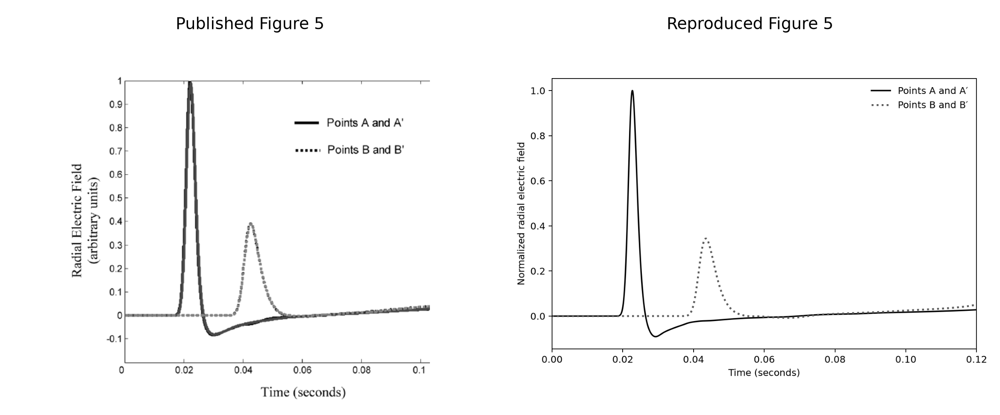
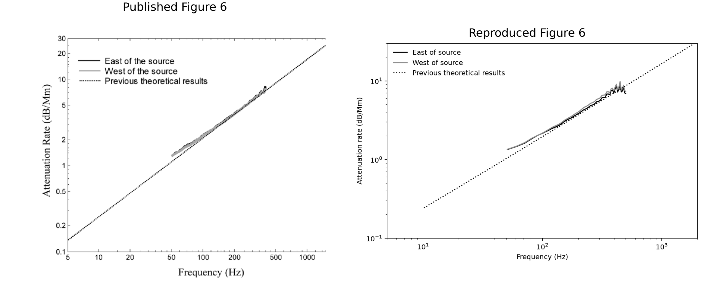
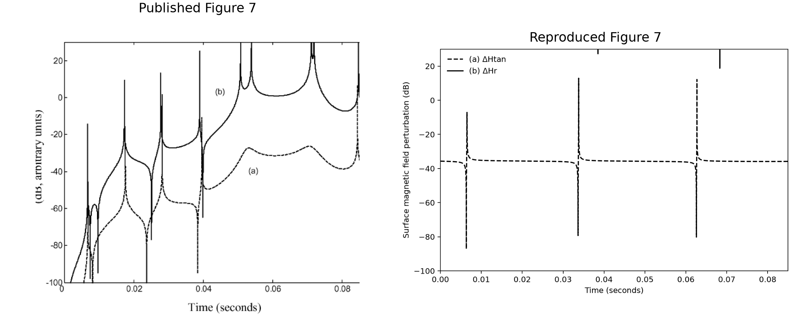

# Simpson–Heikes–Taflove 2006 Figures 5–7 Verification

> Final reproduction status: **FAIL**

Verification performed on 2026-08-03 (Asia/Seoul).

## Executive summary

This study tests whether the present three-dimensional geodesic FDTD
implementation can reproduce Figures 5, 6, and 7 of Simpson, Heikes, and
Taflove (2006). The production calculations use PyTorch on NVIDIA CUDA GPUs
with `float64` fields.

Figure 5 is reproduced qualitatively: the quarter-antipode and half-antipode
responses have the published arrival ordering, relative peak amplitude,
overshoot, and slow-tail morphology. Figure 6 follows the published daytime
attenuation trend in mean, but it fails the paper's pointwise ±0.5 dB/Mm
statement near the upper end of the 50–500 Hz comparison window. The east and
west mean absolute errors are 0.387 and 0.589 dB/Mm, while their maximum
absolute errors are 1.746 and 2.016 dB/Mm.

Figure 7 reproduces only the direction of the claimed sensitivity. Its
`ΔHtan` median is −35.75 dB and 99.70% of nonsingular samples are below
−25 dB, but `ΔHr` has a +100.30 dB median rather than a curve peaking near
+20 dB. The computed 136.03 dB median radial-over-tangential advantage is not
the paper's approximate 45 dB. The failure comes from a nearly zero reference
`Hr`, not an unusually large radial scattered field. Consequently the three
figures are not reproduced as a complete quantitative set.

## Target paper and source record

The target is J. J. Simpson, R. P. Heikes, and A. Taflove, “FDTD Modeling of a
Novel ELF Radar for Major Oil Deposits Using a Three-Dimensional Geodesic Grid
of the Earth-Ionosphere Waveguide,” *IEEE Transactions on Antennas and
Propagation*, 54(6), 1734–1741, 2006,
[doi:10.1109/TAP.2006.875504](https://doi.org/10.1109/TAP.2006.875504).

The supplied eight-page PDF, `/home/kwchun/simpson.pdf`, has SHA-256 digest
`b33632d3eb8c004c69f8d5100792966583206cb62374df298651ce9560f31952`.
The published panels used in the comparisons below are cropped from pages 5,
6, and 7 of that supplied file. They are © 2006 IEEE and are included only as
source-attributed technical excerpts.

## Acceptance criteria

The paper supplies different levels of quantitative detail for the three
figures, so the criteria are separated:

| Figure | Criterion |
|---|---|
| 5 | Qualitative waveform morphology, arrival order, and near/far amplitude ratio; absolute amplitude is arbitrary in the paper. |
| 6 | Both calculated paths remain within approximately ±0.5 dB/Mm of the Bannister daytime result over 50–500 Hz. |
| 7 | `ΔHtan` is more than 25 dB below its reference at almost every nonsingular time, `ΔHr` reaches approximately +20 dB, and radial sensing offers about 45 dB more sensitivity. |

The Figure 7 body text and caption are internally inconsistent about
normalization. The body says the difference is divided by the peak Model-A
field, but the caption attributes the plotted spikes to zero crossings of the
reference waveform. A peak-normalized difference cannot have those poles.
The verification therefore follows the caption and the actual plot:

```text
ΔH(t) = |H_B(t) - H_A(t)| / |H_A(t)|
```

Values within `1e-6` of the reference peak are excluded from scalar summaries,
while the rendered curve retains the approach to the zero-crossing spikes.

## Numerical model

### Figures 5 and 6

| Item | Implemented value |
|---|---:|
| Surface grid | subdivision 7, 163,842 geodesic dual cells |
| Radial domain | −100 to +100 km |
| Radial cells | 40 at 5 km |
| Time step | 3.0 μs |
| Recorded steps / time | 40,000 / 0.120 s |
| Source | 5 km vertical current at 0° N, 47° W |
| Gaussian `1/e` full width / center | `480 Δt` / `960 Δt` |
| Receivers | A/A′ at ±45° and B/B′ at ±90° along the equator |
| Surface data | NOAA-NGDC ETOPO5, bilinear sampling |
| Ionosphere | 70 km reference height, 3.33 km scale height |
| Backend | compiled PyTorch, CUDA, float64 |
| Wall time | 937.6 s |

The source is barycentrically distributed in the horizontal plane and linearly
staggered between the 0 and 5 km `Er` planes, preserving its exact 2.5 km
centroid and total current.

### Figure 7

| Item | Implemented value |
|---|---:|
| Surface grid | subdivision 7, 163,842 geodesic dual cells |
| Nominal radial grid | 5 km from −100 to +100 km |
| Near-surface lithosphere subgrid | 1.25 km from −5 to 0 km |
| Actual radial cells | 43 |
| Stable time step | 2.083689715 μs at Courant factor 1.0 |
| Simulated time / steps | 0.1616 s / 77,542 |
| Transmitter | Clam Lake, Wisconsin, 46.5° N, 90.9° W |
| Ground lines | 22.5 km north–south and east–west, 300 A each |
| Pulse | 20 Hz carrier, 42.5 ms Gaussian-envelope FWHM |
| Oil-field center | 69° N, 156° W |
| Oil-field footprint | circular equivalent of 4,800 km², radius 39.088 km |
| Oil-field depth | 1.25 km thick at median depth 1.2 km |
| Conductivity contrast | 0.1 times surrounding strata |
| Backend | compiled PyTorch, two CUDA GPUs, float64 |
| Production revision | `1e3d939` |
| Wall time | 1,832.2 s reference / 2,249.0 s anomaly |

The ground-line source is projected onto all three oriented primal edges of
the containing face. Each contribution is scaled by `L/Δl`, which preserves
the specified `I·L` current moment on a line shorter than one surface edge.
Those three edges are 55.59, 64.78, and 55.59 km long, so the 22.5 km source
is genuinely subcell rather than silently expanded to an entire edge.
The surface `Hr` sample is linearly interpolated between its two staggered
radial planes. East and north `Htan` are reconstructed by a local least-squares
inverse of the surrounding oriented dual-edge samples; a fixed principal
reference polarization is then used for the signed tangential waveform.

The paper gives a Canadian Shield conductivity of `2.4e-4 S/m`, but does not
publish its exact grid mask. Both models therefore use the same documented
2,500 km cap approximation centered over Canada. This choice cancels partly in
the reference/anomaly difference but remains a reproducibility limitation.

## Figure 5: temporal response



The reproduced averaged A/A′ pulse peaks at 22.710 ms and the averaged B/B′
pulse at 43.482 ms. The far/near normalized peak ratio is 0.34385, compared
with approximately 0.39 by visual reading of the published panel. The computed
waveforms also show the negative overshoot and subsequent slow tail.

The exact east and west quarter-path traces do not coincide: their relative
RMS difference is 8.22%, reflecting the ETOPO5 land/ocean asymmetry. The two
half-path traces coincide to floating-point precision because they meet at the
same antipodal observation point in this grid representation.

Figure 5 is therefore a **qualitative pass**. It is not assigned an absolute
amplitude error because the paper labels the vertical scale as arbitrary and
does not state the current amplitude for this validation pulse.

## Figure 6: daytime attenuation



Each receiver record is truncated at its post-overshoot zero crossing, as
specified by the paper. The adaptive cutoffs are 22,922 samples for A, 23,287
for A′, and 24,081 for both B and B′. A 32,768-point DFT provides 45 fixed bins
from 50.862630 to 498.453776 Hz. The reference line evaluates Bannister's
daytime attenuation equations with the same 70 km height and 3.33 km scale
height rather than fitting pixels from the plot.

| Path | Mean absolute error | Maximum absolute error | Worst frequency | ±0.5 dB/Mm result |
|---|---:|---:|---:|---:|
| A–B, east | 0.387 dB/Mm | 1.746 dB/Mm | 498.454 Hz | **FAIL** |
| A′–B′, west | 0.589 dB/Mm | 2.016 dB/Mm | 447.591 Hz | **FAIL** |

The reproduced curves follow the published trend over most of the valid band,
but the pointwise criterion fails. At 396.729 Hz the east result differs from
the reference by only +0.013 dB/Mm; at 498.454 Hz it is −1.746 dB/Mm. The west
curve reaches its +2.016 dB/Mm maximum residual at 447.591 Hz. This oscillatory
upper-band error is consistent with the high-frequency spatial-dispersion
residual documented in the separate 2004 verification.

## Figure 7: oil-field radar response



The paper-scale result is mixed. The tangential curve is approximately flat at
−36 dB away from its reference zero crossings. Its median is −35.749 dB, and
99.698% of nonsingular samples are below −25 dB. This satisfies the paper's
stated tangential suppression criterion.

The radial curve does not reproduce the published scale or morphology. It is
above the plot's +30 dB limit for almost the entire window, with a +100.304 dB
median and +118.548 dB 95th percentile. The median radial-over-tangential
advantage is 136.028 dB, not approximately 45 dB.

| Metric | Paper behavior | Reproduction | Result |
|---|---:|---:|---:|
| Median pointwise `ΔHtan` | mostly below −25 dB | −35.749 dB | **PASS** |
| Fraction of `ΔHtan < −25 dB` | almost every time | 99.698% | **PASS** |
| Pointwise `ΔHr` scale | reaches about +20 dB | +100.304 dB median | **FAIL** |
| Median `ΔHr−ΔHtan` | about 45 dB | 136.028 dB | **FAIL** |

The absolute fields identify the mechanism:

| Quantity | Peak magnitude |
|---|---:|
| Reference `Htan` | `3.1393e-12 A/m` |
| Oil-model `Htan` | `3.0889e-12 A/m` |
| Absolute `Htan` difference | `5.0390e-14 A/m` |
| Reference `Hr` | `1.0635e-20 A/m` |
| Oil-model `Hr` | `1.7823e-15 A/m` |
| Absolute `Hr` difference | `1.7823e-15 A/m` |

The tangential scattered field is actually 28.02 dB stronger than the radial
scattered field. The apparent radial advantage is caused by the reference
`Hr` being almost seven orders of magnitude smaller than the radial scattered
field. Applying the body text's peak normalization instead of the caption's
pointwise normalization gives −35.890 dB for `ΔHtan` and +104.485 dB for
`ΔHr`; it therefore fails the published +20 dB scale under either reading.

Figure 7 is a **quantitative fail**, although it qualitatively confirms that a
buried conductivity anomaly can generate a radial magnetic component while
only weakly perturbing the dominant tangential reference field.

## Failure analysis and corrective work

The initial implementation could not perform Figure 7 as stated. The following
issues were found and corrected before the production result was accepted:

1. The solver could inject only radial current and record only `Er`. A
   tangential ground-line source and backend-native `Hr`/signed-`Htan` recorder
   were added. Recording stays on the CUDA device until the run completes.
2. The ETOPO5 layered lithosphere could not carry a local anomaly. The common
   spherical-volume anomaly mechanism was extended to that material without
   replacing its relief, ocean, or depth profiles. A subsequent material audit
   found that a broad lateral cap could also multiply seawater; both the Shield
   and oil anomalies are now restricted to background conductivity at or below
   `0.01 S/m`, leaving water layers unchanged.
3. The 1.25 km subgrid reduced the conservative time step from the 3 μs used by
   Figures 5–6. A paired level-5 CUDA float64 experiment showed that Courant
   factors 0.4 and 1.0 agree in field maxima to about `1e-8` relative and in
   perturbation metrics within 0.001 dB; the stable 1.0 setting reduces the
   production run from 193,759 to 77,542 steps.
4. The first tangential source projection preserved direction but not the
   subcell line moment. Scaling each edge by the line-length/edge-length ratio
   corrected the absolute field. A second paired level-5 run showed that the
   normalized sensitivity ordering was unchanged, ruling out source amplitude
   as the cause of the coarse-grid discrepancy.
5. A second source-deposition hypothesis snapped each north–south/east–west
   line to its nearest geodesic edge instead of projecting it over three edges.
   At level 5 it produced a reference `Hr` peak of `1.06e-19 A/m` and a
   peak-normalized radial perturbation of +99.35 dB, the same pathological
   scale as the projected source. Edge cancellation was therefore rejected as
   the primary cause and the direction-preserving projection was retained.
6. At subdivision 5 the 39.1 km-radius oil body contains no electric vertex and
   is represented only on nearby edges. That deliberately coarse diagnostic
   produced a qualitatively correct but grossly exaggerated radial advantage.
   The final result therefore uses the paper-scale subdivision 7, where two
   electric vertices and five electric edges lie inside the circular footprint.

At level 7 the two selected dual cells have a combined area of 7,013.6 km²,
larger than the disk's geometric 4,800 km² because material sampling is binary
at geodesic electric-field points. The five selected edge samples and both
selected vertices are over land in ETOPO5 (elevations 250–450 m). This removes
water contamination but leaves a disclosed horizontal voxelization error.

The final-code resolution study confirms that this is not a smooth convergent
observable:

| Subdivision | Cells | Peak-normalized `ΔHtan` | Peak-normalized `ΔHr` | Reference `Hr` peak |
|---:|---:|---:|---:|---:|
| 5 | 10,242 | −64.103 dB | +95.341 dB | `1.679e-19 A/m` |
| 6 | 40,962 | −49.932 dB | +125.269 dB | `2.081e-20 A/m` |
| 7 | 163,842 | −35.890 dB | +104.485 dB | `1.064e-20 A/m` |

The radial value moves by +29.93 dB and then −20.78 dB under successive
refinement, while the tangential perturbation grows monotonically. The oil
disk is represented by a different small set of binary electric samples at
each level, so no Richardson-style convergence order can be assigned. This
rules out interpreting the level-7 mismatch as a simple remaining truncation
error that could safely be extrapolated to the paper's curve.

The remaining Figure 6 error cannot be removed by float64 precision, DFT
zero-padding, source staggering, or ETOPO5 relief. Those cases were already
isolated in the 2004 campaign. Horizontal refinement reduces the mean error,
but the present geodesic dual grid must be retained, and the paper's exact
Hermance-derived three-dimensional conductivity realization is not published.
The final high-frequency mismatch is therefore reported rather than tuned
away.

## Reproduction commands

Figures 5 and 6 use the exact ETOPO5 level-7 trace configuration:

```bash
.venv/bin/python -m ionosphere_fdtd.simpson_taflove_2004_cli \
  --subdivision 7 --steps 40000 --material etopo5 \
  --etopo5-path data/ETOPO5.DAT --backend torch --device cuda:1 \
  --dtype float64 --dft-window adaptive \
  --ionosphere-reference-height-km 70 \
  --ionosphere-scale-height-km 3.33 --torch-compile \
  --synchronize-every 1024 \
  --output-dir artifacts/simpson-taflove-2006/figure-5-level-7-float64-cuda

.venv/bin/python -m ionosphere_fdtd.simpson_taflove_2006_cli \
  figures-5-6 \
  --traces artifacts/simpson-taflove-2006/figure-5-level-7-float64-cuda/simpson-taflove-2004-traces.npz \
  --output-dir artifacts/simpson-taflove-2006/figures-5-6
```

The paired Figure 7 runs were:

```bash
.venv/bin/python -m ionosphere_fdtd.simpson_taflove_2006_cli radar-run \
  --case reference --subdivision 7 --material etopo5 \
  --etopo5-path data/ETOPO5.DAT --backend torch --device cuda:1 \
  --dtype float64 --torch-compile --courant 1.0 \
  --source-edge-assignment projected --synchronize-every 1024 \
  --output artifacts/simpson-taflove-2006/level-7-courant-1-float64-cuda/reference.npz

.venv/bin/python -m ionosphere_fdtd.simpson_taflove_2006_cli radar-run \
  --case anomaly --subdivision 7 --material etopo5 \
  --etopo5-path data/ETOPO5.DAT --backend torch --device cuda:0 \
  --dtype float64 --torch-compile --courant 1.0 \
  --source-edge-assignment projected --synchronize-every 1024 \
  --output artifacts/simpson-taflove-2006/level-7-courant-1-float64-cuda/anomaly.npz

.venv/bin/python -m ionosphere_fdtd.simpson_taflove_2006_cli analyze-radar \
  --reference artifacts/simpson-taflove-2006/level-7-courant-1-float64-cuda/reference.npz \
  --anomaly artifacts/simpson-taflove-2006/level-7-courant-1-float64-cuda/anomaly.npz \
  --figure artifacts/simpson-taflove-2006/level-7-courant-1-float64-cuda/figure-7.png
```

## Reproducibility limits

- NOAA ETOPO5 relief is exact to the archived file and checksum already
  documented in the 2004 report, but the paper's complete three-dimensional
  Hermance conductivity mapping is not available.
- The exact Canadian Shield boundary and the oil-field footprint shape are not
  published. The implementation uses a disclosed cap for the former and a
  circular equal-area footprint for the latter. Point sampling maps that disk
  to 7,013.6 km² of dual-cell area at level 7; no undocumented conductivity
  retuning is used to force an effective 4,800 km² voxel area.
- The paper uses an optimized geodesic grid. This project retains its existing
  recursively subdivided geodesic dual grid, as required; no result is tuned by
  changing topology or rotating the grid.
- Figure 7 does not define source phase, Gaussian center time, or a formal
  error norm. The simulation begins three Gaussian `1/e` half-widths before the
  envelope center, and its displayed time is referenced to that center.
- The contradictory Figure 7 normalization statements prevent a unique
  literal reproduction. The selected pointwise definition is the only one
  consistent with the published spikes.

## Final conclusion

The current implementation can qualitatively reproduce Figure 5 and the broad
Figure 6 attenuation trend. It cannot meet Figure 6's pointwise ±0.5 dB/Mm
claim, and it cannot reproduce Figure 7's +20 dB radial perturbation or roughly
45 dB sensitivity advantage. The final status is therefore **FAIL**.

The corrective work did produce reusable, tested capabilities: physically
scaled horizontal ground-line sources, CUDA-native radial/tangential magnetic
recording, buried anomalies in the ETOPO5 layered material, protected water
layers, and a reproducible Figure 5–7 analysis CLI. Precision, time-step
stability, source moment, and nearest-edge deposition were tested and rejected
as explanations for the remaining discrepancy.

The strongest remaining causes are inputs that cannot be reconstructed from
the paper: its optimized cell locations, exact three-dimensional lithosphere
conductivity realization, Canadian Shield mask, horizontal subcell treatment
of the 4,800 km² body, and exact ground-line deposition. With the required
current geodesic dual grid retained, forcing the published Figure 7 values
would require undocumented material or normalization tuning and would not be a
valid verification.
