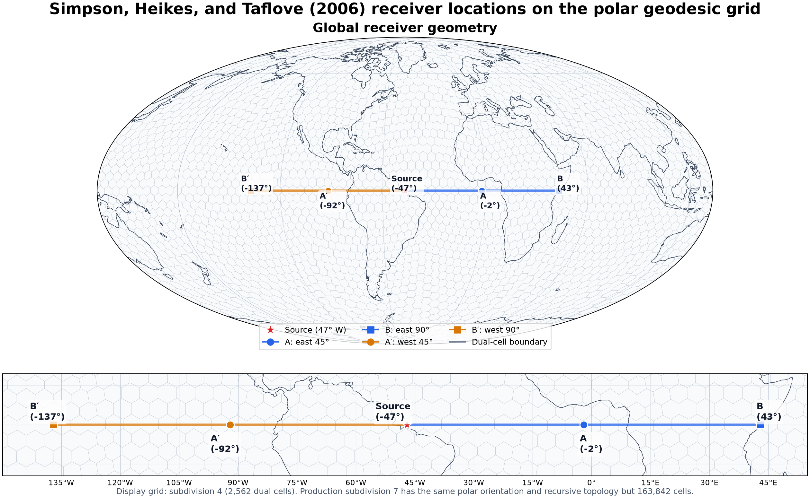

# Simpson–Heikes–Taflove 2006 Figures 5–7 Verification

> Final reproduction status: **FAIL**

Production rerun performed on 2026-08-05 (Asia/Seoul).

Korean version: [한국어](simpson-taflove-2006.ko.md).

## Executive summary

This study tests whether the present three-dimensional geodesic FDTD
implementation can reproduce Figures 5, 6, and 7 of Simpson, Heikes, and
Taflove (2006). The production calculations use PyTorch on NVIDIA CUDA GPUs
with `float64` fields.

Figure 5 reproduces the published arrival ordering, timing, overshoot, and
slow-tail morphology, but not all four relative amplitudes. A corrected
geographic locator separates the previously collapsed B/B′ observations. The
final level-7 polar ETOPO5 run uses Sandia Mesquite's uniform size-and-shape
objective on the sphere and gives normalized far peaks of 0.31141/0.35571
instead of approximately 0.39/0.39. This reduces the far-path relative RMS
difference from 134.5% with the earlier one-step smoother to 18.5%, and the
far tails now agree with one another, but their common magnitude remains about
40% below the published visual estimate. CUDA `float64` isolation runs show
that a fixed-depth surface restores both far peaks and east/west symmetry,
while forcing every shallow ocean column to contain a 5-km seawater cell has
negligible effect. The remaining mismatch is therefore associated with the
complete relief/lithosphere voxelization and the paper's unpublished exact
Mesquite configuration and coordinates, not shallow receiver bathymetry
alone. Figure 6 is now derived from the same audited polar Mesquite trace as
Figure 5. Its east/west mean absolute errors are 0.921/0.284 dB/Mm and its
maximum absolute errors are 3.020/2.125 dB/Mm. Both paths fail the paper's
pointwise ±0.5 dB/Mm statement over 50–500 Hz.

Figure 7 also retains only the direction of the claimed sensitivity after its
transmitter is corrected from the opposite hemisphere to Clam Lake. Its
`ΔHtan` median is −43.25 dB and 92.47% of nonsingular samples are below
−25 dB, but `ΔHr` has a +126.00 dB median rather than a curve near +20 dB.
The computed 165.90 dB median radial-over-tangential advantage is not the
paper's approximate 45 dB. Exact radial source staggering and geographic
`Hr` interpolation correct the observation operators but do not repair this
failure, which still comes from a nearly zero reference `Hr`. Consequently
the three figures are not reproduced as a complete quantitative set.

## Target paper and source record

The target is J. J. Simpson, R. P. Heikes, and A. Taflove, “FDTD Modeling of a
Novel ELF Radar for Major Oil Deposits Using a Three-Dimensional Geodesic Grid
of the Earth-Ionosphere Waveguide,” *IEEE Transactions on Antennas and
Propagation*, 54(6), 1734–1741, 2006,
[doi:10.1109/TAP.2006.875504](https://doi.org/10.1109/TAP.2006.875504).

The supplied eight-page PDF, `/home/kwchun/simpson.pdf`, has SHA-256 digest
`b33632d3eb8c004c69f8d5100792966583206cb62374df298651ce9560f31952`.
The published panels used in the comparisons below are cropped from pages 5,
6, and 7 of that supplied file. They are © 2006 IEEE and are included only as
source-attributed technical excerpts.

## Acceptance criteria

The paper supplies different levels of quantitative detail for the three
figures, so the criteria are separated:

| Figure | Criterion |
|---|---|
| 5 | Qualitative waveform morphology, arrival order, and near/far amplitude ratio; absolute amplitude is arbitrary in the paper. |
| 6 | Both calculated paths remain within approximately ±0.5 dB/Mm of the Bannister daytime result over 50–500 Hz. |
| 7 | `ΔHtan` is more than 25 dB below its reference at almost every nonsingular time, `ΔHr` reaches approximately +20 dB, and radial sensing offers about 45 dB more sensitivity. |

| Verification target | Current result | Status |
|---|---|---:|
| Figure 5 morphology and arrival ordering | Reproduced | **PASS** |
| Figure 5 relative amplitudes and path similarity | Far peaks 0.31141/0.35571; RMS 37.41%/18.47% | **FAIL** |
| Figure 6 A–B pointwise attenuation | Maximum residual 3.020 dB/Mm | **FAIL** |
| Figure 6 A′–B′ pointwise attenuation | Maximum residual 2.125 dB/Mm | **FAIL** |
| Figure 7 complete radar sensitivity | Full audited rerun reported below | **FAIL** |
| Complete Figures 5–7 reproduction | At least one criterion fails for every figure | **FAIL** |

The Figure 7 body text and caption are internally inconsistent about
normalization. The body says the difference is divided by the peak Model-A
field, but the caption attributes the plotted spikes to zero crossings of the
reference waveform. A peak-normalized difference cannot have those poles.
The verification therefore follows the caption and the actual plot:

```text
ΔH(t) = |H_B(t) - H_A(t)| / |H_A(t)|
```

Values within `1e-6` of the reference peak are excluded from scalar summaries,
while the rendered curve retains the approach to the zero-crossing spikes.
For a reproducible scalar interpretation of “almost every time,” this report
requires at least 95% of nonsingular samples to be below −25 dB.

## Numerical model

### Figure 5

| Item | Implemented value |
|---|---:|
| Surface grid | subdivision 7, 163,842 geodesic dual cells |
| Orientation | polar; pentagonal cell centers at both poles |
| Mesh quality | Mesquite 2.99 uniform size-and-shape optimization on the unit sphere; polar pentagons fixed |
| Radial domain | −100 to +100 km |
| Radial cells | 40 at 5 km |
| Time step | 3.0 μs |
| Recorded steps / time | 40,000 / 0.120 s |
| Source | 5 km vertical current at 0° N, 47° W |
| Gaussian `1/e` full width / center | `480 Δt` / `960 Δt` |
| Receivers | A/A′ at ±45° and B/B′ at ±90° along the equator |
| Surface data | NOAA-NGDC ETOPO5, bilinear sampling |
| Ionosphere | 70 km reference height, 3.33 km scale height |
| Backend | compiled PyTorch, CUDA, float64 |
| Optimizer | `TShapeSizeB1`, `PMeanP(1)`, `TrustRegion` |
| Mesquite source revision | `7ae51c8e8617c67e63018c8a7effc0f5455f58b4` |
| Production implementation revision | `e916119` |
| Mesh-coordinate SHA-256 | `221052c8a2bb109f4ee0142d19b4e181c31fd04e508074495f5ff7923cede75f` |
| Vertex-coordinate SHA-256 | `c5736acfb24f1e9e7c97e5ade78c5f4c9ddeb30859aba6ead1502781091cac47` |
| Trace SHA-256 | `34a8f94a329035cebdcd9b56aef8f14f23782754f888ead9bfdaba0e97c86372` |
| Mesh optimization / FDTD wall time | 165.7 / 627.1 s |

The source is barycentrically distributed in the horizontal plane and linearly
staggered between the 0 and 5 km `Er` planes, preserving its exact 2.5 km
centroid and total current.

This single configuration is authoritative for both the current Figure 5 and
Figure 6 results. The v2 archive contains exactly the same vertex bytes as the
previous v1 Mesquite archive; only its validated provenance metadata changed.

### Figure 7

| Item | Implemented value |
|---|---:|
| Surface grid | subdivision 7, 163,842 geodesic dual cells |
| Nominal radial grid | 5 km from −100 to +100 km |
| Near-surface lithosphere subgrid | 1.25 km from −5 to 0 km |
| Actual radial cells | 43 |
| Stable time step | 2.083689715 μs at Courant factor 1.0 |
| Simulated time / steps | 0.1616 s / 77,542 |
| Transmitter | Clam Lake, Wisconsin, 46.5° N, 90.9° W |
| Ground lines | 22.5 km north–south and east–west, 300 A each |
| Pulse | 20 Hz carrier, 42.5 ms Gaussian-envelope FWHM |
| Oil-field center | 69° N, 156° W |
| Oil-field footprint | circular equivalent of 4,800 km², radius 39.088 km |
| Oil-field depth | 1.25 km thick at median depth 1.2 km |
| Conductivity contrast | 0.1 times surrounding strata |
| Backend | compiled PyTorch, two CUDA GPUs, float64 |
| Production revision | `e916119` |
| Wall time | 1,087.776 s reference / 1,302.219 s anomaly |
| Reference trace SHA-256 | `227813f66db8c49e43680f37ddcfc12c3c3a533c19b7b74029f381d1a5b983d7` |
| Anomaly trace SHA-256 | `ed25d2311a6a51de107b677a0e7eec37c6a282211d34ce5c1fbaa8d4fa763fc6` |

The trace hashes and Figure 7 metrics in this report describe the complete
audited terrain-relative, conservative-area production pair above. The run
signatures match exactly, including revision, mesh, material, source,
observation operator, precision, and time grid.

The corrected implementation passes the following production-configuration
initialization gates:

| Gate | Current subdivision-7 result | Status |
|---|---:|---:|
| Clam Lake source vertical reference | ETOPO5 terrain, +236.8 m | **PASS** |
| Alaska receiver vertical reference | ETOPO5 terrain, +305.0 m | **PASS** |
| Oil-body vertical interval | −1,520 to −270 m MSL | **PASS** |
| TM dual-cell oil area | 4,800.0 km² | **PASS** |
| TE edge-diamond oil area | 4,800.0 km² | **PASS** |
| CUDA float64 compiled smoke | 10 finite steps at Courant 1.0 | **PASS** |
| Persistent / peak compiled GPU memory | 985 MiB / 1.59 GiB | **PASS** |

The ground-line source is projected onto all three oriented primal edges of
the containing face. Each contribution is scaled by `L/Δl`, which preserves
the specified `I·L` current moment on a line shorter than one surface edge.
Those three edges are 55.59, 64.78, and 55.59 km long, so the 22.5 km source
is genuinely subcell rather than silently expanded to an entire edge.
The source is also adjoint-linearly staggered between the tangential-field
planes at −625 m and +2,500 m with weights 0.8/0.2. The surface `Hr` sample is
linearly interpolated between its two staggered radial planes and reconstructed
at the exact oil-field coordinate from the containing face and its three
neighbors. East and north `Htan` are reconstructed by a local least-squares
inverse of the surrounding oriented dual-edge samples; a fixed principal
reference polarization is then used for the signed tangential waveform.

The paper gives a Canadian Shield conductivity of `2.4e-4 S/m`, but does not
publish its exact grid mask. Both models therefore use the same documented
2,500 km cap approximation centered over Canada. This choice cancels partly in
the reference/anomaly difference but remains a reproducibility limitation.

## Figures 5–6 receiver geometry

Figures 5–6 use the same equatorial source-receiver geometry as the 2004
experiment: A and A′ are 45° east and west of the 47° W source, while B and B′
are 90° east and west. The exact coordinates are drawn over a subdivision-4
version of the same polar-oriented recursive dual grid so that individual cells
remain visible. The production subdivision-7 grid contains 163,842 cells;
markers are not snapped to display-grid cell centers. Figure 7 uses the separate
Clam Lake–Alaska geometry documented above and is not represented on this map.



## Figure 5: temporal response


All four receiver records are plotted individually with one common
normalization. The audited, Mesquite-optimized ETOPO5 run gives A/A′ peak
times of 22.548/23.232 ms and B/B′ peak times of 44.415/44.037 ms. The
calculated waveforms preserve the published arrival ordering, main pulse,
opposite-sign overshoot, and subsequent slow tail. The raw pulse is negative;
the comparison applies one common sign reversal to match the published panel.
Their amplitudes, however, remain low: the normalized B/B′ peaks are
0.31141/0.35571, versus approximately 0.39 for both published far records by
visual reading.

| Figure 5 criterion | Published behavior | Reproduction | Result |
|---|---|---|---:|
| Arrival ordering | Quarter-antipode response precedes half-antipode response | A/A′ at 22.548/23.232 ms; B/B′ at 44.415/44.037 ms | **PASS** |
| Main-pulse timing | Peaks occur at the corresponding locations in the published panel | All four peaks visually align with the published traces | **PASS** |
| Waveform morphology | Negative main pulse, opposite-sign overshoot, and slow tail | All three features are present | **PASS** |
| A/A′ path similarity | Near records are similar but not identical | Relative RMS difference is 37.41% | **FAIL** |
| B/B′ path similarity | Far records are similar but not identical | Relative RMS difference is 18.47% | **FAIL** |
| Far peak magnitude | Both far peaks are approximately 0.39 | B/B′ are 0.31141/0.35571 | **FAIL** |
| Far slow-tail magnitude at 0.12 s | Both far tails are approximately 0.10 | B/B′ are 0.06085/0.05911 | **FAIL** |
| Overall qualitative morphology | Ordering and characteristic waveform shape | Required qualitative features are present | **PASS** |
| Exact plot reproduction | Timing, relative amplitude, and path similarity agree | Timing agrees; amplitude and symmetry do not | **FAIL** |

Figure 5 is therefore a **morphological pass but quantitative fail**. No
absolute-amplitude criterion is used because the paper labels the vertical
scale as arbitrary and does not state the current amplitude. Every failed
criterion above uses only relative quantities after one common normalization.

### Change from the previous Figure 5 production trace

| Metric | Previous | Audited rerun | Change |
|---|---:|---:|---:|
| A/A′ relative RMS | 37.435% | 37.408% | **0.027 percentage points better** |
| B/B′ relative RMS | 18.484% | 18.474% | **0.010 percentage points better** |
| B normalized peak | 0.31148 | 0.31141 | effectively unchanged |
| B′ normalized peak | 0.35580 | 0.35571 | effectively unchanged |
| B/B′ tail at 0.12 s | 0.06093 / 0.05922 | 0.06085 / 0.05911 | effectively unchanged |

The tiny symmetry improvement is numerically measurable but too small to
change any Figure 5 verdict.

### Follow-up diagnosis of the Figure 5 mismatch

#### Geographic locator correction and material isolation

The original production run contained a geographic face-selection defect. A
direction and its antipode both satisfied the unsigned spherical-triangle
test, and the first candidate was selected. The requested source and receiver
longitudes were therefore represented as follows:

| Location | Requested longitude | Previously represented longitude |
|---|---:|---:|
| Source | −47° | +133° |
| A | −2° | +178° |
| A′ | −92° | +88° |
| B | +43° | −137° |
| B′ | −137° | −137° |

The common 180° shift preserved the source-to-A/A′/B distances and concealed
the error in arrival times, while B and B′ collapsed onto one observation.
The face candidate is now selected by its positive alignment with the requested
direction. Regression tests cover the paper source and all four receivers and
require the antipodal B/B′ observations to use distinct faces. The production
metrics in this report are from the corrected level-7 calculation.

Before repeating that expensive run, three corrected-location subdivision-5
cases isolated the material contribution. Each used 40,000 steps, CUDA
`float64`, and one common normalization over the four individual records.

| Material | B / B′ peak | B / B′ tail at 0.12 s | Quarter / half east-west RMS |
|---|---:|---:|---:|
| Uniform lithosphere | 0.37691 / 0.37855 | 0.07200 / 0.07194 | 5.2% / 1.9% |
| Fixed-depth Natural Earth land/ocean | 0.38240 / 0.38539 | 0.07481 / 0.07466 | 5.2% / 1.9% |
| ETOPO5 relief and representative rock profiles | 0.11120 / 0.39237 | 0.02238 / 0.06673 | 30.8% / 235.9% |

The uniform and fixed-depth land/ocean models recover the published far-peak
scale of approximately 0.39 and keep east/west paths similar. Adding ETOPO5
and the representative 500/200/50 Ω·m profiles strongly suppresses the eastern
B path while leaving B′ near the published peak. This identifies the current
relief/lithosphere discretization, rather than the core FDTD update, as the
dominant source of the corrected-location path asymmetry. The exact
Hermance-derived cellwise conductivity used by the paper remains unavailable.

The production-resolution comparison confirms the same result:

| Level-7 configuration | A / A′ peak | B / B′ peak | A/A′ / B/B′ relative RMS |
|---|---:|---:|---:|
| Native fixed-depth diagnostic | 1.00000 / 0.99476 | 0.33907 / 0.33993 | 0.6% / 0.5% |
| Prior native ETOPO5 | 0.97920 / 1.00000 | 0.16425 / 0.35813 | 37.3% / 105.0% |
| Prior polar projected-step ETOPO5 | 0.96355 / 1.00000 | 0.14159 / 0.35471 | 37.6% / 134.5% |

ETOPO5 elevations at the requested source, A, A′, B, and B′ locations are
−24, −5,014, −3,041, −207, and −4,538 m, respectively. At the
5-km radial spacing, the first tangential material sample below sea level is
at −2.5 km. It is therefore rock beneath the shallow 207-m B ocean but
water beneath the deep B′ ocean. This initially suggested that shallow-water
point sampling was dominant. The later conservative test changed 4,258 edge
columns to preserve a full 5-km surface water cell, however, and left B/B′ at
0.04580/0.40605 instead of 0.04585/0.40613. The fixed-depth control also
flattened positive land relief and used a different coastline. It therefore
isolates the complete surface-geometry representation from the propagation
update, but it cannot attribute the failure to receiver bathymetry alone.

#### Radial coupling is the paper's intentional thin-shell approximation

A review of Taflove and Hagness, Chapter 3, Section 3.6.8, and the supplied
2006 paper changes the interpretation of the radial update. Chapter 3 derives
the Yee scheme from integral Ampere and Faraday contours. Opposite contour
segments have the same length on a Cartesian Yee cell, so their circulation
reduces to a plain field difference divided by the cell increment. Simpson,
Heikes, and Taflove explicitly say that their alternating geodesic TE and TM
planes are coupled in the radial direction by “regular Yee-type updates.”
Their equations (5)–(7) and (10)–(12) then use
`Δt/(μ0 Δr) [E(k+1/2) - E(k-1/2)]` and
`Δt/(ε0 Δr) [H(k+1) - H(k)]`, without radius-weighted fields.

The implementation uses those same plain radial differences. A fully spherical
curl over a thick shell would instead contain `(1/r) ∂(rEt)/∂r` and
`(1/r) ∂(rHt)/∂r`, but adding them would depart from the target algorithm. The
paper treats the 200-km domain as a stack of locally prismatic Yee cells around
an Earth radius of approximately 6,371 km. This is an intentional thin-shell
approximation, not an accidental omission in the reproduction.

As a numerical check, a paired subdivision-5 ETOPO5 calculation replaced only
the radial differences with their radius-weighted counterparts. Both runs used
CUDA `float64` and 40,000 steps. The normalized four-trace RMS change was only
`3.39e-6`; the common absolute peak changed by 0.053%, peak times were
unchanged, and the far/near ratio changed from 0.386870128 to 0.386869895.
Radial metric weighting therefore cannot explain the Figure 5 mismatch even if
the continuum spherical form is preferred for another application.

#### Corrected polar-orientation baseline

The paper places one pentagonal cell at each geographic pole, whereas the
original native mesh orientation placed hexagonal cells there. The production
default now uses a rigid `polar` rotation before subdivision. This preserves
the topology and all intrinsic metric terms while making the two polar cell
centers coincide with the geographic poles. The original `native` orientation
remains available only as an explicit diagnostic.

The first corrected-location polar baseline used subdivision 5, ETOPO5,
40,000 steps, CUDA `float64`, point material sampling, and the same common
four-trace normalization as the earlier screens. It changed no propagation or
material equation.

| Orientation | A / A′ peak | B / B′ peak | B / B′ tail at 0.12 s | A/A′ / B/B′ relative RMS |
|---|---:|---:|---:|---:|
| Native diagnostic | 0.94981 / 1.00000 | 0.11120 / 0.39237 | 0.02238 / 0.06673 | 30.8% / 235.9% |
| Polar paper geometry | 0.97600 / 1.00000 | 0.04036 / 0.40786 | 0.00854 / 0.06923 | 34.5% / 855.1% |

The required polar alignment does not improve Figure 5 by itself. It makes the
eastern far-path suppression larger at this resolution while leaving B′ near
the published peak. Because a rigid rotation cannot change numerical
dispersion on a laterally uniform sphere, this result further localizes the
change to the ETOPO5 columns and the paths by which the rotated edges sample
them. The polar geometry is retained for correctness rather than treated as a
fit parameter. Subsequent mesh-quality and material-isolation experiments use
this polar baseline.

#### Constrained mesh-quality and fixed-depth gate

Reference 13 reports that Mesquite was used to smooth the refined geodesic
mesh, but it does not publish the objective weights or final coordinates. A
deterministic approximation was therefore added as an opt-in experiment. It
minimizes great-circle edge-length variance by projected steps on the unit
sphere while fixing all 12 pentagonal anchors, including both poles. One step
at subdivision 5 changes the edge-length CV from 0.06503 to 0.06082, triangle-
area CV from 0.08644 to 0.07911, dual-cell-area CV from 0.08133 to 0.07714,
and adjacent dual-area-jump RMS from 0.03235 to 0.02524. The worst relative
adjacent jump also decreases from 0.11071 to 0.08294.

The first propagation gate used the fixed 5-km Natural Earth ocean model so
that bathymetric depth could not change between neighboring horizontal
samples. Both calculations used the corrected polar orientation,
subdivision 5, 40,000 steps, CUDA `float64`, and one common four-trace
normalization.

| Mesh optimization | A / A′ peak | B / B′ peak | B / B′ tail at 0.12 s | A/A′ / B/B′ relative RMS |
|---|---:|---:|---:|---:|
| 0 steps | 1.00000 / 0.99338 | 0.39728 / 0.39777 | 0.07752 / 0.07737 | 0.9% / 0.6% |
| 1 projected step | 1.00000 / 0.99660 | 0.39700 / 0.39769 | 0.07732 / 0.07717 | 0.7% / 0.6% |

Both meshes recover the published far-peak scale and nearly identical east and
west paths. The quality step slightly improves the near-path agreement but has
no material effect on the far response. This passes the fixed-depth gate: the
polar geodesic FDTD propagation itself can produce the Figure 5 amplitude and
symmetry, while mesh smoothing alone is not a fit for the ETOPO5 failure.

The corresponding ETOPO5 rerun fails the next gate:

| Polar subdivision-5 material | A / A′ peak | B / B′ peak | B / B′ tail at 0.12 s | A/A′ / B/B′ relative RMS |
|---|---:|---:|---:|---:|
| ETOPO5, 0 optimization steps | 0.97600 / 1.00000 | 0.04036 / 0.40786 | 0.00854 / 0.06923 | 34.5% / 855.1% |
| ETOPO5, 1 projected step | 0.97231 / 1.00000 | 0.04585 / 0.40613 | 0.00964 / 0.06858 | 34.0% / 734.0% |
| Fixed-depth, 1 projected step | 1.00000 / 0.99660 | 0.39700 / 0.39769 | 0.07732 / 0.07717 | 0.7% / 0.6% |

The smoother mesh raises B by 13.6% relative to its very small baseline value,
but B remains 88.7% below B′ and 88.2% below the approximate published 0.39
peak. Its arrival shifts by only 0.192 ms. This is not sufficient evidence to
promote the approximation to subdivision 7. The controlled fixed-depth versus
ETOPO5 contrast instead requires further isolation of the complete surface-
geometry voxelization.

#### Conservative shallow-ocean voxelization

An opt-in conservative rasterization then forced every ETOPO5 ocean column to
contain at least one 5-km seawater cell while preserving the actual coastline,
deeper bathymetry, and positive land topography. This changed 4,258 of 30,720
tangential material columns at subdivision 5 from rock to seawater in the
uppermost subsurface cell, so the experiment did exercise the missing shallow-
water case rather than merely changing metadata.

| Polar optimized ETOPO5 | A / A′ peak | B / B′ peak | B / B′ tail at 0.12 s | A/A′ / B/B′ relative RMS |
|---|---:|---:|---:|---:|
| Exact relief | 0.97231 / 1.00000 | 0.04585 / 0.40613 | 0.00964 / 0.06858 | 34.0% / 734.0% |
| Minimum 5-km ocean column | 0.97081 / 1.00000 | 0.04580 / 0.40605 | 0.00966 / 0.06863 | 34.1% / 734.5% |

The waveform is effectively unchanged. The earlier fixed-depth comparison
therefore did not isolate shallow-water depth alone: it also flattened positive
land relief to sea level and used a different Natural Earth coastline. The
strong contrast is caused by the complete surface-geometry voxelization, not
by the 207-m receiver bathymetry in isolation. Conservative ocean occupancy is
rejected as a Figure 5 correction and remains an explicit diagnostic only.

#### Surface-resolution convergence screen

The exact-relief polar calculation was next increased from subdivision 5 to 6
without changing any other model input. Both cases used one projected mesh-
quality step, 40,000 steps, CUDA `float64`, and point material sampling.

| Subdivision | Surface cells | A / A′ peak | B / B′ peak | B / B′ tail at 0.12 s | A/A′ / B/B′ relative RMS |
|---:|---:|---:|---:|---:|---:|
| 5 | 10,242 | 0.97231 / 1.00000 | 0.04585 / 0.40613 | 0.00964 / 0.06858 | 34.0% / 734.0% |
| 6 | 40,962 | 0.96277 / 1.00000 | 0.07607 / 0.36672 | 0.01533 / 0.06053 | 36.8% / 347.7% |
| 7 | 163,842 | 0.96355 / 1.00000 | 0.14159 / 0.35471 | 0.02820 / 0.05904 | 37.6% / 134.5% |

The B peak grows monotonically as the surface-cell count quadruples, and the
far-path mismatch falls substantially. At paper resolution, however, B is
still 63.7% below the approximate published 0.39 peak and 60.1% below B′.
Horizontal resolution moves the result in the correct direction but does not
converge quickly enough to reproduce Figure 5 at the published grid size.

#### Official Mesquite size-and-shape optimization

The follow-up replaces the one-step in-project smoother with the latest
publicly available upstream Sandia Mesquite snapshot: version 2.99 at commit
`7ae51c8e8617c67e63018c8a7effc0f5455f58b4`. The source is downloaded from
the [official Sandia archive](https://github.com/sandialabs/mesquite) and its
nested archive is pinned by SHA-256. Mesquite remains an external LGPL
dependency rather than being copied into this repository.

The paper says that both cell areas and locations were selected for Laplace
consistency. A scale-invariant shape-only objective was therefore rejected:
it reduced the Laplace error in a preliminary screen but increased cell-area
and edge-length variation. The production adapter instead uses Mesquite's
uniform ideal triangle size-and-shape target, `TShapeSizeB1`, aggregated by
`PMeanP(1)` and minimized by `TrustRegion` on a `SphericalDomain`. Mesquite's
`FeasibleNewton` implementation is documented for a truly planar XY mesh and
is not used on the sphere. The two vertices whose duals are the polar
pentagons are fixed; all other vertices may move. Connectivity, vertex order,
the primal triangular cells, and the geodesic dual-grid implementation are
unchanged. The objective contains no ETOPO5 elevations, source coordinates,
receiver coordinates, or waveform metric.

In the audited rerun at subdivision 7, the optimizer converged in 165.7 s. The largest great-circle
vertex displacement was 0.015475 rad, or 98.6 km at the Earth radius. Every
reported metric improved:

| Subdivision-7 mesh metric | Original polar mesh | Mesquite | Reduction |
|---|---:|---:|---:|
| Primal-edge length CV | 0.065027 | 0.042243 | 35.0% |
| Primal-face area CV | 0.086445 | 0.062306 | 27.9% |
| Dual-cell area CV | 0.085150 | 0.062284 | 26.9% |
| Adjacent dual-area jump RMS | 0.017174 | 0.003643 | 78.8% |
| Maximum adjacent dual-area jump | 0.121137 | 0.085704 | 29.3% |
| Relative Laplace error, real `l=1` harmonic | `7.0163e-5` | `1.0790e-5` | 84.6% |
| Relative Laplace error, real `l=2` harmonic | `5.4227e-4` | `2.2976e-4` | 57.6% |

The Laplace test is the area-weighted relative L2 error of the circumcentric
finite-volume scalar Laplacian induced by the same primal/dual metric factors
as the FDTD curls. For the `l=1` spherical harmonic, optimization also restores
nearly second-order refinement convergence:

| Refinement | Original `l=1` order | Mesquite `l=1` order | Original `l=2` order | Mesquite `l=2` order |
|---|---:|---:|---:|---:|
| subdivision 5 → 6 | 1.505 | 1.993 | 1.080 | 1.211 |
| subdivision 6 → 7 | 1.503 | 1.992 | 1.037 | 1.112 |

The ETOPO5 propagation experiment was then repeated at subdivisions 5, 6,
and 7 without changing the material, radial grid, source, receivers, time
step, or 40,000-step duration. All calculations used PyTorch CUDA `float64`.
The earlier projected one-step results are retained below as the direct
control:

| Mesh / subdivision | A / A′ peak | B / B′ peak | B / B′ tail at 0.12 s | A/A′ / B/B′ relative RMS |
|---|---:|---:|---:|---:|
| Projected step / 5 | 0.97231 / 1.00000 | 0.04585 / 0.40613 | 0.00964 / 0.06858 | 34.0% / 734.0% |
| Mesquite / 5 | 0.97170 / 1.00000 | 0.34303 / 0.40516 | 0.06646 / 0.06814 | 31.4% / 23.8% |
| Projected step / 6 | 0.96277 / 1.00000 | 0.07607 / 0.36672 | 0.01533 / 0.06053 | 36.8% / 347.7% |
| Mesquite / 6 | 0.96689 / 1.00000 | 0.28091 / 0.36450 | 0.05441 / 0.06023 | 36.7% / 28.4% |
| Projected step / 7 | 0.96355 / 1.00000 | 0.14159 / 0.35471 | 0.02820 / 0.05904 | 37.6% / 134.5% |
| Mesquite / 7 | 0.97143 / 1.00000 | 0.31148 / 0.35580 | 0.06093 / 0.05922 | 37.4% / 18.5% |

This is a material improvement and supports Reference 13's claim that Laplace
consistency benefits Maxwell propagation. In particular, the two far tails
now agree to 2.9% relative and the level-7 B peak rises by a factor of 2.20.
It is not a quantitative Figure 5 pass: the far peaks remain approximately
20% and 9% below the visual paper target, both far tails are about 40% low,
and the near-path RMS remains 37.4%. The exact Mesquite objective parameters
and final coordinates used in 2006 were not published, so the present result
is a reproducible reconstruction rather than a claim of coordinate identity.

#### Conductivity-profile sensitivity

Corrected-location subdivision-5 screening varied the ionosphere around the
ETOPO5 material. Every case used CUDA `float64`, 40,000 steps, and one common
normalization over all four records.

| Variant | A / A′ peak | B / B′ peak | A / A′ tail at 0.12 s | B / B′ tail at 0.12 s |
|---|---:|---:|---:|---:|
| 70 km, 3.33 km baseline | 0.94981 / 1.00000 | 0.11120 / 0.39237 | 0.03388 / 0.03418 | 0.02238 / 0.06673 |
| Reference height 68 km | 0.95060 / 1.00000 | 0.10974 / 0.38851 | 0.03374 / 0.03438 | 0.02120 / 0.06231 |
| Reference height 72 km | 0.94915 / 1.00000 | 0.11276 / 0.39654 | 0.03411 / 0.03409 | 0.02363 / 0.07146 |
| Scale height 3.00 km | 0.94433 / 1.00000 | 0.11603 / 0.40923 | 0.03407 / 0.03343 | 0.02646 / 0.08270 |
| Scale height 3.67 km | 0.95584 / 1.00000 | 0.10687 / 0.37727 | 0.03455 / 0.03569 | 0.01977 / 0.05715 |

The ionosphere changes B′ in the expected direction but leaves B strongly
suppressed in every case. Even the 3.00-km scale height raises B only from
0.11120 to 0.11603 while moving B′ above the published visual estimate. The
standard 70-km/3.33-km Bannister profile is therefore retained. Parameter
tuning cannot repair a path-selective surface-geometry discretization error.

#### Fractional radial-interface experiment

An opt-in material experiment replaced tangential-field midpoint sampling by
an arithmetic air/water/rock thickness average in every radial cell. This
preserves static sheet conductance, but it does not preserve the
frequency-dependent surface impedance of a thin, highly conductive seawater
layer. Corrected-location CUDA `float64` runs demonstrate the limitation:

| Surface subdivision | Near-surface radial spacing | Interface | B / B′ peak | B / B′ tail at 0.12 s |
|---:|---:|---|---:|---:|
| 5 | 5 km | Point | 0.11120 / 0.39237 | 0.02238 / 0.06673 |
| 5 | 5 km | Fractional | 0.11266 / 0.39157 | 0.02323 / 0.07028 |
| 4 | 5 km | Point | 0.29043 / 0.48461 | 0.06812 / 0.09994 |
| 4 | 5 km | Fractional | 0.12253 / 0.47570 | 0.01508 / 0.09288 |
| 4 | 250 m | Point | 0.30031 / 0.47117 | 0.06764 / 0.09794 |
| 4 | 250 m | Fractional | 0.26909 / 0.47164 | 0.04666 / 0.09775 |

At 250-m radial spacing the point and fractional four-record waveforms differ
by 6.15% RMS and give similar B′ peaks; B differs by about 10%. At 5-km
spacing, however, arithmetic fractional averaging can suppress B more than
the original point material. It is therefore rejected as a production model
and is not promoted to subdivision 7. The feature remains available only as
an explicit diagnostic; point sampling remains the default.

The comparison also shows that changing the surface subdivision from 4 to 5
moves the point-sampled B peak from 0.29043 to 0.11120, much more than radial
refinement changes it at subdivision 4. This reinforces horizontal
bathymetry/material aliasing as the next correction target. A valid subcell
model must average the complete lossy update or surface impedance over each
horizontal support, rather than only the bulk conductivity over radial depth.

#### Geodesic edge-support material quadrature

A second opt-in diagnostic divided each tangential electric degree of
freedom's edge-dual diamond into four triangular supports and averaged the
point-sampled ETOPO5 material over their centroids. This retains the exact
surface topology and metric while removing reliance on one edge midpoint.

| Subdivision | Support | B / B′ peak | B / B′ tail at 0.12 s |
|---:|---|---:|---:|
| 4 | Edge midpoint | 0.29043 / 0.48461 | 0.06812 / 0.09994 |
| 4 | Edge diamond | 0.29193 / 0.48430 | 0.06838 / 0.10050 |
| 5 | Edge midpoint | 0.11120 / 0.39237 | 0.02238 / 0.06673 |
| 5 | Edge diamond | 0.11150 / 0.39270 | 0.02244 / 0.06695 |

The B peak changes by only 0.5% at subdivision 4 and 0.3% at subdivision 5.
Local quadrature over one edge support therefore does not remove the large
subdivision-dependent path difference and is not promoted to level 7. The
remaining alias is global: different surface refinements route the wave over
different sequences of binary 5-km water and rock columns. Reproducing the
paper by changing those columns would require its unpublished exact optimized
cell coordinates or an explicitly disclosed ocean-column approximation, not
a local metric correction. The later official Mesquite reconstruction reduces
this alias substantially but does not eliminate it.

## Figure 6: daytime attenuation


Each receiver record is truncated at its post-overshoot zero crossing, as
specified by the paper. The audited adaptive cutoffs are 23,464 samples for
A, 22,663 for A′, 24,508 for B, and 24,531 for B′. A 32,768-point DFT provides
45 fixed bins from 50.862630 to 498.453776 Hz. The reference line evaluates Bannister's
daytime attenuation equations with the same 70 km height and 3.33 km scale
height rather than fitting pixels from the plot.

| Path | Mean absolute error | Maximum absolute error | Worst frequency | ±0.5 dB/Mm result |
|---|---:|---:|---:|---:|
| A–B, east | 0.921 dB/Mm | 3.020 dB/Mm | 437.419 Hz | **FAIL** |
| A′–B′, west | 0.284 dB/Mm | 2.125 dB/Mm | 498.454 Hz | **FAIL** |

The west curve follows the published trend in mean, but still violates the
pointwise tolerance at the upper end of the band. The east curve is
systematically too attenuating because the ETOPO5 point-sampled material
suppresses B. With fixed-depth Natural Earth material, east/west mean errors
become 0.423/0.425 dB/Mm and the two paths nearly coincide, but maximum errors
remain 2.933/4.370 dB/Mm. Thus bathymetry discretization explains the large
east/west split, while the remaining upper-band oscillation is consistent
with the high-frequency spatial-dispersion residual documented in the 2004
verification.

Compared with the previously documented native-grid Figure 6 result, the
audited common-trace east MAE improves from 2.064 to 0.921 dB/Mm and its
maximum improves from 5.026 to 3.020 dB/Mm. The west MAE changes from 0.277
to 0.284 dB/Mm and its maximum worsens from 1.650 to 2.125 dB/Mm. This is a
configuration-consistency improvement, not a clean solver-only comparison.
Reanalyzing the previous Mesquite trace with the same adaptive procedure gives
0.914/2.976 and 0.276/1.990 dB/Mm, so the audited solver changes do not improve
Figure 6 accuracy at fixed mesh and analysis settings.

### Spectral-window sensitivity

A corrected-location subdivision-5 diagnostic retained each adaptive
post-overshoot zero-crossing cutoff but replaced the terminal rectangular
window by a cosine taper. This isolates hard-cutoff leakage without changing
the propagation model.

| Terminal window | East MAE / maximum | West MAE / maximum |
|---|---:|---:|
| Rectangular | 4.033 / 6.419 dB/Mm | 1.790 / 4.164 dB/Mm |
| 2% cosine tail | 3.999 / 6.609 dB/Mm | 1.813 / 4.377 dB/Mm |
| 5% cosine tail | 4.071 / 7.705 dB/Mm | 1.862 / 5.119 dB/Mm |
| 10% cosine tail | 4.518 / 7.056 dB/Mm | 2.596 / 8.184 dB/Mm |
| 20% cosine tail | 4.566 / 8.405 dB/Mm | 2.358 / 7.031 dB/Mm |

No taper improves the pointwise maximum error; longer tapers increasingly
distort the physically isolated pulse. The rectangular window is retained,
and terminal DFT leakage is rejected as the primary Figure 6 residual.

## Figure 7: oil-field radar response


The original production run placed the Clam Lake transmitter at its antipode,
46.46° S, 89.15° E, while the oil-field receiver remained at the requested
Alaska location. Those results are superseded. The panel and metrics below use
a complete corrected-location reference/anomaly pair.

The audited tangential curve remains well below −25 dB away from reference
zero crossings. Its median is −43.253 dB, but only 92.469% of nonsingular
samples are below −25 dB. It passes the median suppression criterion but falls
short of the report's 95% operational interpretation of “almost every time.”

The radial curve still does not reproduce the published scale or morphology.
It is above the plot's +30 dB limit for almost the entire window, with a
+126.000 dB median and +147.896 dB 95th percentile. The median
radial-over-tangential advantage is 165.903 dB, not approximately 45 dB.

| Metric | Paper behavior | Reproduction | Result |
|---|---:|---:|---:|
| Median pointwise `ΔHtan` | below −25 dB | −43.253 dB | **PASS** |
| Fraction of `ΔHtan < −25 dB` | at least 95% | 92.469% | **FAIL** |
| Pointwise `ΔHr` scale | reaches about +20 dB | +126.000 dB median | **FAIL** |
| Median `ΔHr−ΔHtan` | about 45 dB | 165.903 dB | **FAIL** |

The absolute fields identify the mechanism:

| Quantity | Peak magnitude |
|---|---:|
| Reference `Htan` | `1.5553e-8 A/m` |
| Oil-model `Htan` | `1.5478e-8 A/m` |
| Absolute `Htan` difference | `1.2661e-10 A/m` |
| Reference `Hr` | `1.0609e-16 A/m` |
| Oil-model `Hr` | `3.1418e-10 A/m` |
| Absolute `Hr` difference | `3.1418e-10 A/m` |

The corrected short propagation path raises the reference tangential field by
more than three orders of magnitude compared with the superseded antipodal
run. In the audited pair, the radial scattered-field peak is 7.90 dB stronger
than the tangential scattered-field peak. The apparent radial advantage is
dominated by the reference `Hr` being roughly six orders of magnitude smaller
than the radial scattered field. Applying the body text's peak normalization
instead of the caption's pointwise normalization gives −41.787 dB for `ΔHtan`
and +129.430 dB for `ΔHr`; it therefore fails the published +20 dB scale under
either reading.

Figure 7 is a **quantitative fail**, although it qualitatively confirms that a
buried conductivity anomaly can generate a radial magnetic component while
only weakly perturbing the dominant tangential reference field.

### Change from the previous Figure 7 production pair

| Metric | Previous | Audited rerun | Change |
|---|---:|---:|---:|
| Median pointwise `ΔHtan` | −36.829 dB | −43.253 dB | **6.424 dB more suppression** |
| Fraction `ΔHtan < −25 dB` | 97.522% | 92.469% | 5.053 percentage points worse |
| Median pointwise `ΔHr` | +97.941 dB | +126.000 dB | 28.059 dB worse |
| Median radial advantage | 136.940 dB | 165.903 dB | 28.963 dB worse |
| Reference runtime | 2,201.4 s | 1,087.8 s | **50.6% faster** |
| Anomaly runtime | 1,819.9 s | 1,302.2 s | **28.4% faster** |

The tangential median and runtime improve, but the radial mismatch and the
tangential coverage criterion worsen. No Figure 7 acceptance verdict improves.

### Correctness and uncertainty gates after the production run

The original tangential ground-line deposition snapped the requested 0-m
source to the nearest TE-r midpoint, which is 625 m below the surface in the
Figure 7 subgrid. The source now uses adjoint radial interpolation over the
−625-m and +2,500-m planes with weights 0.8/0.2, preserving both its exact
altitude and current moment. A subdivision-5 paired test shows that this is a
necessary correctness fix but not the cause of the radar discrepancy:

| Source / receiver / Shield | Peak-normalized `ΔHr` | Median pointwise `ΔHr` | Median advantage | Reference `Hr` peak |
|---|---:|---:|---:|---:|
| Snapped −625 m / face / 2,500 km | +94.972 dB | +84.885 dB | 151.750 dB | `7.176e-16 A/m` |
| Exact 0 m / face / 2,500 km | +95.040 dB | +85.085 dB | 151.944 dB | `7.728e-16 A/m` |
| Exact 0 m / local-linear / 2,500 km | +70.511 dB | +59.617 dB | 125.385 dB | `3.065e-15 A/m` |
| Exact 0 m / local-linear / no Shield | +70.443 dB | +58.971 dB | 124.364 dB | `1.083e-15 A/m` |

At subdivision 5, replacing the containing-face `Hr` sample by a four-face
local-linear reconstruction at the exact oil-field coordinate improves the
normalized radial result by 24.5 dB. The reconstruction is promoted on
correctness grounds because radial interpolation alone cannot correct a
horizontal face-center offset. It is not, however, a fitted remedy: the
previous subdivision-7 point-sampled run moved the pointwise median from
+95.691 to +97.941 dB and the peak-normalized result from +103.991 to
+112.300 dB. The opposite changes
at the two resolutions expose strong horizontal sampling sensitivity rather
than convergence toward the published result. Removing the approximate Shield
changes the subdivision-5 normalized radial peak by only 0.07 dB; the
unpublished Shield boundary changes absolute scale but is rejected as the
primary normalized-error cause.

| Subdivision-7 `Hr` receiver | Peak-normalized `ΔHr` | Median pointwise `ΔHr` | Median advantage | Reference `Hr` peak |
|---|---:|---:|---:|---:|
| Containing face | +103.991 dB | +95.691 dB | 137.450 dB | `4.7439e-17 A/m` |
| Previous exact local-linear, point-sampled oil | +112.300 dB | +97.941 dB | 136.940 dB | `7.2689e-17 A/m` |
| Audited exact local-linear, conservative oil | +129.430 dB | +126.000 dB | 165.903 dB | `1.0609e-16 A/m` |

The paper specifies two orthogonal 300-A ground lines but not their relative
polarity. Separate north and east basis simulations permit linear synthesis
without selecting a combination to fit the target:

| Source basis | Peak-normalized `ΔHtan` | Peak-normalized `ΔHr` | Absolute `ΔHr/ΔHtan` |
|---|---:|---:|---:|
| North only | −47.743 dB | +70.956 dB | −6.467 dB |
| East only | −46.111 dB | +72.670 dB | −7.228 dB |
| North + east | −66.515 dB | +70.511 dB | +3.590 dB |
| North − east | −46.585 dB | +71.865 dB | −6.878 dB |

The absolute scattered components are now within about 7 dB for every basis,
consistent with the paper's statement that they are comparable. Source
polarity changes the apparent advantage substantially through tangential
cancellation, but all four radial results remain 50 dB or more above the
paper's approximate +20 dB scale. Source convention is therefore retained as
a disclosed uncertainty, not used as a fitting parameter.

## Failure analysis and corrective work

The following implementation issues were found and corrected before the final
production results were accepted:

1. The unsigned spherical-triangle test accepted both a requested direction
   and its antipode. Candidate faces are now ranked by positive alignment with
   the requested direction. This separates B/B′ in Figures 5–6 and moves the
   Figure 7 transmitter from the opposite hemisphere back to Clam Lake.
   Regression tests cover all paper locations, including the non-equatorial
   transmitter and oil-field receiver.
2. The solver could inject only radial current and record only `Er`. A
   tangential ground-line source and backend-native `Hr`/signed-`Htan` recorder
   were added. Recording stays on the CUDA device until the run completes.
3. The ETOPO5 layered lithosphere could not carry a local anomaly. The common
   spherical-volume anomaly mechanism was extended to that material without
   replacing its relief, ocean, or depth profiles. A subsequent material audit
   found that a broad lateral cap could also multiply seawater; both the Shield
   and oil anomalies are now restricted to background conductivity at or below
   `0.01 S/m`, leaving water layers unchanged.
4. The 1.25 km subgrid reduced the conservative time step from the 3 μs used by
   Figures 5–6. A paired level-5 CUDA float64 experiment showed that Courant
   factors 0.4 and 1.0 agree in field maxima to about `1e-8` relative and in
   perturbation metrics within 0.001 dB; the stable 1.0 setting reduces the
   production run from 193,759 to 77,542 steps.
5. The first tangential source projection preserved direction but not the
   subcell line moment. Scaling each edge by the line-length/edge-length ratio
   corrected the absolute field while retaining the line direction. The final
   source is distributed over the three oriented edges of the containing face
   and adjoint-linearly staggered across the two radial source planes.
6. The original mesh orientation put hexagonal cells at the geographic poles,
   contrary to the paper. A rigid default rotation now aligns degree-five cell
   centers with both poles without changing topology or intrinsic metrics.
7. The paper's exact Mesquite coordinates and objective parameters are
   unavailable. The latest public Mesquite 2.99 snapshot is now integrated as
   an offline optimizer. Its uniform spherical size-and-shape objective
   improves every tracked mesh-quality and Laplace metric while fixing only
   the two polar pentagons. It uses no ETOPO5, source, receiver, or waveform
   information. The optimized coordinate archive is validated before every
   FDTD run, and all geometry is rebuilt without changing grid topology.
8. Figure 7 formerly referenced its source, receiver, and buried body to sea
   level even when ETOPO5 relief was active. The default now references all
   three consistently to local terrain; explicit sea-level placement remains
   available as a controlled comparison.
9. Binary point sampling represented the nominal 4,800 km² oil body as
   7,013.6 km² at level 7 and made it disappear entirely at coarser levels.
   The default conservative rasterizer now preserves 4,800 km² independently
   on the TM dual cells and TE edge diamonds, then applies radial cell-overlap
   fractions. Point sampling remains an explicit control mode.
10. The radial boundary is now explicitly identified as PEC, and regression
    tests independently verify its ghost-cell curl, second-order conductive
    decay, stiff-loss passivity, and native/polar TM and TE CFL spectra.
11. Magnetic timestamps now carry their half-step offset, archives are written
    atomically, and reference/anomaly comparisons require matching canonical
    run signatures including mesh coordinates, material, source, backend,
    dtype, and configuration.
12. CUDA dual-cell circulation now uses a fixed degree-five/six incidence sum
    instead of atomic scatter accumulation. Repeated compiled float64 runs are
    bitwise identical in the four field arrays.
13. Separable spherical metric factors replace dense edge-by-layer metric
    tensors. At subdivision 5 with 24 radial cells, persistent RTX 3060
    allocation falls from 89.4 to 38.0 MB without changing the equations; a
    120-step float64 comparison differs only at roundoff scale.
14. Exact ETOPO5 pole samples now average the corresponding latitude row,
    removing an undefined-longitude dependency at the polar pentagons. The
    official south-pole row average is 2,810.375 m.

Coarse source-deposition and resolution diagnostics performed before the
geographic correction are retained in git history as implementation tests, but
their numerical radar metrics are excluded from this report because they used
the antipodal transmitter. The final Figure 7 verdict is based only on the new
paper-scale corrected-location pair.

The archived level-7 production pair used binary point sampling: its two
selected dual cells had a combined area of 7,013.6 km² rather than the
geometric 4,800 km². The current default replaces that discretization with
fractional area support. It selects the same two TM cells and five TE supports
but assigns fractional occupancy so each staggered grid integrates to exactly
4,800 km². This resolves the disclosed horizontal area error without changing
the recursively subdivided geodesic topology or tuning conductivity.

The corrected Figure 7 absolute fields show that the solver does generate a
radial scattered field. In the audited conservative-area pair its peak is
7.90 dB larger than the tangential scattered-field peak, but the reported
165.90 dB normalized advantage is still dominated by division by an
almost-zero reference `Hr`. The paper does not
publish enough information to determine whether the discrepancy comes from
its exact optimized cell positions, ground-line phase/deposition, Canadian
Shield mask, conductivity realization, oil-body voxelization, or the
internally inconsistent normalization description. Undocumented tuning of any
of those inputs was not used.

For Figures 5–6, fixed-depth material restores east/west symmetry but not the
pointwise high-frequency attenuation tolerance. Float64 precision, DFT
zero-padding, source staggering, radial metric weighting, and horizontal
refinement were already isolated in this and the 2004 campaign. The present
geodesic dual grid must be retained, and the paper's exact Hermance-derived
three-dimensional conductivity realization is not published. The final
bathymetry and high-frequency mismatches are therefore reported rather than
tuned away.

## Reproduction commands

The final Figure 5 result first builds the pinned Mesquite source, creates the
level-7 coordinate archive, and then uses that archive in the ETOPO5 run:

```bash
python tools/mesquite/build.py --build-dir build/mesquite

.venv/bin/python -m ionosphere_fdtd.mesh_optimize_cli \
  --subdivision 7 --orientation polar --fixed-vertices poles \
  --executable build/mesquite/bin/ionosphere-mesquite-optimize \
  --movement-tolerance 1e-10 --max-iterations 200 \
  --output /tmp/ionosphere-mesquite-level-7.npz

.venv/bin/python -m ionosphere_fdtd.simpson_taflove_2004_cli \
  --subdivision 7 --mesh-orientation polar \
  --mesh-coordinates /tmp/ionosphere-mesquite-level-7.npz \
  --minimum-ocean-depth-km 0 \
  --steps 40000 --material etopo5 \
  --etopo5-path data/ETOPO5.DAT --backend torch --device cuda:0 \
  --dtype float64 --dft-window adaptive \
  --ionosphere-reference-height-km 70 \
  --ionosphere-scale-height-km 3.3333333333333335 --torch-compile \
  --synchronize-every 1024 \
  --output-dir /tmp/ionosphere-verification-20260805/st2006-fig56-l7

.venv/bin/python -m ionosphere_fdtd.simpson_taflove_2006_cli \
  figures-5-6 \
  --traces /tmp/ionosphere-verification-20260805/st2006-fig56-l7/simpson-taflove-2004-traces.npz \
  --output-dir /tmp/ionosphere-verification-20260805/st2006-fig56-l7/figures-5-6
```

The fixed-depth isolation changes `--material etopo5` to
`--material natural-earth` and omits `--etopo5-path`. The conservative
shallow-ocean diagnostic changes only `--minimum-ocean-depth-km` from 0 to 5. The
subdivision-5 ionosphere sensitivity cases keep the ETOPO5 material and change
only the reference or scale height documented in the table above. Figure 6
is generated from the same current trace as Figure 5.

The paired Figure 7 runs were:

```bash
.venv/bin/python -m ionosphere_fdtd.simpson_taflove_2006_cli radar-run \
  --case reference --subdivision 7 --material etopo5 \
  --etopo5-path data/ETOPO5.DAT --backend torch --device cuda:1 \
  --dtype float64 --torch-compile --courant 1.0 \
  --source-basis both --vertical-reference terrain \
  --horizontal-anomaly conservative-nearest \
  --receiver-support local-linear --synchronize-every 1024 \
  --output /tmp/ionosphere-verification-20260805/st2006-fig7-reference.npz

.venv/bin/python -m ionosphere_fdtd.simpson_taflove_2006_cli radar-run \
  --case anomaly --subdivision 7 --material etopo5 \
  --etopo5-path data/ETOPO5.DAT --backend torch --device cuda:0 \
  --dtype float64 --torch-compile --courant 1.0 \
  --source-basis both --vertical-reference terrain \
  --horizontal-anomaly conservative-nearest \
  --receiver-support local-linear --synchronize-every 1024 \
  --output /tmp/ionosphere-verification-20260805/st2006-fig7-anomaly.npz

.venv/bin/python -m ionosphere_fdtd.simpson_taflove_2006_cli analyze-radar \
  --reference /tmp/ionosphere-verification-20260805/st2006-fig7-reference.npz \
  --anomaly /tmp/ionosphere-verification-20260805/st2006-fig7-anomaly.npz \
  --figure /tmp/ionosphere-verification-20260805/st2006-figure-7.png
```

## Reproducibility limits

- NOAA ETOPO5 relief is exact to the archived file and checksum already
  documented in the 2004 report, but the paper's complete three-dimensional
  Hermance conductivity mapping is not available.
- The exact Canadian Shield boundary and the oil-field footprint shape are not
  published. The implementation uses a disclosed cap for the former and a
  circular equal-area footprint for the latter. Conservative fractional
  rasterization preserves the disclosed 4,800 km² area on both electric-field
  grids; it cannot recover the unpublished footprint shape.
- The paper uses an optimized geodesic grid. This project retains its existing
  recursively subdivided geodesic dual-grid topology, as required. Its rigid
  polar orientation places pentagonal cell centers at both geographic poles.
  The pinned Mesquite 2.99 reconstruction uses a documented uniform
  size-and-shape objective on the sphere and fixes those two vertices. The
  paper does not publish its exact Mesquite objective parameters, constraints,
  termination criteria, or final coordinates, so the reconstructed vertices
  cannot be assumed identical to the paper's grid.
- Figure 7 does not define source phase, Gaussian center time, or a formal
  error norm. The simulation begins three Gaussian `1/e` half-widths before the
  envelope center, and its displayed time is referenced to that center.
- The contradictory Figure 7 normalization statements prevent a unique
  literal reproduction. The selected pointwise definition is the only one
  consistent with the published spikes.

## Final conclusion

The current implementation reproduces Figure 5 timing and morphology but not
all four relative amplitudes. It follows the broad Figure 6 attenuation trend
but cannot meet the pointwise ±0.5 dB/Mm claim. It also cannot reproduce
Figure 7's +20 dB radial perturbation or roughly 45 dB sensitivity advantage.
The final status is therefore **FAIL**.

The corrective work did produce reusable, tested capabilities: physically
scaled horizontal ground-line sources, CUDA-native radial/tangential magnetic
recording, buried anomalies in the ETOPO5 layered material, protected water
layers, polar pentagon alignment, a pinned Sandia Mesquite build and spherical
size-and-shape optimization pipeline, Laplace-consistency metrics,
conservative ocean-column diagnostics, conservative buried-body support,
terrain-relative radar geometry, deterministic CUDA circulation, explicit
PEC/CFL/loss invariants, and a reproducible Figure 5–7 analysis CLI. Precision,
time-step stability, source moment, radial metric weighting, and
ionosphere-profile sensitivity were tested. The geographic locator defect was
corrected, and all paper-scale production traces affected by the geographic,
terrain-reference, and conservative-area corrections have now been recomputed.

For Figure 5, fixed-depth geometry restores symmetry. The official Mesquite
optimization materially improves the ETOPO5 result: it reduces the level-7
far-path RMS difference from 134.5% to 18.5%, raises B from 0.14159 to
0.31148, and restores nearly second-order `l=1` Laplace convergence. It does
not repair the 37.4% near-path mismatch or the approximately 40% low far
tails. Arithmetic radial fractions, local edge-support quadrature, and
conservative 5-km ocean occupancy are also insufficient. This leaves the
complete ETOPO5 surface/lithosphere voxelization and the difference between
the reconstructed and unpublished paper-specific optimized coordinates as the
strongest identified limitations; shallow bathymetry alone is no longer
supported as the dominant cause. A frequency-dependent ground
surface impedance could improve physical convergence while retaining the
required geodesic grid, but it would no longer be the paper's published
bulk-cell algorithm. Figure 6 additionally retains the known
high-frequency spatial-dispersion residual. Figure 7 remains limited by inputs
that cannot be reconstructed from the paper: optimized cell positions, exact
three-dimensional lithosphere conductivity, Canadian Shield mask, exact
oil-field footprint shape, source phase/deposition, and a consistent
normalization definition. The corrected geographic `Hr` receiver
also changes in opposite directions at subdivisions 5 and 7, confirming that
the residual is not a removable face-center observation artifact. Forcing the
published Figure 7 values by undocumented tuning would not be a valid
verification.
